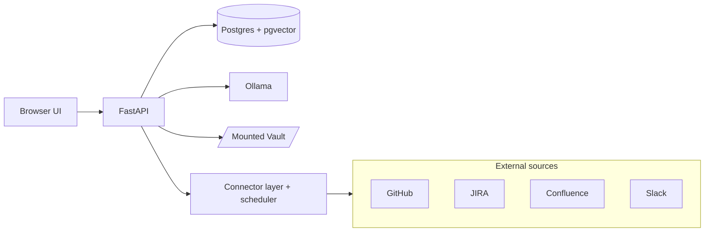
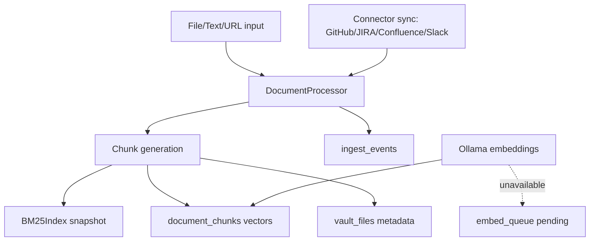
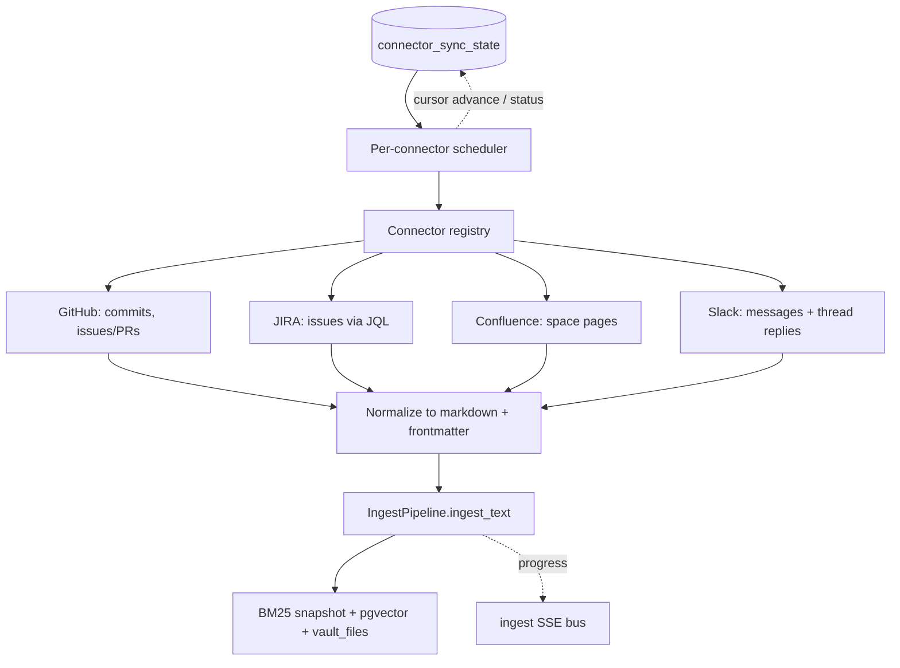
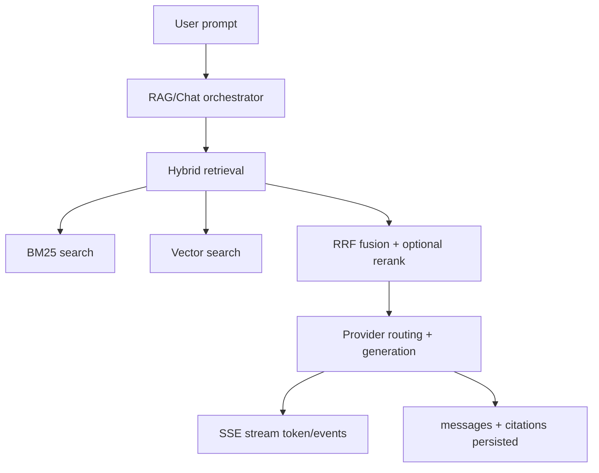
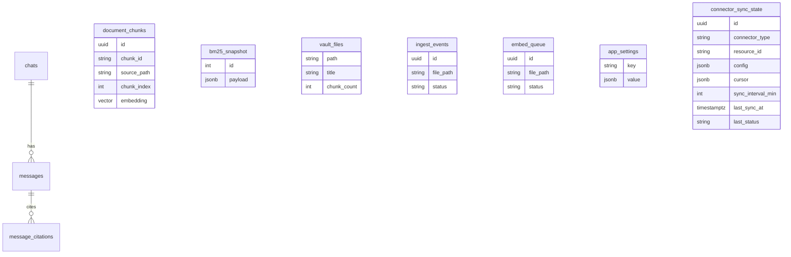

# ARCHITECTURE

## System Overview

Second-Brain-App runs as a three-service local stack:
- API: FastAPI + static React assets
- Database: Postgres 16 + pgvector
- Model runtime: Ollama

It also pulls from external team sources through a pluggable connector layer
(GitHub, JIRA, Confluence, Slack) on a per-connector schedule.

## Ingest Pipeline

Flow details:
1. Input arrives from watcher or ingest routes.
2. Parser extracts metadata/frontmatter and normalizes content.
3. Chunks update BM25 snapshot and vector rows.
4. Ingest events stream via SSE and persist to DB.
5. If Ollama is unavailable, embeddings are deferred into `embed_queue`.

## Connector Sync (GitHub / JIRA / Confluence / Slack)

External team sources plug in through `SourceConnector` implementations. Each
connector fetches records, normalizes them to markdown, and routes them through
the **same** `IngestPipeline.ingest_text`, so synced items are indexed, retrieved,
and cited exactly like local documents. A per-connector scheduler triggers
incremental syncs on each connector's cadence.

Flow details:
1. Scheduler ticks (~60s); a connector is due when `now - last_sync_at >= sync_interval_min` (an in-flight set prevents overlap).
2. The registry builds the connector; the secret is read from an env var named by `config.token_env` (never stored in the DB).
3. Records are fetched **incrementally** from the stored cursor, normalized, and written to `raw/connectors/<type>/<resource>/<id>.md`.
4. Each item is ingested through the standard pipeline; progress publishes on the shared ingest SSE bus.
5. On success the cursor advances and `last_status`/`item_count` persist; a failed sync leaves the cursor unchanged so the window retries.

## Chat Query Pipeline

## Module Map

- `src/api/main.py`: app bootstrap, lifespan, routing, auth/rate-limit helpers.
- `src/api/routes_ingest.py`: ingest endpoints and ingest SSE events.
- `src/api/routes_chats.py`: chat CRUD and streaming message operations.
- `src/api/routes_vault.py`: file browsing, file read, stats.
- `src/api/routes_settings.py`: persisted settings patch/read.
- `src/api/routes_connectors.py`: connector CRUD, test, manual sync, status.
- `src/core/connectors/`: connector layer — `base.py` (`SourceConnector`, `SourceItem`), `github.py`, `jira.py`, `confluence.py`, `slack.py`, `registry.py` (build + `sync_connector`), `scheduler.py` (`is_due`/`next_sync_at` + tick loop).
- `src/core/ingest_pipeline.py`: ingest orchestration, reindex, queue draining.
- `src/core/rag_orchestrator.py`: retrieval + generation glue.
- `src/core/bm25_index.py`: in-memory BM25 with Postgres snapshot persistence.
- `src/core/ollama_health.py`: availability checks + embed queue drain trigger.
- `src/db/models.py`: SQLAlchemy model definitions.
- `src/watcher/vault_watcher.py`: watchdog-based filesystem ingest trigger.

## Postgres Schema (Current)

`connector_sync_state` holds one row per configured source (GitHub repo, JIRA
project, Confluence space, Slack channel). `config` carries non-secret settings
plus a `token_env` pointer; `cursor` tracks incremental position;
`sync_interval_min` drives the scheduler. Synced documents land in
`document_chunks` / `vault_files` like any other ingested file.

## Resource Budget (Guideline)

| State | API RAM | Postgres RAM | Ollama RAM | Notes |
|---|---:|---:|---:|---|
| Idle | 20-80 MB | 80-180 MB | 200-400 MB | no active generation |
| Ingest burst | +150-400 MB | +20-80 MB | stable | depends on chunk fan-out |
| Active chat | +100-300 MB | +10-40 MB | 4-8 GB | model dominates |

## Reliability Controls

- Alembic migrations run at startup.
- Watcher debounce to avoid event storms.
- Queue-and-drain behavior for embedding outages.
- Single-DB durability and pg_dump backups.
- Docker restart policy + optional launchd autostart.
