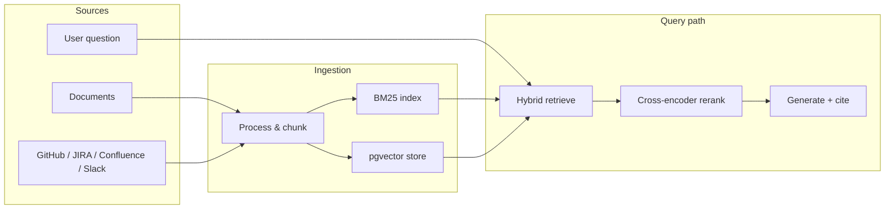
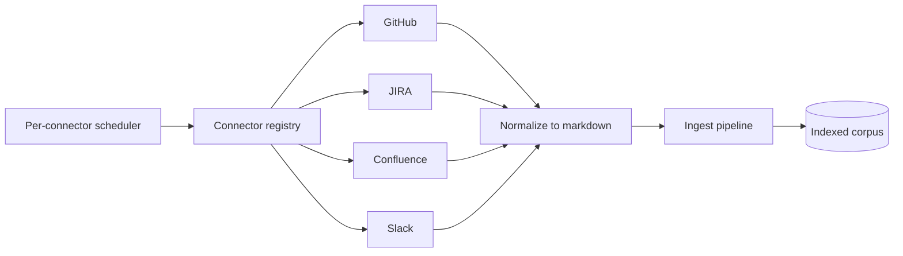

# Project Overview

**Second-Brain-App** is a local-first LLM wiki: it ingests your documents and team
sources, then answers questions grounded in that knowledge with inline citations.
Instead of a generic chatbot, every answer is built from retrieved evidence in your
own corpus.

Purpose: summarize what this project does and how it is designed.
Audience: first-time visitors, reviewers, and engineers doing a quick architecture review.
Reading time: ~4 minutes.

## Problem

Teams scatter knowledge across PDFs, markdown notes, wikis, tickets, and commit
history. Finding reliable answers is slow when search is weak and responses aren't
grounded. This app combines lexical + semantic retrieval with a generation layer
that stays tied to retrieved context, and keeps the corpus fresh by syncing from
team systems.

## User-facing surfaces

The primary surface is a **React single-page app** served by the API, organized
into four sections:

- **Ask** — multi-turn chat with personas, grounding toggles, Sources drawer, save-to-wiki / rolling memory, truthfulness, and pin / regenerate / edit-fork.
- **Knowledge** — Browse (Ask about this file), Add (wide formats, cancel, capabilities, Cursor-assist APIs), Connectors (sync + ask about synced).
- **Settings** — LLM keys, connector tokens, chat persona, Brave / web / vision / memory.
- **Help** — demo-script cards + `/observability/dashboard`.

A **FastAPI** backend exposes the same capabilities over HTTP (see
[`Second_Brain_ClaudProject_Context.md`](Second_Brain_ClaudProject_Context.md) §4
for the route map). A legacy Streamlit demo path remains for Hugging Face Spaces.

## How it works

**Query lifecycle:** normalize the query → BM25 + vector retrieval → weighted RRF
fusion → optional cross-encoder reranking → context optimization → provider routing
(Ollama / OpenAI / Anthropic / Gemini) → answer with citations mapped to chunk IDs
and verification-scored.

**Ingestion lifecycle:** files/text/URLs (and connector records) are parsed by
format-specific extractors (including tabular / slides / notebooks / code),
chunked by `DocumentProcessor`, written to the BM25 snapshot and `document_chunks`
vectors, with content-hash skip via `.ingest-manifest.json`, metadata in
`vault_files`, and progress streamed over SSE.

## Connectors & scheduler

Team sources plug in through a pluggable connector layer
(`src/core/connectors/`). Each connector normalizes records — GitHub commits/PRs,
JIRA issues, Confluence pages, Slack messages + thread replies — to markdown and
runs them through the same ingest pipeline, so synced items become fully
retrievable and citable. A per-connector scheduler refreshes each source on its own
cadence (manual / 15m / hourly / 6h / daily) with incremental cursors. Credentials
live in environment variables and are never stored in the database.

## Why it's notable

- Full-stack AI system design (retrieval, reranking, generation, citations), not just prompt calls.
- Local-first inference via Ollama with production-minded retrieval abstractions.
- Pluggable connectors keep team knowledge current for grounded answers.
- Modular boundaries (ingest / retrieval / generation / API / UI / connectors) that support iteration.

## Go deeper

- Setup & usage: [`INSTRUCTIONS.md`](INSTRUCTIONS.md)
- Architecture & schema: [`ARCHITECTURE.md`](ARCHITECTURE.md)
- Grounding/reference: [`Second_Brain_ClaudProject_Context.md`](Second_Brain_ClaudProject_Context.md)
- Operations: [`RUNBOOK.md`](RUNBOOK.md)
