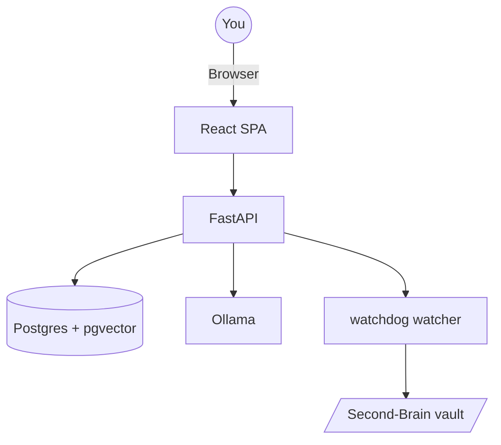

# Second-Brain-App

A persistent local web app that turns your Obsidian vault into a queryable second brain with multi-turn chat, automatic ingest, and citation-linked browsing.

## Table of Contents
- Features
- Architecture
- Quickstart
- First-Run Setup
- Configuration
- Usage Guide
- API Reference
- Operations
- Troubleshooting
- Development
- Project Structure
- Testing
- Contributing
- License

## Features
- Multi-turn chat with streaming responses and conversation persistence.
- Automatic watcher ingest from `raw/` plus manual ingest (file/text/URL).
- Hybrid retrieval (BM25 + vector) with optional reranking.
- Vault browser for `raw/` and `wiki/` with markdown + frontmatter rendering.
- Citation and retrieval transparency in chat responses.
- Ollama-first local inference with optional OpenAI/Anthropic/Gemini/Groq keys.
- Graceful degradation via embed queue when Ollama is unavailable.
- Single Postgres persistence layer for app state and indexes.

## Architecture
Three service deployment:
- `postgres` (Postgres 16 + pgvector)
- `api` (FastAPI + static React app)
- `ollama` (local LLM and embeddings)



## Quickstart
```bash
cd ~/Documents/Second-Brain-App
cp .env.example .env
make build
make up
docker compose exec ollama ollama pull llama3.1:8b
docker compose exec ollama ollama pull nomic-embed-text
make smoke
```
Open `http://localhost:8000` and trigger reindex from Dashboard (or `make reindex`).

## First-Run Setup
1. Copy `.env.example` to `.env` and set optional provider keys.
2. Build and launch stack with `make build && make up`.
3. Pull models in Ollama.
4. Reindex vault.
5. Ask a query and verify citations.
6. Optional autostart: `make install-launchd`.

## Configuration
### Environment variables
| Variable | Default | Description |
|---|---|---|
| `VAULT_HOST_PATH` | `/Users/vamshipokala/Documents/Second-Brain` | host vault mount |
| `POSTGRES_PASSWORD` | `localdev` | Postgres password |
| `VECTOR_BACKEND` | `pgvector` | vector backend |
| `OLLAMA_KEEP_ALIVE` | `5m` | model residency |
| `LLM_DEFAULT_MODEL` | `llama3.1:8b` | default chat model |
| `EMBED_MODEL` | `nomic-embed-text` | embedding model |
| `MAX_INGEST_WORKERS` | `2` | ingest concurrency |
| `WATCHER_DEBOUNCE_MS` | `5000` | watcher debounce |
| `OPENAI_API_KEY` | empty | optional key |
| `ANTHROPIC_API_KEY` | empty | optional key |
| `GEMINI_API_KEY` | empty | optional key |
| `GROQ_API_KEY` | empty | optional key |
| `HF_TOKEN` | empty | optional Hugging Face token for gated reranker/NLI/tokenizer models |
| `DOC_API_KEYS` | empty | optional API auth keys |
| `LOG_LEVEL` | `INFO` | API log level |

## Usage Guide
### Chat
- Create/pin chats, stream replies, regenerate, and edit-fork messages.
- Switch provider/model/scope per conversation.
- Inspect cited chunks and retrieval metadata.

### Ingest
- Auto ingest: drop files into `~/Documents/Second-Brain/raw/`.
- Manual ingest via Ingest tab: files, text, URL.
- Full rebuild: `make reindex`.

### Vault
- Browse file tree: `/vault/files`.
- Read file content: `/vault/files/{path}`.
- Stats endpoint: `/vault/stats`.

### Settings
- Persist key/value config in Postgres with env-overrides.

## API Reference
Base URL: `http://localhost:8000`

### Core
- `GET /health`
- `GET /config/llm`
- `GET /metrics`

### Query
- `POST /query`
- `POST /query/stream`

### Chat
- `GET /chats`
- `POST /chats`
- `GET /chats/{id}`
- `PATCH /chats/{id}`
- `DELETE /chats/{id}`
- `POST /chats/{id}/messages`
- `POST /chats/{id}/messages/{id}/regenerate`
- `POST /chats/{id}/messages/{id}/edit`

### Ingest
- `POST /ingest`
- `POST /ingest/text`
- `POST /ingest/url`
- `POST /reindex`
- `GET /events/ingest`

### Vault/Settings
- `GET /vault/files`
- `GET /vault/files/{path}`
- `GET /vault/stats`
- `GET /settings`
- `PATCH /settings`

## Operations
```bash
make build
make up
make down
make restart
make status
make logs
make dbshell
make reindex
make backup
make smoke
make migrate
```

Restore from backup:
```bash
gunzip -c backups/secondbrain-YYYY-MM-DD.sql.gz | docker compose exec -T postgres psql -U secondbrain secondbrain
```

## Troubleshooting
- Docker I/O errors: free disk, restart Docker Desktop, prune cache/images.
- Ollama unavailable: check `docker compose logs ollama` and `/health`.
- Watcher not firing: verify vault mount and debounce settings.
- Citation path mismatch: run `make reindex`.
- High memory: lower model size and keep-alive duration.

## Development
Backend:
```bash
python3 -m venv .venv
source .venv/bin/activate
pip install -r requirements/base.txt
PYTHONPATH=. uvicorn src.api.main:app --reload --port 8000
```
Frontend:
```bash
cd frontend
npm install
npm run dev
```

## Project Structure
```text
Second-Brain-App/
├── Dockerfile
├── docker-compose.yml
├── .env.example
├── Makefile
├── launchd/
├── scripts/
├── src/
│   ├── api/
│   ├── core/
│   ├── db/
│   └── watcher/
├── frontend/
└── Docs/
```

## Testing
```bash
pytest tests/unit -q
pytest tests/integration -q
cd frontend && npm run test
make smoke
```

## Contributing
- Keep changes focused and test-backed.
- Align API contracts with frontend usage.
- Prefer explicit config and migration-safe schema changes.

## License
MIT
