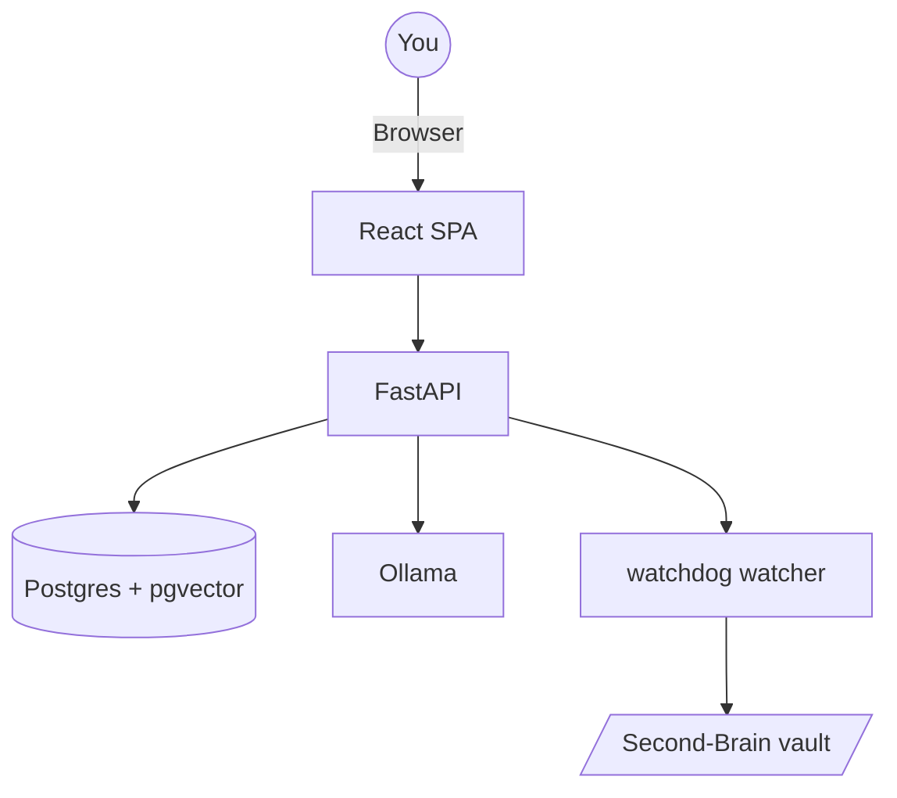

# Second-Brain-App

A persistent local web app that turns your Obsidian vault into a queryable second brain with multi-turn chat, automatic ingest, team connectors, and citation-linked browsing.

## Table of Contents
- Features
- Architecture
- Quickstart
- First-Run Setup
- Configuration
- Usage Guide
- API Reference
- Operations
- Troubleshooting
- Development
- Project Structure
- Testing
- Contributing
- License

## Features
- Multi-turn **Ask** chat with streaming replies, auto-created conversations, and seed starter questions.
- **Personas** (9 roles + student grade + addon), per-send **corpus / general** grounding, optional **Brave web search**.
- **Save to wiki** (`wiki/analyses/…`), **rolling memory** (`context/memory.md`), copy on messages, last-send meta strip.
- **Sources drawer** + optional **truthfulness** scores and **provenance** badges on citations.
- Pin / regenerate / edit-fork; Enter to send, Shift+Enter for newline; Vault / Global scope pills.
- **Ingest:** PDF/DOCX/MD/HTML plus CSV/XLSX, PPTX, IPYNB, common code/IaC; optional vision (settings-gated); cancel + capability header; content-hash skip; browser Cursor-assist pack.
- Team connectors (GitHub, JIRA, Confluence, Slack) with sync progress and “Ask about synced items”.
- Hybrid retrieval (BM25 + vector) with optional reranking; Help link to `/observability/dashboard`.
- Ollama-first local inference; Light / System / Dark theme; Postgres persistence.

## Architecture
Three service deployment:
- `postgres` (Postgres 16 + pgvector)
- `api` (FastAPI + static React app)
- `ollama` (local LLM and embeddings)



## Quickstart — what to do

```bash
cd ~/Documents/Second-Brain-App
cp .env.example .env          # edit VAULT_HOST_PATH + optional keys
make build && make up
docker compose exec ollama ollama pull llama3.1:8b
docker compose exec ollama ollama pull nomic-embed-text
make smoke
```

Open `http://127.0.0.1:8000`.

1. **Ask** — chat auto-creates; pick a seed question → open **Sources**.
2. **Settings** — set persona / optional Brave key / vision ingest; save provider keys.
3. **Knowledge → Add** — drop a spreadsheet, deck, or markdown; watch progress (Stop cancels).
4. Optional: **Connectors** → public GitHub sync → **Ask about synced items**.
5. **Help** → observability dashboard for eng audiences.
6. Rebuild index when needed: `make reindex`. Optional macOS autostart: `make install-launchd`.

Full walkthrough: [`Docs/INSTRUCTIONS.md`](Docs/INSTRUCTIONS.md). Zero-Docker desktop alternative: [Second-Brain-Lite](../Second-Brain-Lite).

## Configuration
### Environment variables
| Variable | Default | Description |
|---|---|---|
| `VAULT_HOST_PATH` | `/Users/vamshipokala/Documents/Second-Brain` | host vault mount |
| `POSTGRES_PASSWORD` | `localdev` | Postgres password |
| `POSTGRES_HOST_PORT` | `5433` | host port for Postgres (avoids clash with local 5432) |
| `VECTOR_BACKEND` | `pgvector` | vector backend |
| `OLLAMA_KEEP_ALIVE` | `5m` | model residency |
| `LLM_DEFAULT_MODEL` | `llama3.1:8b` | default chat model |
| `EMBED_MODEL` | `nomic-embed-text` | embedding model |
| `MAX_INGEST_WORKERS` | `2` | ingest concurrency |
| `WATCHER_DEBOUNCE_MS` | `5000` | watcher debounce |
| `OPENAI_API_KEY` | empty | optional key |
| `ANTHROPIC_API_KEY` | empty | optional key |
| `GEMINI_API_KEY` | empty | optional key |
| `GATEWAY_BASE_URL` | `http://localhost:4000/v1` | AI Gateway / LiteLLM OpenAI-compatible base URL (also settable in Settings) |
| `GATEWAY_API_KEY` | empty | AI Gateway API key (also settable in Settings) |
| `GATEWAY_DEFAULT_MODEL` | empty | default model route name for the gateway provider |
| `GROQ_API_KEY` | empty | optional key |
| `HF_TOKEN` | empty | optional Hugging Face token for gated reranker/NLI/tokenizer models |
| `GITHUB_TOKEN` / `JIRA_API_TOKEN` / `CONFLUENCE_API_TOKEN` / `SLACK_BOT_TOKEN` | connector credentials (env wins over UI Settings) |
| `BRAVE_SEARCH_API_KEY` | empty | optional; enables Ask **Web search** (also settable in Settings) |
| `VISION_INGEST_ENABLED` | empty | optional; enable PNG/JPEG/WebP ingest placeholders |
| `CONNECTOR_SYNC_INTERVAL_MIN` | `0` | global connector sync default (0 = manual) |
| `DOC_API_KEYS` | empty | optional API auth keys |
| `LOG_LEVEL` | `INFO` | API log level |

## Usage Guide
### Ask
- Auto-created chat + seed questions; **Vault** / **Global** pills; Enter send / Shift+Enter newline.
- Composer: persona chip (opens Settings), corpus-only / web-search toggles, **Save to wiki**, **Update memory**, last-send meta.
- “Searching knowledge…” then **Sources** (citations, chunks, provenance); truthfulness badge when scored.
- Pin / regenerate / edit-fork; copy on messages. Demo session chip is Ask-only.

### Knowledge
- **Browse** — preview + **Ask about this file**.
- **Add** — wider formats (see Features); capability line + **Stop**; human progress; Advanced raw SSE; optional Cursor-assist prepare/commit APIs.
- **Connectors** — Test / Sync; public-repo demo hint; **Ask about synced items**.

### Settings
- **AI Gateway** (LiteLLM / OpenAI-compatible): base URL, API key, default model — then select `gateway` in Ask.
- Provider keys, connector tokens, **Chat persona** (role / grade / addon), rolling memory, Brave key, web search, vision ingest (masked secrets; `.env` wins).

### Help
- Demo-script cards + link to `/observability/dashboard`.

### Theme
- Cycle **Light / System / Dark** from the top bar.

## API Reference
Base URL: `http://localhost:8000`

### Core
- `GET /health`
- `GET /config/llm`
- `GET /metrics`

### Query
- `POST /query`
- `POST /query/stream`

### Chat
- `GET /chats`
- `POST /chats`
- `GET /chats/{id}`
- `PATCH /chats/{id}` (title, pin, provider, model, scope, …)
- `DELETE /chats/{id}`
- `GET /chats/search?q=`
- `POST /chats/{id}/messages` (SSE; body may include `grounding_mode`, `include_web_search`)
- `POST /chats/{id}/messages/{id}/regenerate` (SSE)
- `POST /chats/{id}/messages/{id}/edit` (SSE)
- `POST /chats/{id}/messages/{id}/save-to-wiki`
- `POST /chats/{id}/memory/update`

### Memory
- `GET /memory`
- `POST /memory/rollup`

### Ingest
- `GET /ingest/capabilities`
- `POST /ingest/cancel`
- `POST /ingest`
- `POST /ingest/text`
- `POST /ingest/url`
- `POST /ingest/cursor-assist/prepare`
- `POST /ingest/cursor-assist/preview`
- `POST /ingest/cursor-assist/commit`
- `POST /reindex`
- `GET /events/ingest`

### Connectors
- `GET /connectors`
- `POST /connectors`
- `POST /connectors/{id}/test`
- `POST /connectors/{id}/sync`
- `GET /connectors/{id}/status`
- `DELETE /connectors/{id}`

### Vault / Settings / Observability
- `GET /vault/files`
- `GET /vault/files/{path}`
- `GET /vault/stats`
- `GET /settings`
- `PATCH /settings`
- `GET /settings/personas`
- `GET /observability/dashboard`

## Operations
```bash
make build
make up
make down
make restart
make status
make logs
make dbshell
make reindex
make backup
make smoke
make migrate
```

Restore from backup:
```bash
gunzip -c backups/secondbrain-YYYY-MM-DD.sql.gz | docker compose exec -T postgres psql -U secondbrain secondbrain
```

## Troubleshooting
- First `docker compose … --build` is slow: PyTorch may pull large CUDA wheels (hundreds of MB each). One-time / layer-cached; CUDA GPU is **not** required (CPU rerank is fine; Mac Docker cannot use NVIDIA anyway). See [Docs/INSTRUCTIONS.md](Docs/INSTRUCTIONS.md) §3.
- Docker I/O errors: free disk, restart Docker Desktop, prune cache/images.
- Ollama unavailable: check `docker compose logs ollama` and `/health`.
- Watcher not firing: verify vault mount and debounce settings.
- Citation path mismatch: run `make reindex`.
- Empty answers: ingest or sync documents first; confirm models are pulled.
- High memory: lower model size and keep-alive duration.
- Frontend Vitest worker timeouts: retry with `cd frontend && npx vitest run --pool=threads --maxWorkers=1`.

## Development
Backend (local, outside Docker):
```bash
python3 -m venv .venv
source .venv/bin/activate
pip install -r requirements/base.txt   # includes openpyxl, python-pptx, Pillow for wider ingest
PYTHONPATH=. uvicorn src.api.main:app --reload --port 8000
```
Frontend:
```bash
cd frontend
npm install
npm run dev
```

Docs hub: [`Docs/README.md`](Docs/README.md). Install / day-to-day use: [`Docs/INSTRUCTIONS.md`](Docs/INSTRUCTIONS.md). MCP connectors (Atlassian, GitHub, Google Workspace, custom): [`Docs/MCP_CONNECTORS.md`](Docs/MCP_CONNECTORS.md).

## Project Structure
```text
Second-Brain-App/
├── Dockerfile
├── docker-compose.yml
├── .env.example
├── Makefile
├── launchd/
├── scripts/
├── src/
│   ├── api/
│   ├── core/
│   ├── db/
│   └── watcher/
├── frontend/
└── Docs/
```

## Testing
```bash
pytest tests/unit -q
pytest tests/integration -q
cd frontend && npm run test
cd frontend && npm run test:e2e
make smoke
```

## Contributing
- Keep changes focused and test-backed.
- Align API contracts with frontend usage.
- Prefer explicit config and migration-safe schema changes.

## License
MIT
