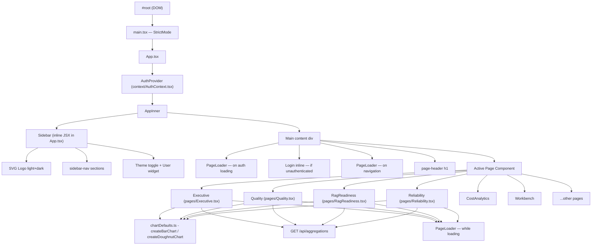
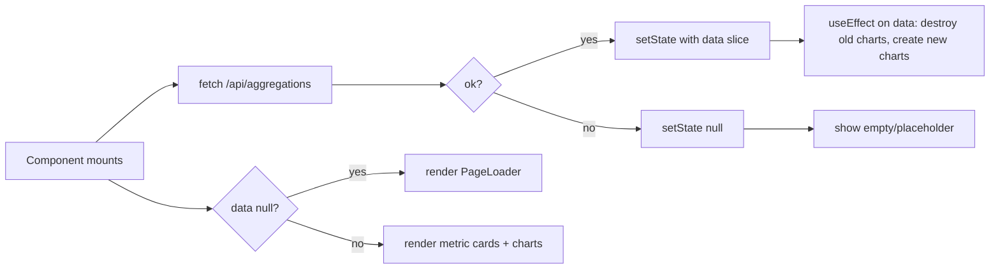
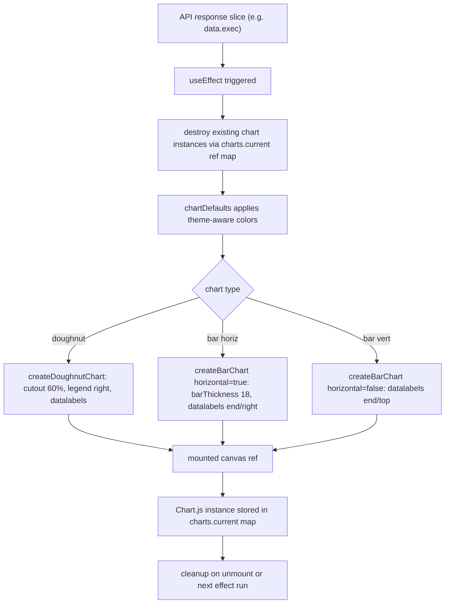
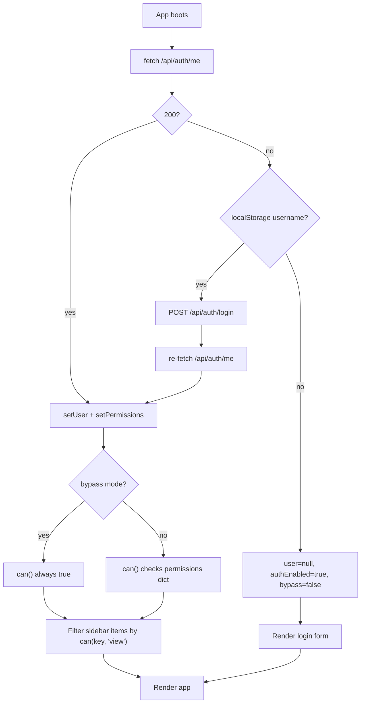
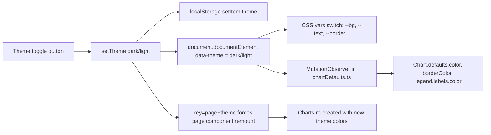
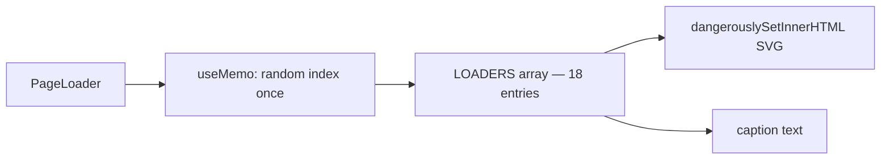

# MARI Dashboard — React Component Architecture

> **Date:** 2026-04-16  
> **Companion to:** [[React-UI-Overview]]

---

## Full Component Tree



---

## Lifecycle: Analytics Page Mount

Every analytics tab follows the **same lifecycle pattern**:



---

## Chart Rendering Pipeline



---

## Auth & Permission Flow



---

## State Management (AppInner)

`AppInner` is the sole stateful shell. All page components are **stateless relative to routing** — they own their own data-fetch state internally.

```typescript
// AppInner state
const [page, setPage] = useState('exec')           // active page key
const [pageLoading, setPageLoading] = useState(false)  // 1s transition loader
const [collapsed, setCollapsed] = useState(...)    // sidebar collapsed?
const [theme, setTheme] = useState(...)            // 'light' | 'dark'
const [userMenuOpen, setUserMenuOpen] = useState(false)
const [collapsedSections, setCollapsedSections] = useState<Set<string>>()
const [loginUsername, setLoginUsername] = useState('')
```

Navigation triggers a **1-second PageLoader** before swapping the page:

```typescript
const navigate = (key: string) => {
  if (key === page) return
  setPageLoading(true)
  setTimeout(() => { setPage(key); setPageLoading(false) }, 1000)
}
```

---

## Theme System



---

## PageLoader Component

18 hotel-themed SVG variants selected randomly on mount via `useMemo`.



**Loader themes:** Bell, Keycard, Elevator, Stars, Pool, Bed, Thermometer, Suitcase, and 10 more.

---

## Workbench Sub-component Map

The Workbench page decomposes into 14 child components:

```mermaid
flowchart TD
    WB["Workbench (pages/Workbench.tsx)"] --> WBSB["WorkbenchSidebar: session list"]
    WB --> WBCHAT["WorkbenchChat: message thread"]
    WB --> WBINPUT["WorkbenchInputBar: text + send"]
    WB --> WBTRACE["WorkbenchTrace: classification trace"]
    WB --> WBASSESS["WorkbenchAssessment: quality scoring"]
    WB --> WBFB["WorkbenchFeedback: thumb up/down"]
    WB --> WBCW["WorkbenchContextWarning: token overflow alert"]
    WB --> WBRETRY["WorkbenchRetryPrompt: retry with edits"]
    WB --> WBDEMO["WorkbenchDemoMenu: demo scenario picker"]

    WB --> WBCFG["WorkbenchConfigModal: system config"]
    WB --> WBLLM["WorkbenchLlmConfigModal: model picker"]
    WB --> WBINTENT["WorkbenchIntentModal: intent viewer"]
    WB --> WBBATCH["WorkbenchBatchModal: batch run"]
    WB --> WBBRAND["WorkbenchBrandVoiceModal: brand voice editor"]
```



---

## File & Folder Structure

```
frontend/src/
├── main.tsx                        ← entry, CSS imports
├── App.tsx                         ← root + sidebar + routing
├── variables.css
├── base.css
├── sidebar.css
├── components.css
├── loaders.css
│
├── pages/
│   ├── Executive.tsx               ← Analytics: exec
│   ├── Quality.tsx                 ← Analytics: quality
│   ├── RagReadiness.tsx            ← Analytics: rag
│   ├── Reliability.tsx             ← Analytics: reliability
│   ├── CostAnalytics.tsx           ← Analytics: costs
│   ├── Validation.tsx              ← Data: validation
│   ├── ProductCatalog.tsx          ← Data: propcat
│   ├── Taxonomy.tsx                ← Data: taxonomy
│   ├── Workbench.tsx               ← Tools: workbench
│   ├── EvalFeedback.tsx            ← Tools: ragresults
│   ├── IntentReadiness.tsx         ← Tools: readiness
│   ├── Docs.tsx                    ← System: docs
│   ├── Settings.tsx                ← System: settings
│   ├── Login.tsx                   ← System: login
│   └── Profile.tsx                 ← System: profile
│
├── components/
│   ├── PageLoader.tsx              ← animated loaders
│   ├── PermGate.tsx                ← permission wrapper + useDataPerm
│   ├── SearchableSelect.tsx        ← filterable dropdown
│   ├── ArchitectureDiagram.tsx     ← system diagram
│   └── workbench/
│       ├── WorkbenchAssessment.tsx
│       ├── WorkbenchBatchModal.tsx
│       ├── WorkbenchBrandVoiceModal.tsx
│       ├── WorkbenchChat.tsx
│       ├── WorkbenchConfigModal.tsx
│       ├── WorkbenchContextWarning.tsx
│       ├── WorkbenchDemoMenu.tsx
│       ├── WorkbenchFeedback.tsx
│       ├── WorkbenchInputBar.tsx
│       ├── WorkbenchIntentModal.tsx
│       ├── WorkbenchLlmConfigModal.tsx
│       ├── WorkbenchRetryPrompt.tsx
│       ├── WorkbenchSidebar.tsx
│       └── WorkbenchTrace.tsx
│
├── context/
│   └── AuthContext.tsx             ← AuthProvider + useAuth
│
├── hooks/
│   ├── useApi.ts
│   └── useApiFetch.ts
│
├── utils/
│   └── chartDefaults.ts           ← Chart.js factory + theme
│
└── lib/
    ├── workbenchTypes.ts
    ├── workbenchDefaults.ts
    ├── workbenchLlm.ts
    ├── workbenchPrompt.ts
    ├── workbenchHandoff.ts
    └── workbenchHelpers.ts
```

---

## API Surface Used by React

| Endpoint | Method | Caller | Purpose |
|----------|--------|--------|---------|
| `/api/aggregations` | GET | All analytics pages | Fetch `exec`, `quality`, `rag`, `reliability`, `costs` slices |
| `/api/auth/me` | GET | `AuthContext` | Get current user + permissions |
| `/api/auth/login` | POST | `AuthContext`, `AppInner` | Authenticate by username |
| `/api/auth/logout` | POST | `AuthContext` | Clear session |

---

## CSS Class Reference (shared across tabs)

| Class | Usage |
|-------|-------|
| `.metrics-grid` | 3-column auto-fill grid for metric cards |
| `.metric-card` | Individual KPI card with label + value + delta |
| `.metric-card.accent-*` | Colour accents: cyan, green, orange, red, purple, yellow |
| `.charts-grid` | 2-column chart layout grid |
| `.chart-card` | Card wrapper with header + container |
| `.chart-card.full-width` | Spans both columns |
| `.chart-container` | Fixed-height canvas wrapper |
| `.chart-container.tall` | Taller canvas for many-label bar charts |
| `.chart-container.small` | Shorter canvas |
| `.chart-title` | Bold chart heading |
| `.chart-subtitle` | Secondary grey subtitle |
| `.data-table-wrapper` | Scrollable table container |
| `.data-table` | Striped table |
| `.mono-cell` | Monospace table cell |
| `.badge.badge-purple` | Intent badge |
| `.badge.badge-red` | Error/method badge |
| `.hint` | Muted helper text |
| `.mono` | Inline monospace span |

---

*Generated 2026-04-16 — source: `emergingtech-tipai-ecmp-dashboard/frontend/src/`*
