# MARI Dashboard — React UI Overview

> **Date:** 2026-04-16  
> **Project:** `emergingtech-tipai-ecmp-dashboard`  
> **Purpose:** Documents how the React frontend renders all 15 pages — Analytics (Executive, Quality, RAG Readiness, Reliability, Cost Analytics), Data (Validation, Taxonomy, Product Catalog), Tools (Workbench, Eval & Feedback, Intent Readiness), and System (Docs, Settings, Profile, Login) — including component hierarchy, data flow, and chart layout.

---

## Table of Contents

1. [[#Architecture at a Glance]]
2. [[#Application Entry Point]]
3. [[#Navigation & Routing]]
4. [[#Shared Infrastructure]]
5. [[#Executive Tab]]
6. [[#Quality Tab]]
7. [[#RAG Readiness Tab]]
8. [[#Reliability Tab]]
9. [[#Cost Analytics Tab]]
10. [[#Validation Tab]]
11. [[#Taxonomy Tab]]
12. [[#Product Catalog Tab]]
13. [[#AI Workbench Tab]]
14. [[#Eval and Feedback Tab]]
15. [[#Intent Readiness Tab]]
16. [[#Docs Tab]]
17. [[#Settings Tab]]
18. [[#Profile Tab]]
19. [[#Login Tab]]
20. [[#Cross-Cutting Concerns]]
21. [[#Component Inventory]]

---

## Architecture at a Glance

The dashboard is a **Vite + React 18 + TypeScript** SPA served at `/app/` by a FastAPI backend. All page navigation is **client-side only** — there is no React Router. A single `App.tsx` component owns the sidebar, auth state, and active page.

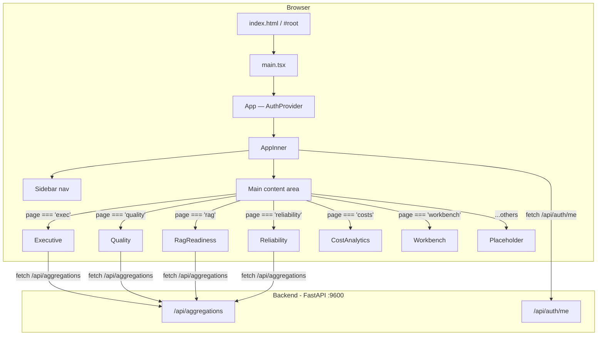

---

## Application Entry Point

### `frontend/src/main.tsx`

Boots the React app into `#root`, imports all global CSS, and wraps in `StrictMode`.

```typescript
import { StrictMode } from 'react'
import { createRoot } from 'react-dom/client'
import './variables.css'
import './base.css'
import './sidebar.css'
import './components.css'
import './loaders.css'
import App from './App'

createRoot(document.getElementById('root')!).render(
  <StrictMode>
    <App />
  </StrictMode>,
)
```

### CSS Layer

| File | Purpose |
|------|---------|
| `variables.css` | CSS custom properties (colors, spacing, dark/light theme vars) |
| `base.css` | Global resets, metric-card, charts-grid, data-table |
| `sidebar.css` | Sidebar layout, nav-items, collapse animation |
| `components.css` | Badges, selects, buttons, modals |
| `loaders.css` | Hotel-themed SVG loader animations |

---

## Navigation & Routing

All navigation is **state-driven** inside `AppInner`. No URL changes.

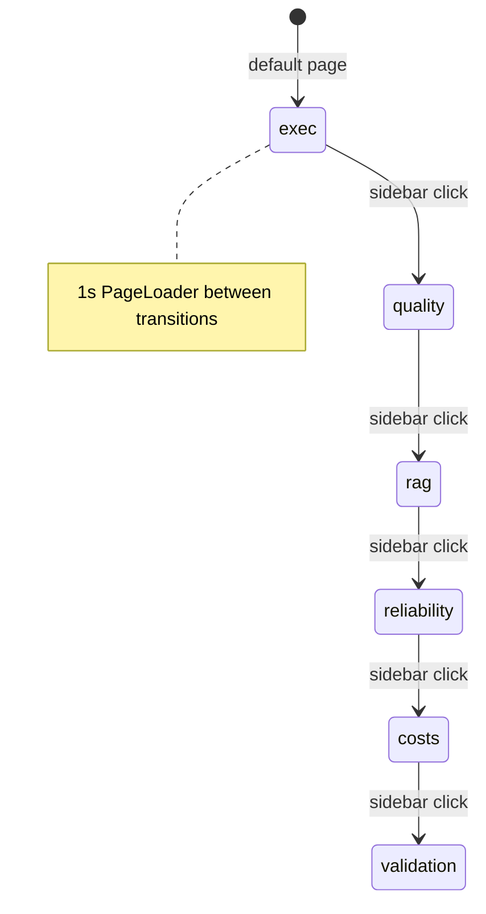

### Nav Sections (from `App.tsx`)

```
Analytics
  ├── Executive       (exec)
  ├── Quality         (quality)
  ├── RAG Readiness   (rag)
  ├── Reliability     (reliability)
  └── Cost Analytics  (costs)

Data
  ├── Validation      (validation)
  ├── Product Catalog (propcat)
  └── Taxonomy        (taxonomy)

Tools
  ├── AI Workbench    (workbench)
  ├── Eval & Feedback (ragresults)
  └── Intent Readiness(readiness)

System
  ├── Help & Docs     (docs)
  ├── Settings        (settings)
  ├── Profile         (profile)
  └── Login           (login)
```

### Page-component map

| Nav key | React component | Source file |
|---------|----------------|-------------|
| `exec` | `Executive` | `pages/Executive.tsx` |
| `quality` | `Quality` | `pages/Quality.tsx` |
| `rag` | `RagReadiness` | `pages/RagReadiness.tsx` |
| `reliability` | `Reliability` | `pages/Reliability.tsx` |
| `costs` | `CostAnalytics` | `pages/CostAnalytics.tsx` |
| `workbench` | `Workbench` | `pages/Workbench.tsx` |
| `validation` | `Validation` | `pages/Validation.tsx` |
| `taxonomy` | `Taxonomy` | `pages/Taxonomy.tsx` |
| `propcat` | `ProductCatalog` | `pages/ProductCatalog.tsx` |
| `readiness` | `IntentReadiness` | `pages/IntentReadiness.tsx` |
| `ragresults` | `EvalFeedback` | `pages/EvalFeedback.tsx` |
| `docs` | `Docs` | `pages/Docs.tsx` |
| `login` | `Login` | `pages/Login.tsx` |
| `profile` | `Profile` | `pages/Profile.tsx` |
| `settings` | `Settings` | `pages/Settings.tsx` |

---

## Shared Infrastructure

### `AuthContext.tsx` — Authentication & Permissions

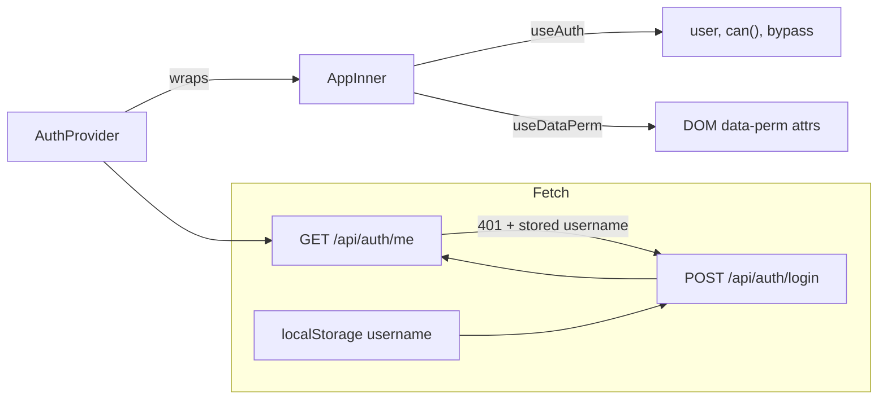

**Key exports:**
- `useAuth()` → `{ user, can, bypass, authEnabled, loading, logout, reload }`
- `can(page, action)` → mirrors original `permissions.js`; returns `true` in bypass mode
- `AuthProvider` wraps the entire app

### `PermGate.tsx` — UI Permission Enforcement

| Export | Behaviour |
|--------|-----------|
| `<PermGate page action>` | Wraps children; dims + disables on insufficient permission |
| `useDataPerm()` | Post-render hook that processes `[data-perm]` DOM attributes |

### `PageLoader.tsx` — Loading State

Displays one of **18 hotel-themed animated SVG loaders** (bell, keycard, elevator, stars, pool waves, bed…) with a caption.  
Used by every analytics page while `fetch('/api/aggregations')` is in flight.

### `chartDefaults.ts` — Chart.js Shared Config

Registers Chart.js core + `chartjs-plugin-datalabels`. Provides:

| Export | Description |
|--------|-------------|
| `createDoughnutChart(canvas, labels, values, id?)` | Cutout 60%, rich legend with %, datalabels |
| `createBarChart(canvas, labels, values, horizontal, color, ...)` | Border-radius 4, datalabels, scale config |
| `destroyChart(id)` | Registry-based cleanup |
| `formatPercent(num, denom)` | `"nn.n%"` string |
| `formatNumber(n)` | K / M abbreviations |
| `colors` | Named brand colours |
| `colorArray` | 16-slot palette for slices |

Theme-aware: a `MutationObserver` on `data-theme` re-applies colour tokens whenever dark/light mode switches.

---

## Executive Tab

> **File:** `frontend/src/pages/Executive.tsx`  
> **API endpoint:** `GET /api/aggregations` → `response.exec`

### Screen Layout

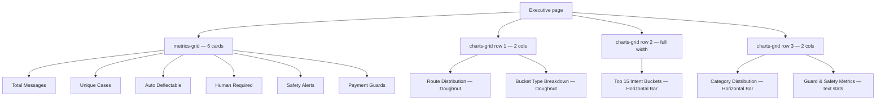

### Data Types

```typescript
interface ExecAgg {
  total: number          // total customer messages
  cases: number          // unique case count
  routeDist: Record<string, number>    // e.g. { 'Human-Light': 1200, 'Human-Full': 400 }
  humanLight: number
  humanFull: number
  ragOnly: number
  safetyCount: number
  paymentCount: number
  bucketTypes: Record<string, number>  // INFO / REQUEST / PROBLEM / COMPLAINT
  bucketKeys: Record<string, number>   // intent bucket -> count
  categories: Record<string, number>
  nonLatinCount: number
  pureAckCount: number
  ragFirst: number
  ragSystem: number
  noRag: number
}
```

### Charts

| Canvas ref | Chart type | Data | Colour |
|-----------|-----------|------|--------|
| `chartRouteDist` | Doughnut | `agg.routeDist` | `colorArray` |
| `chartBucketType` | Doughnut | `agg.bucketTypes` | `colorArray` |
| `chartTopIntents` | Horizontal Bar (top 15) | `agg.bucketKeys` sorted desc | `colors.cyan` |
| `chartCategories` | Horizontal Bar (top 12) | `agg.categories` sorted desc | `colors.purple` |

### Render Flow

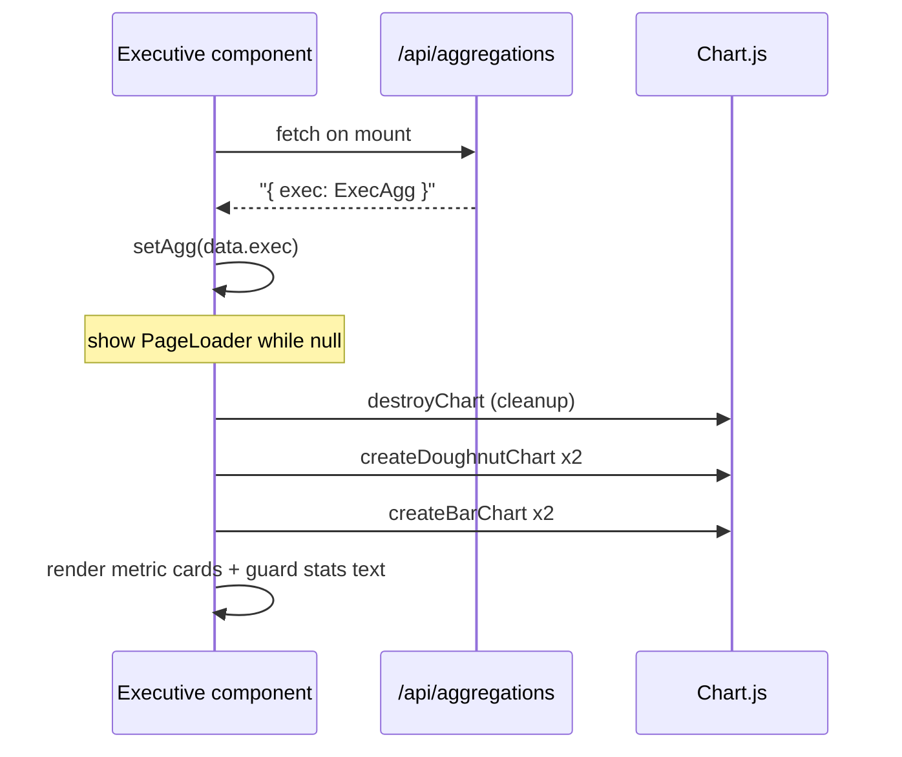

### Metric Cards

| Card | Accent | Value | Detail |
|------|--------|-------|--------|
| Total Messages | (none) | `agg.total` | "Customer messages only" |
| Unique Cases | cyan | `agg.cases` | — |
| Auto Deflectable | green | `ragOnly / total %` | "RAG-only (fully automated)" |
| Human Required | orange | `humanFull / total %` | "Human-Full routing" |
| Safety Alerts | red | `agg.safetyCount` | — |
| Payment Guards | purple | `agg.paymentCount` | — |

---

## Quality Tab

> **File:** `frontend/src/pages/Quality.tsx`  
> **API endpoint:** `GET /api/aggregations` → `response.quality`

### Screen Layout

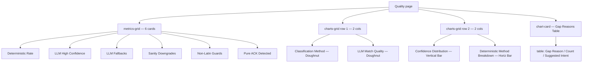

### Data Types

```typescript
interface QualityAgg {
  total: number
  detCount: number        // deterministic classifications
  methods: Record<string, number>       // LLM, PURE_ACK, LANG_GUARD_NONLATIN, ...
  highConf: number        // LLM HIGH confidence
  llmCount: number
  fallbackCount: number   // GENERAL_UNCLEAR / OOS
  sanityCount: number
  nonLatinGuards: number
  pureAckCount: number
  llmMatchQuality: Record<string, number>  // GREAT / GOOD / WEAK / NONE
  llmConfidence: Record<string, number>    // HIGH / MEDIUM / LOW
  detBreakdown: Record<string, number>     // Regex, AppButton, Typed, Followup
  gapReasons: Record<string, { count: number; suggested: string }>
}
```

### Charts

| Canvas ref | Chart type | Data | Colour |
|-----------|-----------|------|--------|
| `chartMethodDist` | Doughnut | computed `methodGroups` | `colorArray` |
| `chartMatchQuality` | Doughnut | `q.llmMatchQuality` ordered GREAT→NONE | `colorArray` |
| `chartConfidence` | Vertical Bar | `q.llmConfidence` ordered HIGH→LOW | `colors.cyan` |
| `chartDetBreakdown` | Horizontal Bar | `q.detBreakdown` | `colors.green` |

**Method grouping logic** (computed before charting):
```typescript
const methodGroups = {
  'Deterministic': q.detCount,
  'LLM': q.methods['LLM'] || 0,
  'Pure ACK': q.methods['PURE_ACK'] || 0,
  'Lang Guard': q.methods['LANG_GUARD_NONLATIN'] || 0,
  'Payment Guard': q.methods['PAYMENT_GUARD'] || 0,
  'Skipped': q.methods['SKIPPED'] || 0,
  'Other': q.total - sum(above),
}
```

### Gap Reasons Table

Sorted by count descending, capped at top 10.  
Columns: `Gap Reason | Count | Suggested Intent (badge-purple)`

### Metric Cards

| Card | Accent | Value | Detail |
|------|--------|-------|--------|
| Deterministic Rate | (none) | `detCount / total %` | "No LLM needed" |
| LLM High Confidence | cyan | `highConf / llmCount %` | — |
| LLM Fallbacks | orange | `q.fallbackCount` | "GENERAL_UNCLEAR / OOS" |
| Sanity Downgrades | purple | `q.sanityCount` | — |
| Non-Latin Guards | yellow | `q.nonLatinGuards` | — |
| Pure ACK Detected | green | `q.pureAckCount` | — |

---

## RAG Readiness Tab

> **File:** `frontend/src/pages/RagReadiness.tsx`  
> **API endpoint:** `GET /api/aggregations` → `response.rag`

### Screen Layout

```mermaid
flowchart TD
    RP["RagReadiness page"]
    RP --> DM["metrics-grid — Deflection tier 4 cards"]
    RP --> CM["metrics-grid — Core RAG 6 cards"]
    RP --> CR1["charts-grid row 1 — 2 cols"]
    RP --> CR2["charts-grid row 2 — 2 cols"]
    RP --> TB["charts-grid tables — 2 cols"]

    DM --> D1["Msg Deflection RAG_ONLY"]
    DM --> D2["Msg RAG-Eligible"]
    DM --> D3["Case Deflection RAG_ONLY"]
    DM --> D4["Case RAG-Eligible"]

    CM --> C1["RAG Eligible"]
    CM --> C2["RAG+System"]
    CM --> C3["RAG-Only"]
    CM --> C4["No-RAG"]
    CM --> C5["Has Required Keys"]
    CM --> C6["Missing Keys"]

    CR1 --> CH1["RAG Mode Distribution — Doughnut"]
    CR1 --> CH2["Top RAG-Eligible Intents — Horiz Bar + Filter"]

    CR2 --> CH3["Deflection Tier Messages — Doughnut"]
    CR2 --> CH4["Deflection Tier Cases — Doughnut"]

    TB --> T1["RAG Sources table"]
    TB --> T2["Required Keys table"]
```

### Interactive Filter

The "Top RAG-Eligible Intents" chart has a `<select>` dropdown that re-renders the bar chart on change:

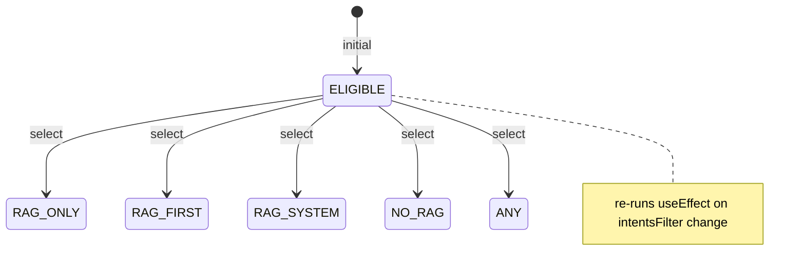

### Data Types

```typescript
interface RagAgg {
  total: number
  ragSystem: number
  ragFirst: number
  ragOnly: number
  noRag: number
  ragEligible: number
  withKeys: number
  withoutKeys: number
  sourceCounts: Record<string, number>
  keyCounts: Record<string, number>
  ragIntentsByMode: Record<string, Record<string, number>>
  msgTierCounts: Record<string, number>   // RAG_ONLY / RAG_FIRST / RAG_SYSTEM / NO_RAG
  caseTierCounts: Record<string, number>
  totalCases: number
}
```

### Charts

| Canvas ref | Chart type | Data | Colour |
|-----------|-----------|------|--------|
| `chartRagMode` | Doughnut | ragSystem, ragFirst, ragOnly, noRag | `colorArray` |
| `chartRagIntents` | Horiz Bar (top 10) | filtered by `intentsFilter` state | `colors.orange` |
| `chartDeflectMsg` | Doughnut | `msgTierCounts` | `colorArray` |
| `chartDeflectCase` | Doughnut | `caseTierCounts` | `colorArray` |

### Deflection Tier Metric Cards (row 1)

| Card | Accent | Value |
|------|--------|-------|
| Msg Deflection (RAG_ONLY) | green | `msgDeflect / total %` |
| Msg RAG-Eligible | cyan | `msgRagEligible / total %` |
| Case Deflection (RAG_ONLY) | purple | `caseDeflect / totalCases %` |
| Case RAG-Eligible | orange | `caseRagEligible / totalCases %` |

### Core RAG Metric Cards (row 2)

| Card | Accent | Value |
|------|--------|-------|
| RAG Eligible | (none) | `formatNumber(g.ragEligible)` |
| RAG+System | cyan | `formatNumber(g.ragSystem)` |
| RAG-Only | orange | `formatNumber(g.ragOnly)` |
| No-RAG | purple | `formatNumber(g.noRag)` |
| Has Required Keys | green | `formatNumber(g.withKeys)` |
| Missing Keys | yellow | `formatNumber(g.withoutKeys)` |

---

## Reliability Tab

> **File:** `frontend/src/pages/Reliability.tsx`  
> **API endpoint:** `GET /api/aggregations` → `response.reliability`

### Screen Layout

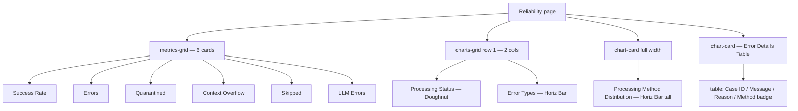

### Data Types

```typescript
interface ReliabilityAgg {
  total: number
  methods: Record<string, number>     // all classification methods + counts
  skipped: number
  errors: number
  quarantined: number
  overflowCount: number
  llmErrors: number
  success: number
  errorReasons: Record<string, number>  // top error reason strings
  errorRows: {
    id_case: string
    message_text: string
    reason: string
    method: string
  }[]
}
```

### Charts

| Canvas ref | Chart type | Data | Colour |
|-----------|-----------|------|--------|
| `chartStatus` | Doughnut | Success / Skipped / Errors / Quarantined | `colorArray` |
| `chartErrors` | Horiz Bar (top 8) | `r.errorReasons` sorted desc | `colors.red` |
| `chartMethods` | Horiz Bar (top 20) | `r.methods` sorted desc | `colors.blue` |

### Error Table

- Shows `r.errorRows` (up to full list)
- If total problem count exceeds shown rows: trailing row says *"Showing N of M rows"*
- Method column rendered as `<span class="badge badge-red">`
- Message text truncated to 60 chars; reason to 80 chars

### Metric Cards

| Card | Accent | Value |
|------|--------|-------|
| Success Rate | green | `success / total %` |
| Errors | red | `r.errors` |
| Quarantined | orange | `r.quarantined` |
| Context Overflow | yellow | `r.overflowCount` |
| Skipped | purple | `r.skipped` |
| LLM Errors | (none) | `r.llmErrors` |

---

## Cost Analytics Tab

> **File:** `frontend/src/pages/CostAnalytics.tsx`  
> **API endpoints:** `GET /api/cost/summary`, `/api/cost/by-intent`, `/api/cost/by-property`, `/api/cost/by-batch`, `/api/cost/timeline`

### Screen Layout

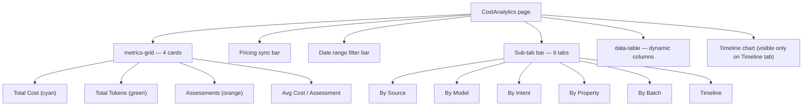

### Sub-tabs

| Tab | API | Columns |
|-----|-----|---------|
| By Source | `data.by_source` (from summary) | Source, Count, Input Tokens, Output Tokens, Cost |
| By Model | `data.by_model` grouped | Model, Backend, Count, Tokens, Cost, Avg Latency |
| By Intent | `GET /api/cost/by-intent` | Intent, Model, Count, Tokens, Cost, Avg Latency |
| By Property | `GET /api/cost/by-property` | Property, Model, Count, Tokens, Cost, Avg Latency |
| By Batch | `GET /api/cost/by-batch` | Batch, Date, Model, Count, Tokens, Cost |
| Timeline | `GET /api/cost/timeline?days=N` | Dual-axis: Cost bar + Tokens line chart |

### Metric Cards

| Card | Accent | Value |
|------|--------|-------|
| Total Cost | cyan | `fmtCost(data.grand_total_cost)` |
| Total Tokens | green | Input + Output tokens combined |
| Assessments | orange | `data.workbench.total_assessments` |
| Avg Cost / Assessment | (none) | Total cost / assessment count |

### State

- `tab` — active sub-tab (`source | model | intent | property | batch | timeline`)
- `fromDate / toDate` — date range filter; re-fetches summary on change
- `columns / rows` — dynamically set when tab switches
- `timelineData` — raw API response for chart rendering
- `syncing` — LiteLLM pricing sync in progress flag
- `pricingCount` — number of models with configured pricing

---

## Validation Tab

> **File:** `frontend/src/pages/Validation.tsx`  
> **API endpoint:** `GET /api/validation/enriched`

### Screen Layout

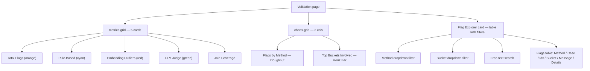

### Data Model

```typescript
interface ValRow {
  validation_method: string  // RULE_BASED | EMBEDDING_OUTLIER | LLM_JUDGE
  id_case: string
  message_index: string
  bucket_key: string
  message_text: string
  details: string            // built from reason, suggested_bucket, score, cls_method
}
```

### Charts

| Canvas ref | Chart type | Data | Colour |
|-----------|-----------|------|--------|
| `chartMethods` | Doughnut (top 10) | `byMethod` counts | `colorArray` |
| `chartBuckets` | Horizontal Bar (top 12) | `byBucket` counts | `colors.orange` |

### Badge Colours

| Method | Badge class |
|--------|-------------|
| `RULE_BASED` | `badge-orange` |
| `EMBEDDING_OUTLIER` | `badge-red` |
| `LLM_JUDGE` | `badge-green` |
| Other | `badge-blue` |

---

## Taxonomy Tab

> **File:** `frontend/src/pages/Taxonomy.tsx`  
> **API endpoints:** `GET /api/taxonomy`, `GET /api/classification/search`, `PATCH /api/taxonomy/:bucket_key`

### Screen Layout

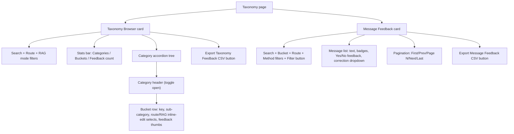

### Key Features

- **Inline editing**: Route and RAG mode dropdowns within each bucket card; changes are `PATCH`-ed to `/api/taxonomy/:bucket_key` immediately.
- **Feedback persistence**: Both taxonomy feedback and message feedback survive page reload via `localStorage`.
- **Server-side search**: Message Feedback uses `GET /api/classification/search?q=&bucket=&route=&method=&limit=50&offset=N` with abort-controller debounce.
- **CSV export**: Both feedback stores export as downloadable CSV files.

### State

| Key | Description |
|-----|-------------|
| `taxData` | Full taxonomy array from `/api/taxonomy` |
| `feedback` | `Record<bucket_key, {vote, correction}>` |
| `openCats` | Set of expanded category names |
| `msgRows / msgTotal / msgPage` | Server-side message search results |
| `msgFeedback` | `Record<"caseId__msgIdx", {vote, correction}>` |

---

## Product Catalog Tab

> **File:** `frontend/src/pages/ProductCatalog.tsx`  
> **API endpoints:** `/api/prop-catalog/*`, `/api/mapping-discovery/*`, `/api/marsha-mapping`, `/api/taxonomy/lookup`

### Screen Layout

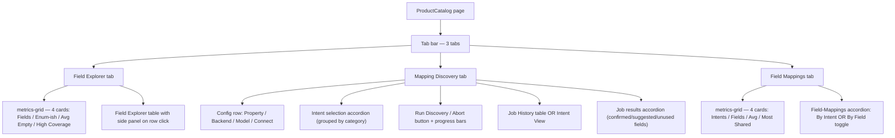

### Sub-tabs Summary

| Tab | Data source | Purpose |
|-----|------------|---------|
| Field Explorer | `GET /api/prop-profile?limit=50000` | Browse all property catalog fields, filter by enum-ish / coverage |
| Mapping Discovery | `POST /api/mapping-discovery/start` | LLM-powered discovery of which catalog fields each intent needs |
| Field Mappings | `GET /api/marsha-mapping` | Browse/edit confirmed field-to-intent mappings |

### Discovery Job Lifecycle

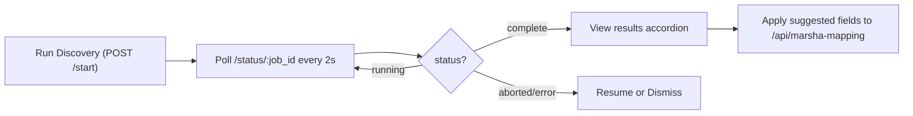

---

## AI Workbench Tab

> **File:** `frontend/src/pages/Workbench.tsx`  
> **API endpoints:** `/api/workbench/*`, `/api/llm/*`, `/api/taxonomy/*`

The Workbench is the most complex page. It composes **14 child components** and manages a full chat/assessment workflow.

### Screen Layout

```mermaid
flowchart TD
    WB["Workbench page"]
    WB --> WBS["WorkbenchSidebar: session list + new/delete"]
    WB --> WBC["WorkbenchChat: message thread"]
    WB --> WBI["WorkbenchInputBar: text + send + actions"]
    WB --> WBT["WorkbenchTrace: classification trace panel"]
    WB --> WBA["WorkbenchAssessment: quality score card"]
    WB --> WBF["WorkbenchFeedback: thumb up/down + reasons"]
    WB --> WBCW["WorkbenchContextWarning: token overflow alert"]
    WB --> WBRP["WorkbenchRetryPrompt: retry with edits"]
    WB --> WBDM["WorkbenchDemoMenu: demo scenario picker"]

    WB --> M1["WorkbenchConfigModal: system/template config"]
    WB --> M2["WorkbenchLlmConfigModal: model + backend picker"]
    WB --> M3["WorkbenchIntentModal: intent viewer"]
    WB --> M4["WorkbenchBatchModal: batch run across test cases"]
    WB --> M5["WorkbenchBrandVoiceModal: brand voice editor"]
```

### Key Capabilities

| Feature | Description |
|---------|-------------|
| Session management | Create/rename/delete chat sessions; persisted to `/api/workbench/sessions` |
| Chat | Send guest messages, receive AI responses with classification trace |
| Assessment | LLM judge scores each response on answerability, tone, faithfulness |
| Batch runs | Run all test cases against selected model/template |
| Brand voice | Edit/save brand voice guidelines used in assessments |
| Template selection | Switch between prompt templates mid-session |

---

## Eval and Feedback Tab

> **File:** `frontend/src/pages/EvalFeedback.tsx`  
> **API endpoints:** `/api/workbench/assessments`, `/api/workbench/test-cases`, `/api/eval-runs/*`

### Screen Layout

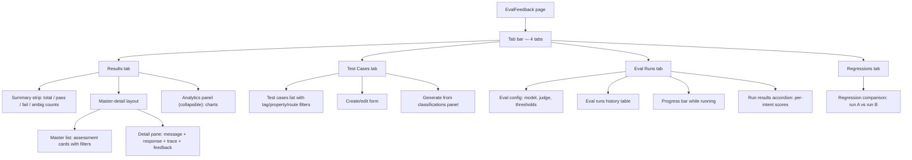

### Sub-tabs

| Tab | Purpose |
|-----|---------|
| Results | Browse/filter assessment results; inline feedback (pass/fail/reasons) |
| Test Cases | Create, edit, tag, and generate structured test cases |
| Eval Runs | Configure and launch batch evaluations; track progress |
| Regressions | Compare two eval runs to detect score regressions |

### Analytics Panel (Results tab)

When expanded shows Chart.js charts:
- Answer Quality distribution (Doughnut)
- Response latency histogram (Bar)
- Score by intent / route breakdowns

---

## Intent Readiness Tab

> **File:** `frontend/src/pages/IntentReadiness.tsx`  
> **API endpoints:** `/api/readiness`, `/api/readiness/generate`, `/api/prop-catalog/unique-codes`

### Screen Layout

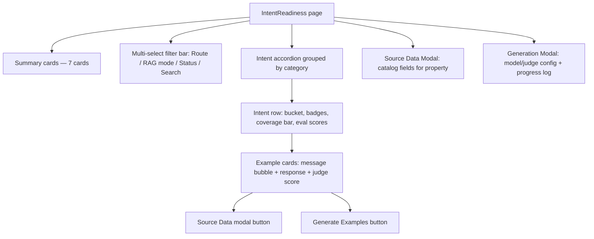

### Summary Cards

| Card | Value |
|------|-------|
| Total Intents | All intents in taxonomy |
| RAG Ready | Status = `ready` |
| Needs Review | Status = `needs_review` |
| No Data | Status = `no_data` |
| Avg Coverage | Mean `coverage_pct` across intents |
| Avg Eval Score | Mean eval score |
| Properties | Distinct property count in data |

### Intent Status Values

| Status | Meaning |
|--------|---------|
| `ready` | Has examples + passes eval threshold |
| `needs_review` | Has examples but quality uncertain |
| `no_data` | No example messages yet |

### Generation Workflow

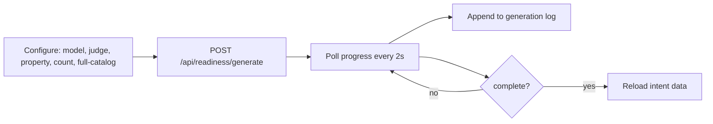

---

## Docs Tab

> **File:** `frontend/src/pages/Docs.tsx`  
> **API endpoints:** `GET /api/docs` (index), `GET /api/docs/:id` (content)

### Screen Layout

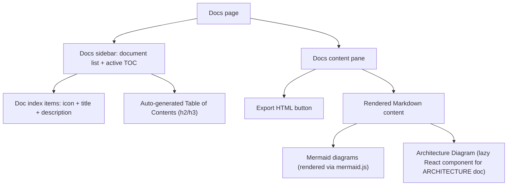

### Key Features

| Feature | Description |
|---------|-------------|
| Markdown rendering | Custom `renderMarkdown()` — handles headings, tables, blockquotes, code blocks, links |
| Mermaid diagrams | `mermaid.initialize()` + `mermaid.run()` after content renders; theme-aware |
| Cross-doc links | `[text](FILE.md)` links trigger `loadDoc(id)` |
| TOC | Auto-generated from `h2`/`h3` headings in rendered HTML; click scrolls to section |
| HTML export | Standalone HTML file with inlined CSS; strips toolbars; preserves SVGs |
| Architecture doc | Special case: also renders the `<ArchitectureDiagram>` React component |

---

## Settings Tab

> **File:** `frontend/src/pages/Settings.tsx`  
> **API endpoints:** `/api/workbench/templates/*`, `/api/settings/*`, `/api/llm/*`, `/api/admin/*`, `/api/stats/*`

### Screen Layout

```mermaid
flowchart TD
    SP["Settings page"]
    SP --> TB["Tab bar — 6 tabs"]

    TB --> S1["Prompts and Templates"]
    TB --> S2["LLM Config"]
    TB --> S3["Brand"]
    TB --> S4["Data"]
    TB --> S5["System"]
    TB --> S6["Users and Access (admin only)"]

    S1 --> TPL["Template CRUD cards: RAG rules, handoff, JSON schema, voice"]
    S1 --> SYS["System prompts: Judge + Discovery"]

    S2 --> LLM["LiteLLM + Ollama endpoint config"]
    S2 --> PRC["Model pricing table (input/output per M tokens)"]
    S2 --> CTX["Context limits table (max tokens per model)"]

    S3 --> BR["Brand Reference: personality principles, writing rules, terminology"]

    S4 --> DB["DB stats grid"]
    S4 --> CLR["Clear tables buttons"]
    S4 --> AGG["Recompute aggregations button"]
    S4 --> IMP["Server-side import from file path"]
    S4 --> EXP["Export data as JSON"]

    S5 --> REV["Reviewer name (localStorage)"]
    S5 --> SYI["System info grid: Python, Platform, DB, LLM"]
    S5 --> DEM["Launch Demo button"]

    S6 --> USR["User management table: create/deactivate/change role"]
    S6 --> OVR["Permission override editor per user"]
    S6 --> RPR["Role permissions reference table"]
```

### Settings Sub-tabs

| Tab | Permission Required | APIs Used |
|-----|---------------------|-----------|
| Prompts & Templates | `settings:view` | `/api/workbench/templates`, `/api/settings/judge_prompt`, `/api/settings/discovery_prompt` |
| LLM Config | `settings:view` | `/api/llm/config`, `/api/llm/models`, `/api/settings/model_pricing`, `/api/settings/model_ctx_limits` |
| Brand | `settings:view` | `/api/settings/brand_reference` |
| Data | `settings:edit` | `/api/stats/row-counts`, `/api/aggregations`, `/api/classification/import-file` |
| System | `settings:view` | `/api/stats/system-info` |
| Users & Access | `settings:edit` | `/api/admin/users`, `/api/admin/roles` |

---

## Profile Tab

> **File:** `frontend/src/pages/Profile.tsx`  
> **API endpoint:** `PUT /api/auth/profile`

### Screen Layout

```mermaid
flowchart TD
    PP["Profile page"]
    PP --> C1["My Profile card"]
    PP --> C2["My Permissions card"]

    C1 --> AV["Avatar initials circle"]
    C1 --> UI["Username / display name / role badge"]
    C1 --> DN["Edit display name input + Save button"]

    C2 --> PT["Permissions table: Page / Actions"]
```

### Key Points

- Uses `useAuth()` to read `user`, `permissions`, `reload`.
- `PUT /api/auth/profile` updates `display_name`; calls `reload()` to refresh context.
- In bypass mode (no users configured): shows "Not logged in — auth is in bypass mode."
- Role colours: `admin` = danger, `lead` = warning, `analyst` = teal, `executive` = text3.

---

## Login Tab

> **File:** `frontend/src/pages/Login.tsx`  
> **API endpoint:** `POST /api/auth/login`

### Screen Layout

```mermaid
flowchart TD
    LP["Login page"]
    LP --> CARD["Centered card (max 420px)"]
    CARD --> LOGO["MARI SVG logo"]
    CARD --> HDR["Sign in heading"]
    CARD --> FORM["Username input + Sign In button"]
    CARD --> ERR["Error message (on failed login)"]
    CARD --> FOOT["Footer note: SSO integration coming soon"]
```

### Login Flow

```mermaid
sequenceDiagram
    participant U as User
    participant L as Login component
    participant A as /api/auth/login

    U->>L: Enter username + press Enter or Sign In
    L->>A: POST username
    alt success (200)
        A-->>L: OK
        L->>L: localStorage.setItem dashboard_username
        L->>L: reload() + window.location.reload()
    else failure (4xx)
        A-->>L: error message
        L->>L: setError(message)
    end
```

---

## Cross-Cutting Concerns

### Data Fetching Pattern (all analytics tabs)

```mermaid
sequenceDiagram
    participant Page
    participant API as GET /api/aggregations
    participant Charts as Chart.js

    Page->>API: fetch on mount
    alt success
        API-->>Page: JSON response slice
        Page->>Page: setState with slice
        Page->>Charts: destroy old instances
        Page->>Charts: create new instances
    else error or not ok
        API-->>Page: null
        Page->>Page: setLoading(false)
    end
    note over Page: renders PageLoader while data is null
```

### Theme Switching

App stores theme in `localStorage` and sets `data-theme="dark|light"` on `<html>`.  
`chartDefaults.ts` watches the attribute via `MutationObserver` and re-applies Chart.js colour defaults.  
Each page component accepts `key={page + theme}` so it remounts (and re-creates charts) on theme change.

### Chart Cleanup Strategy

Each page component keeps a `charts = useRef<Record<string, Chart>>({})` map.  
Before creating new charts it calls `c.destroy()` on every existing instance to prevent canvas reuse errors.

### Permission Checks

- Sidebar items are filtered: `section.items.filter(item => can(item.key, 'view'))`
- Inline actions use `<PermGate>` or `[data-perm]` attributes
- In bypass mode (no users configured) all `can()` calls return `true`

---

## Component Inventory

### Pages

| Component | File | Status |
|-----------|------|--------|
| `Executive` | `pages/Executive.tsx` | Fully migrated |
| `Quality` | `pages/Quality.tsx` | Fully migrated |
| `RagReadiness` | `pages/RagReadiness.tsx` | Fully migrated |
| `Reliability` | `pages/Reliability.tsx` | Fully migrated |
| `CostAnalytics` | `pages/CostAnalytics.tsx` | Fully migrated |
| `Validation` | `pages/Validation.tsx` | Fully migrated |
| `ProductCatalog` | `pages/ProductCatalog.tsx` | Fully migrated |
| `Taxonomy` | `pages/Taxonomy.tsx` | Fully migrated |
| `Workbench` | `pages/Workbench.tsx` | Fully migrated |
| `EvalFeedback` | `pages/EvalFeedback.tsx` | Fully migrated |
| `IntentReadiness` | `pages/IntentReadiness.tsx` | Fully migrated |
| `Docs` | `pages/Docs.tsx` | Fully migrated |
| `Settings` | `pages/Settings.tsx` | Fully migrated |
| `Login` | `pages/Login.tsx` | Fully migrated |
| `Profile` | `pages/Profile.tsx` | Fully migrated |

### Shared Components

| Component | File | Purpose |
|-----------|------|---------|
| `PageLoader` | `components/PageLoader.tsx` | Hotel-themed SVG loaders, 18 variants |
| `PermGate` | `components/PermGate.tsx` | Declarative permission wrapper |
| `SearchableSelect` | `components/SearchableSelect.tsx` | Filterable dropdown |
| `ArchitectureDiagram` | `components/ArchitectureDiagram.tsx` | System diagram SVG |

### Workbench Sub-components

| Component | File |
|-----------|------|
| `WorkbenchAssessment` | `components/workbench/WorkbenchAssessment.tsx` |
| `WorkbenchBatchModal` | `components/workbench/WorkbenchBatchModal.tsx` |
| `WorkbenchBrandVoiceModal` | `components/workbench/WorkbenchBrandVoiceModal.tsx` |
| `WorkbenchChat` | `components/workbench/WorkbenchChat.tsx` |
| `WorkbenchConfigModal` | `components/workbench/WorkbenchConfigModal.tsx` |
| `WorkbenchContextWarning` | `components/workbench/WorkbenchContextWarning.tsx` |
| `WorkbenchDemoMenu` | `components/workbench/WorkbenchDemoMenu.tsx` |
| `WorkbenchFeedback` | `components/workbench/WorkbenchFeedback.tsx` |
| `WorkbenchInputBar` | `components/workbench/WorkbenchInputBar.tsx` |
| `WorkbenchIntentModal` | `components/workbench/WorkbenchIntentModal.tsx` |
| `WorkbenchLlmConfigModal` | `components/workbench/WorkbenchLlmConfigModal.tsx` |
| `WorkbenchRetryPrompt` | `components/workbench/WorkbenchRetryPrompt.tsx` |
| `WorkbenchSidebar` | `components/workbench/WorkbenchSidebar.tsx` |
| `WorkbenchTrace` | `components/workbench/WorkbenchTrace.tsx` |

### Context & Hooks

| Export | File | Purpose |
|--------|------|---------|
| `AuthProvider`, `useAuth` | `context/AuthContext.tsx` | Auth state, `can()` check |
| `useDataPerm` | `components/PermGate.tsx` | DOM `[data-perm]` enforcement |
| `useApi` | `hooks/useApi.ts` | Generic API hook |
| `useApiFetch` | `hooks/useApiFetch.ts` | Fetch-with-loading hook |

### Utilities

| Export | File |
|--------|------|
| `createDoughnutChart`, `createBarChart`, `colors`, `colorArray` | `utils/chartDefaults.ts` |
| Workbench state types | `lib/workbenchTypes.ts` |
| Workbench default config | `lib/workbenchDefaults.ts` |
| Workbench LLM helpers | `lib/workbenchLlm.ts` |
| Workbench prompt builder | `lib/workbenchPrompt.ts` |
| Workbench handoff logic | `lib/workbenchHandoff.ts` |
| Workbench misc helpers | `lib/workbenchHelpers.ts` |

---

## Build & Proxy Config

```typescript
// vite.config.ts
export default defineConfig(({ command }) => ({
  plugins: [react()],
  base: command === 'build' ? '/app/' : '/',  // served at /app/ in production
  server: {
    port: 3000,
    proxy: {
      '/api': 'http://localhost:9600',   // FastAPI backend
      '/static': 'http://localhost:9600',
    },
  },
  build: { outDir: 'dist', sourcemap: true },
}))
```

---

*Generated 2026-04-16 — source: `emergingtech-tipai-ecmp-dashboard/frontend/src/`*
