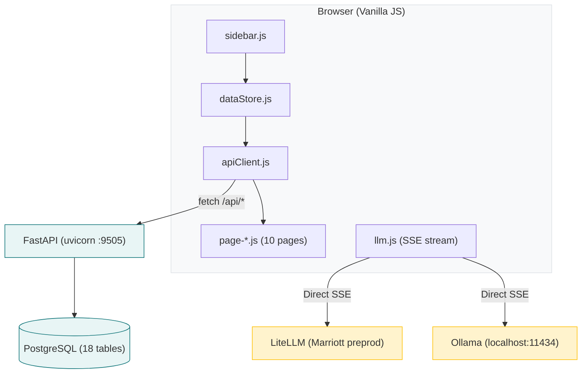
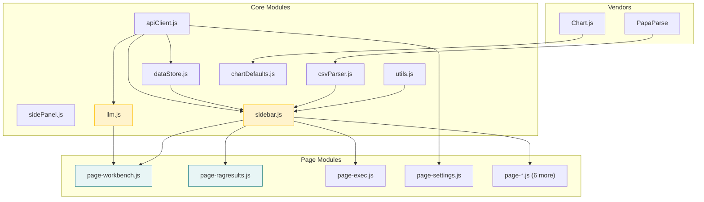
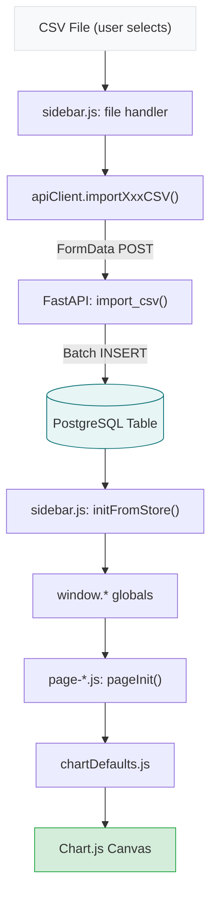

# Marriott AI Dashboard — Architecture Documentation

> System-level architecture for the full application stack.
>
> **Related docs:** [Workbench Guide](WORKBENCH-GUIDE.md) | [API Routes](API-ROUTES.md) | [Security Audit](SECURITY-AUDIT.md) | [Recommendations](RECOMMENDATIONS.md)

## System Architecture Diagram



**Key architectural note:** LLM calls bypass the backend entirely. The browser sends requests directly to LiteLLM/Ollama with the API key in the `Authorization` header. The FastAPI backend only serves data and configuration.

---

## Full Stack Overview

| Layer | Technology | Details |
|-------|-----------|---------|
| **Frontend** | Vanilla JS + Jinja2 | 10 page templates, 13 JS modules, no build step |
| **Backend** | FastAPI + Uvicorn | 15 API routers, ~67 endpoints, port 9505 |
| **Database** | PostgreSQL + asyncpg | 18 tables, connection pool (min=2, max=10) |
| **LLM** | LiteLLM (Marriott) + Ollama (local) | Direct browser-to-LLM calls via SSE streaming |
| **Config** | python-dotenv (.env) | Loaded in config.py, subset served to frontend |

---

## Configuration System

### Backend Config (`v2/config.py`)

Loads `v2/.env` via `python-dotenv`, then reads environment variables with defaults:

| Variable | Env Var | Default |
|----------|---------|---------|
| `ENV_NAME` | `ENV_NAME` | `"development"` |
| `APP_PORT` | `APP_PORT` | `9505` |
| `APP_HOST` | `APP_HOST` | `"0.0.0.0"` |
| `DB_HOST` | `DB_HOST` | `"localhost"` |
| `DB_PORT` | `DB_PORT` | `"5432"` |
| `DB_NAME` | `DB_NAME` | `"marriott_dashboard"` |
| `DB_USER` | `DB_USER` | `"dashboard"` |
| `DB_PASSWORD` | `DB_PASSWORD` | `"dashboard123"` |
| `DATABASE_URL` | `DATABASE_URL` | Constructed from DB_* vars |
| `MIN_POOL_SIZE` | `DB_MIN_POOL` | `2` |
| `MAX_POOL_SIZE` | `DB_MAX_POOL` | `10` |
| `OLLAMA_ENDPOINT` | `OLLAMA_ENDPOINT` | `"http://localhost:11434"` |
| `LITELLM_API_BASE` | `LITELLM_API_BASE` | `"https://tip-ai.emerging-tech.mdev1.cld.marriott.com/tip-ai/v1/preprod/litellm"` |
| `LITELLM_API_KEY` | `LITELLM_API_KEY` | `""` |
| `LITELLM_MODEL` | `LITELLM_MODEL` | `"claude-3-5-sonnet-20241022"` |

Environment variables serve as **defaults**. LLM endpoints and API key can be overridden at runtime via the UI (stored in the `settings` table under key `llm_config`). The proxy reads DB settings first, falling back to env vars.

### Frontend Config

The endpoint `GET /api/config/frontend` returns only non-secret values:

```json
{ "env": "<ENV_NAME>" }
```

LLM endpoints, API keys, and model lists are never exposed to the browser. All LLM traffic is proxied through `/api/llm/*` endpoints (see `routers/llm_proxy.py`). LLM configuration is managed via `GET/PUT /api/llm/config`.

---

## Database Schema

### 16 Tables

| Table | Primary Key | Purpose |
|-------|------------|---------|
| `classification_rows` | `id SERIAL` | Guest message classifications with bucket, method, confidence |
| `taxonomy_data` | `id SERIAL` (UNIQUE `bucket_key`) | Intent taxonomy definitions (category, route, rag_mode) |
| `validation_data` | `id SERIAL` | Validation flag rows stored as JSONB |
| `prop_profile_data` | `id SERIAL` | Property profile data stored as JSONB |
| `prop_code_map` | `id_case TEXT` | Maps case IDs to property codes |
| `prop_catalog` | `marsha_code TEXT` | MARSHA product catalog with JSONB fields |
| `marsha_mapping` | `bucket_key TEXT` | Bucket-to-MARSHA field coverage mapping |
| `workbench_assessments` | `id SERIAL` | LLM assessment results (30+ columns) |
| `eval_test_cases` | `id TEXT` | Eval golden test cases with expected values |
| `eval_runs` | `run_id TEXT` | Eval run metadata (model, config, summary) |
| `eval_results` | `id SERIAL` | Eval individual results (FK to runs and test_cases) |
| `settings` | `key TEXT` | Arbitrary key-value config store (JSONB values) |
| `routing_rules` | `bucket_key TEXT` | Bucket-to-action routing rules |
| `aggregations` | `id TEXT` (default 'current') | Pre-computed dashboard aggregation data |
| `taxonomy_feedback` | `bucket_key TEXT` | Per-bucket human feedback (JSONB) |
| `message_feedback` | `message_key TEXT` | Per-message human feedback (JSONB) |
| `workbench_conversations` | `id TEXT` (UUID) | Workbench conversation metadata (property, case, intent, model) |
| `workbench_messages` | `id SERIAL` | Individual messages within conversations (FK to conversations, CASCADE) |

### Indexes

- `idx_cls_bucket` on `classification_rows(bucket_key)`
- `idx_cls_case` on `classification_rows(id_case)`
- `idx_tax_route` on `taxonomy_data(route)`
- `idx_tax_category` on `taxonomy_data(category)`
- `idx_pcm_code` on `prop_code_map(property_code)`
- `idx_wa_case`, `idx_wa_intent`, `idx_wa_property`, `idx_wa_timestamp` on `workbench_assessments`
- `idx_etc_tags` (GIN) on `eval_test_cases(tags)`
- `idx_etc_property` on `eval_test_cases(property)`
- `idx_er_timestamp` on `eval_runs(timestamp DESC)`
- `idx_eres_run`, `idx_eres_tc` on `eval_results`
- `idx_wc_case`, `idx_wc_property`, `idx_wc_created` on `workbench_conversations`
- `idx_wm_convo` on `workbench_messages(conversation_id)`

### Key Relationships

- `eval_results.run_id` -> `eval_runs.run_id` (CASCADE DELETE)
- `eval_results.test_case_id` -> `eval_test_cases.id` (CASCADE DELETE)
- `workbench_messages.conversation_id` -> `workbench_conversations.id` (CASCADE DELETE)
- `classification_rows` UNIQUE on `(id_case, message_index)`

---

## Frontend Module Dependency Graph

All modules use global variables on `window.*` (no ES module imports). Load order is
critical and defined in `base.html`.



### Key Module Responsibilities

| Module | Responsibility |
|--------|---------------|
| `apiClient.js` | ~40 methods wrapping all `/api/*` fetch calls |
| `dataStore.js` | In-memory cache layer with cross-tab sync via BroadcastChannel |
| `sidebar.js` | Global data hydration, CSV upload handling, routing rules UI |
| `llm.js` | LLM system prompt construction, SSE streaming, Ollama/LiteLLM calls |
| `utils.js` | `escapeHtml`, `showToast`, counting/formatting helpers |
| `csvParser.js` | PapaParse wrapper with BOM stripping and value normalization |
| `chartDefaults.js` | Chart.js configuration, chart creation/destruction helpers |
| `sidePanel.js` | Slide-out detail panel management |

---

## LLM Integration Flow

> For the complete workbench message pipeline, routing decision engine, response card anatomy, assessment system, and brand voice integration, see **[Workbench Guide](WORKBENCH-GUIDE.md)**.

**Summary:** All LLM calls are proxied through the backend via `routers/llm_proxy.py`. The browser calls `/api/llm/chat` (streaming) or `/api/llm/chat/sync` (non-streaming), and the proxy forwards to LiteLLM or Ollama with server-side API keys. The system prompt is built client-side by `buildSystemPrompt()` in `llm.js`, incorporating property data, routing rules, and brand voice settings.

- **LiteLLM:** SSE format (`data: ` prefix lines), parsed by `streamSSE()` in `llm.js`
- **Ollama:** NDJSON format (JSON-per-line), parsed by `streamNDJSON()` in `llm.js`
- Unified entry point: `callLLM(messages, model, targetDiv, backend)` for streaming, `callLLMSync(backend, model, messages)` for non-streaming
- Both use `targetDiv.textContent` (safe against XSS) for real-time display
- Both support cancellation via `AbortController`
- API keys never leave the server — managed via `GET/PUT /api/llm/config` (stored in `settings` table)

---

## Data Flow: CSV Upload to Chart Rendering



### Cross-Tab Synchronization

`dataStore.js` uses `BroadcastChannel('dashboard_data_updates')` to notify other
tabs when data changes. Receiving tabs invalidate their in-memory cache and re-fetch
from the API on next access.

---

## Middleware Stack

1. **CORSMiddleware** — `allow_origins=["*"]`, `allow_credentials=True`,
   `allow_methods=["*"]`, `allow_headers=["*"]`
2. **CacheStaticMiddleware** (custom) — Sets `Cache-Control: no-cache, no-store,
   must-revalidate` on all `/static/` paths

No authentication middleware. No rate limiting. No request logging middleware.
