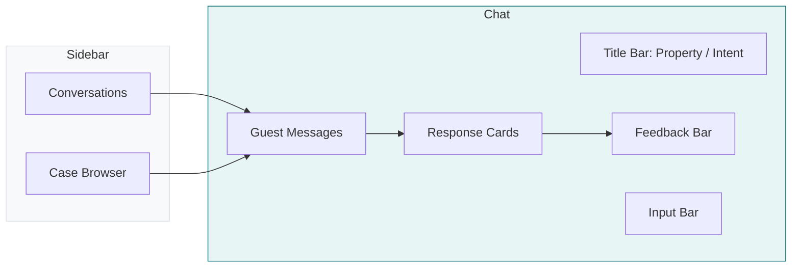
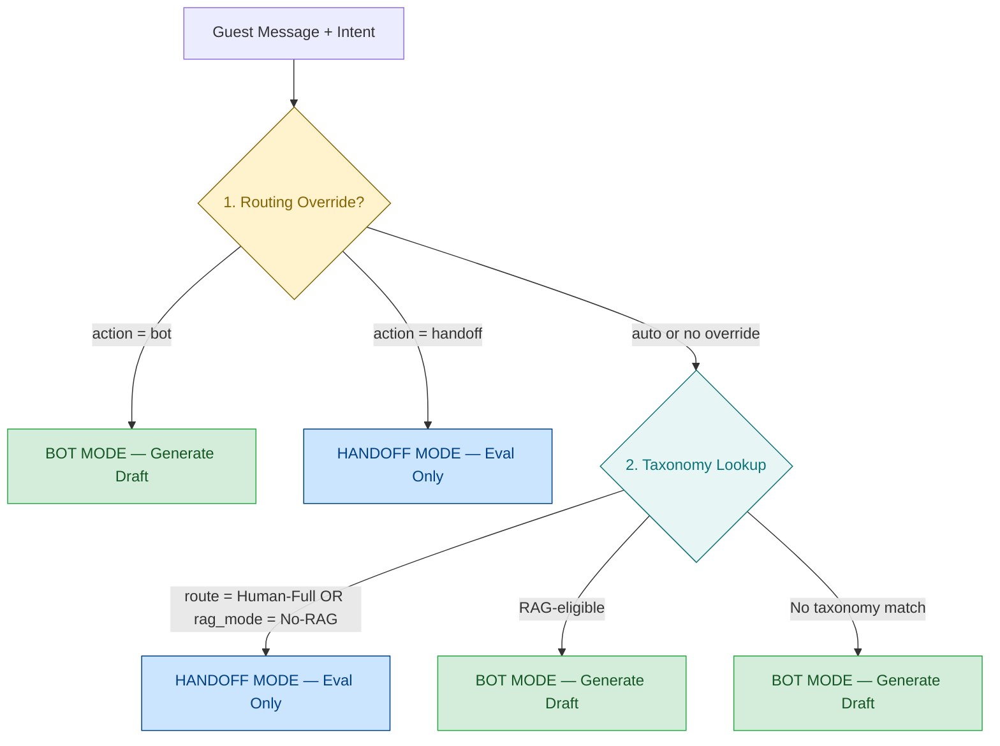
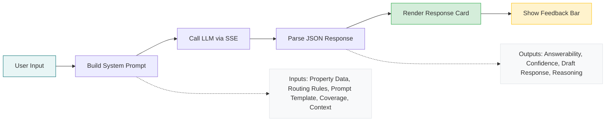
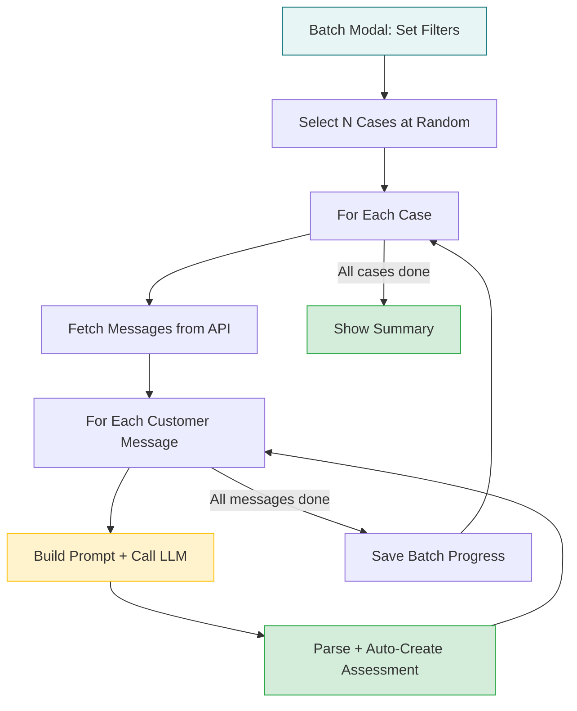
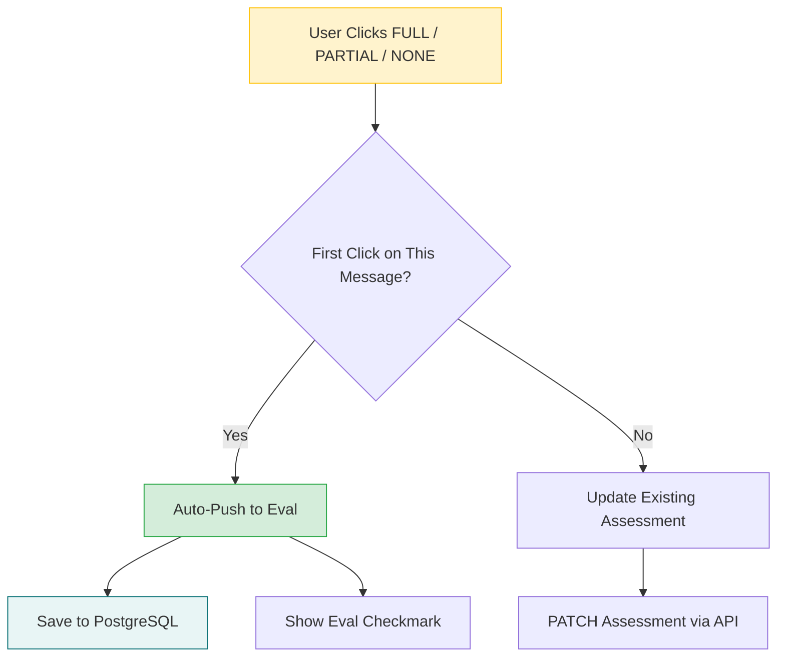
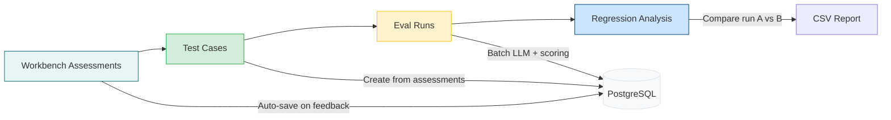
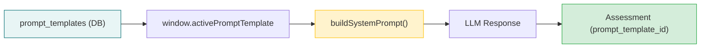
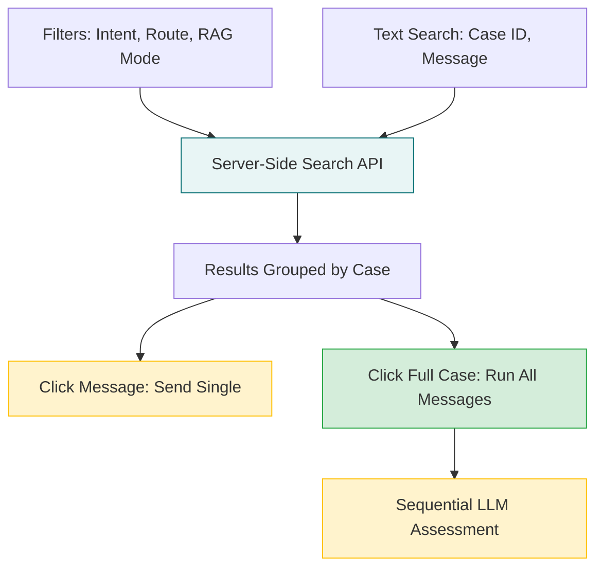
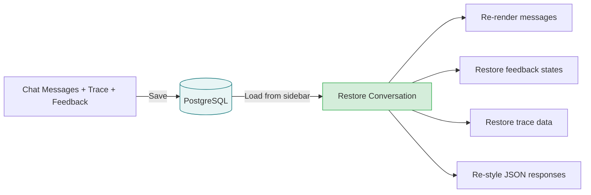
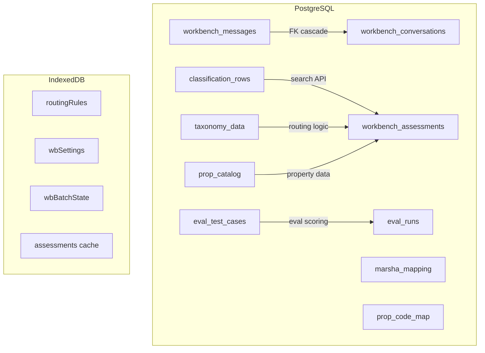

# AI Workbench — Technical Reference

> Comprehensive guide to the AI Workbench system: routing logic, assessment pipeline, evaluation framework, and supporting services.
>
> **Related docs:** [Architecture](ARCHITECTURE.md) | [API Routes](API-ROUTES.md) | [Security Audit](SECURITY-AUDIT.md)

---

## Table of Contents

1. [System Overview](#1-system-overview)
2. [Routing Decision Engine](#2-routing-decision-engine)
3. [Message Processing Pipeline](#3-message-processing-pipeline)
4. [Response Card Reference](#4-response-card-reference)
5. [Assessment & Feedback System](#5-assessment--feedback-system)
6. [Evaluation Framework](#6-evaluation-framework)
7. [Prompt Template System](#7-prompt-template-system)
8. [Case Browser](#8-case-browser)
9. [Conversation Persistence](#9-conversation-persistence)
10. [Data Storage Reference](#10-data-storage-reference)
11. [File Reference](#11-file-reference)
12. [Intent Readiness Page](#12-intent-readiness-page)

---

## 1. System Overview

The AI Workbench is an interactive testing environment for evaluating RAG (Retrieval-Augmented Generation) answerability across Marriott properties. It sends guest messages to an LLM with property-specific context and evaluates the quality of automated responses.



**Key components:**
- **Title bar** — Property selector, intent selector, config and sidebar toggles
- **Chat area** — Guest messages, bot/handoff response cards with inline feedback
- **Sidebar** — Conversation history (top zone) and case browser (bottom zone), resizable via drag handle
- **Trace tab** — Detailed inspection of system prompt, metadata, and raw LLM response

---

## 2. Routing Decision Engine

The routing engine determines whether the bot should generate a draft response (BOT mode) or hand off to a human associate (HANDOFF mode). This decision is made per-message based on the classified intent.

### Decision Flow



### Priority Summary

| Priority | Source | Mechanism |
|----------|--------|-----------|
| 1 (highest) | Manual override | `routingRules[bucket].action` — set in Config modal |
| 2 | Taxonomy default | `taxonomyLookup[bucket].route` / `.rag_mode` — from CSV import |
| 3 (fallback) | No taxonomy match | Defaults to BOT (generate draft) |

### Override Indicator

When a routing override is active, response cards display a yellow **Override** badge. Assessments record `route_override: true` for audit purposes.

### Implementation

| Function | File | Line |
|----------|------|------|
| `shouldGenerateDraft(bucketKey)` | `sidebar.js` | 228 |
| `getEffectiveRouting(bucketKey)` | `sidebar.js` | 241 |
| `setRoutingRule(bucketKey, action)` | `sidebar.js` | 252 |

---

## 3. Message Processing Pipeline

### Single Message Flow



### System Prompt Construction

Built by `buildSystemPrompt()` in `llm.js`:

| Step | Input | What it does |
|------|-------|-------------|
| Property data | `propCatalogMap[marshaCode]` | Extracts fields mapped to this bucket via MARSHA mapping |
| Coverage analysis | `marshaMapping[bucket]` | Determines coverage tier (High/Medium/Low/Unmapped) and gap list |
| Routing decision | `shouldGenerateDraft()` | Sets draft vs. eval-only instruction set |
| Prompt template | `window.activePromptTemplate` (from DB) | Provides rules, schema, and voice for the system prompt |
| Ambiguity context | Prior messages | Includes conversation history if message is a follow-up |

### Batch Run Flow

Random batch and case runs follow the same pipeline but loop through multiple messages automatically:



---

## 4. Response Card Reference

### BOT Card (draft mode)

The bot generates a full draft response for the guest.

| Element | Description |
|---------|-------------|
| **Answerability pill** | Colored badge: green (FULL), yellow (PARTIAL), red (NONE) + confidence % |
| **Route tags** | RAG mode, route, override badge (if active), voice profile label |
| **Timestamp** | When the response was generated |
| **Draft response** | The LLM-generated guest-facing reply |
| **Missing data note** | Shown for PARTIAL — what data was unavailable |
| **Feedback bar** | FULL/PARTIAL/NONE rating + Good/Needs work/Hallucinated quality rating |
| **Eval indicator** | Green checkmark after assessment is auto-saved |
| **Reviewed badge** | Green "✓ FULL · Send as-is" badge (top-right) after any feedback is given — updates live, never duplicates |

### Conversational (Non-JSON) Card

When the LLM returns a plain conversational response (e.g. "Hello! How can I help?") instead of structured JSON, the card renders as plain text but still includes the full feedback bar so reviewers can rate it.

### HANDOFF Card (eval-only mode)

The message is routed to a human associate. The LLM still evaluates answerability and provides a suggested response.

| Element | Description |
|---------|-------------|
| **HANDOFF TO ASSOCIATE** | Blue header with route info and voice profile |
| **Override badge** | Yellow badge if routing was manually overridden |
| **Eval pill** | Answerability + confidence from LLM evaluation |
| **Suggested response** | Draft the associate can use or modify |
| **Missing data** | What information the associate should look up |
| **Assessment Details** | Expandable: reasoning, intents, bucket correctness |
| **Feedback bar** | Same rating controls as BOT card |

### Header Tag Reference

| Tag | Source | Meaning |
|-----|--------|---------|
| `FULL 92%` | LLM response | Answerability level + confidence (colored pill) |
| `RAG-only` | `taxonomyLookup[bucket].rag_mode` | RAG mode from taxonomy |
| `Auto` | `taxonomyLookup[bucket].route` | Route from taxonomy |
| **Override** | `routingRules[bucket]` | Yellow badge — routing was manually overridden |
| **Voice profile** | Voice profile config | Active profile name with microphone icon |
| `12:43 PM` | Timestamp | When the response was generated |

---

## 5. Assessment & Feedback System

### Auto-Save Flow

Assessments are created automatically when a user provides feedback on a response card.



### Assessment Creation Paths

| # | Path | Trigger | How |
|---|------|---------|-----|
| 1 | Inline feedback | Click rating button on response card | Auto-pushed on first answerability click |
| 2 | Manual log | "Log Assessment" button | Uses last message + trace + feedback form |
| 3 | Random batch | "Run Batch" from modal | Auto-created per message during batch |
| 4 | Case browser | "Full Case" button on case card | Auto-created per message during case run |

### Assessment Record Fields

| Category | Fields |
|----------|--------|
| **Identity** | property, case_id, message_index, intent |
| **LLM Result** | answerability, confidence, draft_response, reasoning, missing_data, none_reason |
| **Intent Analysis** | detected_intents, is_multi_intent, bucket_seems_correct, suggested_bucket |
| **Context** | ambiguous, ambiguity_reason, conversation_context |
| **Coverage** | coverage_tier, coverage_pct, mapped_fields, fields_found_count |
| **Routing** | route_mode, route, rag_mode, **route_override** |
| **Human Feedback** | fb_answerability, fb_response, fb_bucket, fb_suggested_bucket, fb_corrected_response, fb_failure_reasons (JSONB), fb_hallucination_severity, fb_safe_to_send, fb_suggested_new_bucket, fb_confidence_correct, fb_intents_correct, fb_missing_intents, fb_reviewer_id, fb_timestamp, notes |
| **Metadata** | timestamp, model, backend, prompt_version, system_prompt, raw_llm_response |

### Response Usability Scale

The four-tier `fb_response` scale replaces the old good/needs_work/hallucinated values:

| Tier | Meaning | Expanded Section |
|------|---------|-----------------|
| **send_as_is** | Response is ready to send to the guest without changes | No |
| **minor_edit** | Small tweaks needed (typo, tone adjustment, minor detail) | Yes — failure reasons + corrected response |
| **major_rewrite** | Significant rewriting needed (wrong focus, missing key info) | Yes — failure reasons + corrected response |
| **discard** | Response is unusable and should not be shown to guest | Yes — failure reasons |

### Failure Reason Taxonomy

When minor_edit, major_rewrite, or discard is selected, reviewers pick all applicable failure reasons:

- **Hallucinated facts** — response contains invented information (shows severity toggle: Minor/Major)
- **Wrong tone or style** — doesn't match expected brand voice
- **Too long for SMS** — exceeds channel constraints
- **Missing information** — doesn't address part of the guest's question
- **Incorrect information** — contains factual errors from the data
- **Wrong language** — response language doesn't match guest language
- **Safety/compliance concern** — potential regulatory or policy issue
- **Inappropriate content** — PII leak, legal promise, medical advice

### Deflection Safety

Every response card has a **"Safe to auto-send?"** toggle (Yes/No), stored as `fb_safe_to_send`. This is independent of usability — a response might need a minor edit but still be safe for auto-deflection, or be send-as-is quality but unsafe due to compliance concerns.

### Classification Feedback (Advanced Section)

A collapsible "Advanced" section on each response card and in the eval feedback panel provides classification-level feedback:

- **Confidence correct?** (Yes/No) — was the LLM's HIGH/MEDIUM/LOW confidence rating appropriate?
- **Detected intents correct?** (Yes/No) — did the LLM identify all topics in the message? Always visible in the Advanced section.
- **Missing intents** (text field, shown when intents = No) — what topics were missed?

**Multi-intent behavior:** When the LLM flags `is_multi_intent: true`, the "Intents correct?" feedback is promoted to the main feedback button row (alongside Answerability, Usability, Bucket, Safe?) for quick access. It remains in the Advanced section regardless, so single-intent messages can still get intents feedback if needed.

### Bucket Feedback

**Correct/Wrong** buttons on each response card. When "Wrong" is clicked:
- **Workbench:** Opens the intent search modal (same fuzzy taxonomy search used in the top bar)
- **Eval page:** Shows an inline suggested bucket input with autocomplete from `window.taxonomyLookup`

The selected/typed bucket is stored as `fb_suggested_bucket`.

### Reviewer Tracking

`fb_reviewer_id` is automatically stamped from the reviewer name configured on the Settings page. Every feedback action records who reviewed it and when (`fb_timestamp`).

### Feedback Analytics

On the Results tab summary strip:
- **Send-as-is rate** = deflection candidate rate (% of responses ready without edits)
- **Safe-to-send rate** = safety clearance rate (% of responses cleared for auto-deflection)
- **Reviewed count** = total assessments with feedback
- **Top failure reason** = most common failure reason across reviewed responses

### Feedback Persistence

Feedback is persisted in two places:
1. **Assessment record** — all `fb_*` fields in `workbench_assessments`
2. **Conversation message** — `feedback` JSONB column in `workbench_messages` (restored on conversation reload)

---

## 6. Evaluation Framework

The eval framework (RAG Results page) enables systematic testing and regression detection.



### Test Cases

Golden test cases with expected values:
- **Required:** message, intent, property
- **Optional:** expected_answerability, expected_bucket, expected_ambiguous
- **Auto-tagged:** by property and intent
- **Sources:** Manual entry, generated from assessments, generated from classification data

### Eval Run Scoring

Each test case is re-evaluated through the LLM and scored on 8 metrics:

| Metric | What it measures | Scale |
|--------|-----------------|-------|
| Answerability match | LLM result vs. expected | 0 or 1 |
| Bucket match | Bucket correctness check | 0, 0.5, or 1 |
| Ambiguity match | Ambiguity detection accuracy | 0 or 1 |
| Coverage | Property data coverage for this bucket | 0–100% |
| Latency | Response time vs. threshold | Pass/Fail |
| Relevance | LLM-judged response relevance | 0.0–1.0 |
| Faithfulness | LLM-judged factual accuracy | 0.0–1.0 |
| Hallucination | LLM-judged hallucination risk | 0.0–1.0 |

A test case **passes** when all scores meet their configured thresholds.

### Eval Result Detail Modal

Clicking a result row opens a detail modal with five sections:

| Section | Contents |
|---------|----------|
| **Test Case Input** | Original guest message, intent/bucket, property code, and expected values (answerability, bucket, ambiguity) from the test case definition |
| **Generation Output** | The LLM-generated draft response, answerability classification, confidence score, reasoning, and missing data notes |
| **Judge Scores** | Relevance, faithfulness, and hallucination scores from the LLM judge, each with the judge's reasoning explaining why it assigned that score |
| **Pass/Fail Summary** | Tiered pass/fail badges (Classification, Response, Readiness) with per-metric pass/fail breakdown showing which thresholds were met or missed |
| **Reviewer Feedback** | Full enterprise feedback controls: answerability override, usability rating, bucket correctness, safety toggle, failure reasons, corrected response textarea, and advanced classification feedback |

**Judge reasoning:** The LLM judge (`rrScoreLLMMetric`) returns both a numeric score and a textual reason for each metric. Reasons are stored in `details.judge_reasons` (JSONB) on each eval result. The modal displays each reason below its corresponding score. Older results without judge reasons display scores only — no errors or blank panels.

**Feedback auto-save:** All feedback controls in the modal persist immediately on click via `PATCH /api/eval/results/{id}`. No manual save step is needed. The `updateEvalResult()` API client method sends partial updates to the `EvalResultUpdate` Pydantic model on the backend.

### Regression Analysis

Compare two eval runs to detect regressions:
- Select baseline run (A) and comparison run (B)
- Per test case: flag regressions (A passed, B failed), improvements (A failed, B passed)
- Compute metric deltas across runs
- Export regression report as CSV

---

## 7. Prompt Template System

Full prompt structure (rules, schema, voice) stored as named, DB-backed templates. Each template is tracked on every assessment and filterable in intent readiness exports.

### Architecture



### Template Fields

| Field | Purpose |
|-------|---------|
| `name` | Display name (e.g. "Default", "v2-no-hedging") |
| `description` | Optional description |
| `rules_rag` | Rules block for RAG-eligible intents |
| `rules_handoff` | Rules block for human-routed intents |
| `json_schema` | Output JSON schema string |
| `voice_instructions` | Voice/tone instructions |
| `conversational_fallback` | How to handle off-topic/casual messages |
| `is_default` | Whether this is the default template |

### API Endpoints

| Method | Path | Purpose |
|--------|------|---------|
| GET | `/api/workbench/templates` | List all templates |
| GET | `/api/workbench/templates/{id}` | Get one template |
| POST | `/api/workbench/templates` | Create template |
| PUT | `/api/workbench/templates/{id}` | Update template |
| DELETE | `/api/workbench/templates/{id}` | Delete (non-default only) |
| POST | `/api/workbench/templates/{id}/clone` | Clone a template |
| PUT | `/api/workbench/templates/{id}/default` | Set as default |

### UI: Prompt Template Modal

Opened from the Config panel (replaces old "Voice Profile" trigger). Contains:

1. **Voice** section — voice instructions textarea + conversational fallback textarea + presets (same as before)
2. **Rules & Schema** section (collapsible) — RAG rules, handoff rules, JSON schema textareas with "Reset to default" buttons
3. **Saved Templates** section — list of DB-backed templates with Load/Clone/Rename/Delete/Update actions

### How `buildSystemPrompt()` Uses Templates

`window.activePromptTemplate` is set by the template selector. `buildSystemPrompt()` reads:
- `tpl.rules_rag` / `tpl.rules_handoff` — falls back to `DEFAULT_RULES_RAG` / `DEFAULT_RULES_HANDOFF`
- `tpl.json_schema` — falls back to `DEFAULT_JSON_SCHEMA`
- Voice comes from textarea (which is populated from template on load)

Dynamic per-call sections (capabilities, property data, prompt assembly) stay in JS — only authored text blocks move to templates.

### Assessment Tracking

Every assessment now stores:
- `prompt_version` — template name (string)
- `prompt_template_id` — template ID (for precise tracking)

Both appear in CSV exports and intent readiness data.

### Voice Presets

Quick-fill buttons populate the voice textarea (same presets as before: Warm & Friendly, Professional, Casual, Luxury, SMS/Concise, Bonvoy Assistant).

### Migration

On first load, any existing IndexedDB voice profiles (`_wbPromptVersions`) are migrated to DB templates with default rules/schema + the saved voice text. The old IndexedDB key is cleared.

### Default Template Seed

On DB init, if `prompt_templates` is empty, a "Default" template is seeded with the hardcoded rules/schema/voice values from llm.js.

---

## 8. Case Browser

Server-side search interface for finding and loading cases into the chat.



### Filters

| Filter | Source | Type |
|--------|--------|------|
| **Text search** | Case ID, message text | Free text (ILIKE) |
| **Intent** | `taxonomyLookup` keys | Dropdown |
| **Route** | `taxonomyLookup[].route` | Dropdown |
| **RAG Mode** | `taxonomyLookup[].rag_mode` | Dropdown |

All filter dropdowns populate from taxonomy data (lightweight, no bulk data fetch). At least one filter is required to search.

### Search Endpoint

`GET /api/classification/search` — Server-side filtered query with optional taxonomy join. Returns max 500 CUSTOMER messages, grouped by case on the client.

### Case Card Elements

- **Case header:** Case ID (monospace), property code, filtered message count, "Full Case" button
- **Bucket badges:** Unique intents found in the filtered results for this case
- **Message rows:** Click to send single message through LLM; assessed messages show colored dots
- **Full Case button:** Fetches ALL messages via `GET /api/classification/case/{id}` and runs each sequentially
- **Assessed cases:** Dimmed to highlight unassessed work

### Random Batch Modal

Full filter suite for batch evaluation runs:
- Include/exclude buckets (multi-select)
- Route and RAG mode filters
- Property filter
- Batch size (1–50)
- Live match count updated on filter change

---

## 9. Conversation Persistence



### What is Saved

| Data | Storage | Restored on Load |
|------|---------|-----------------|
| Messages (role, content) | PostgreSQL `workbench_messages` | Full chat re-rendered |
| Parsed LLM response | `parsed_response` JSONB column | Response cards re-styled |
| Trace data | `trace` JSONB column | Trace tab available |
| Feedback state | `feedback` JSONB column | Button highlights + "Eval" indicator |
| Conversation metadata | PostgreSQL `workbench_conversations` | Property, case ID, intent, model |

### Conversation Restore Process

1. Fetch conversation + all messages from API
2. Re-render each message with proper styling
3. For assistant messages without `parsed_response`, attempt JSON extraction from raw content
4. Restore feedback button states from saved `feedback` object
5. Map message IDs to DOM elements for subsequent feedback updates

### Sidebar Display

- Cards with label, relative timestamp ("2h ago"), preview text
- Active conversation highlighted in teal
- Delete button visible on hover
- Draggable divider between conversations and case browser zones

---

## 10. Data Storage Reference

### Data Architecture



### PostgreSQL Tables (source of truth)

| Table | Purpose | Key Fields |
|-------|---------|-----------|
| `classification_rows` | Imported guest messages | id_case, message_text, bucket_key, method |
| `taxonomy_data` | Intent definitions | bucket_key, route, rag_mode, category |
| `workbench_conversations` | Chat sessions | id, label, property_code, case_id, model |
| `workbench_messages` | Messages within conversations | role, content, parsed_response, trace, feedback |
| `workbench_assessments` | Evaluation results (40+ cols) | property, answerability, route_override, fb_* |
| `prop_catalog` | Property data for RAG | marsha_code, JSONB fields |
| `marsha_mapping` | Bucket to property field map | bucket_key, fields, coverage_tier |
| `prop_code_map` | Case ID to property code | id_case, property_code |
| `eval_test_cases` | Golden test cases | message, intent, expected_answerability |
| `eval_runs` | Eval run metadata | run_id, model, summary |
| `eval_results` | Individual eval scores | test_case_id, run_id, scores |

> For complete schema with all 18 tables, indexes, and relationships, see [Architecture — Database Schema](ARCHITECTURE.md#database-schema).

### IndexedDB (browser cache)

| Key | Purpose | Synced to |
|-----|---------|-----------|
| `routingRules` | User routing overrides | Settings API |
| `wbSettings` | Model, backend, API key | Settings API |
| `wbBatchState` | Batch progress for resume | Local only |
| `workbenchAssessments` | Assessment cache | Workbench API |
| `evalTestCases` | Test case definitions | Eval API |
| `evalRuns` | Eval run results | Eval API |

---

## 11. File Reference

| File | Responsibility | Approx. Lines |
|------|---------------|--------------|
| `static/js/page-workbench.js` | Chat UI, feedback, batch runs, case browser | ~4,250 |
| `static/js/llm.js` | System prompt builder, LLM proxy calls (`callLLM`, `callLLMSync`, `fetchModels`) | ~370 |
| `routers/llm_proxy.py` | LLM proxy — routes all LLM calls through backend, keeps API keys server-side | ~230 |
| `static/js/sidebar.js` | Routing rules, data loading, globals | ~850 |
| `static/js/page-ragresults.js` | Eval framework, test cases, regressions | ~2,650 |
| `static/js/apiClient.js` | All API call methods | ~300 |
| `static/js/dataStore.js` | Settings API cache layer, cross-tab sync | ~220 |
| `routers/conversations.py` | Conversation CRUD + message feedback | ~160 |
| `routers/classification.py` | Case search + CSV import | ~330 |
| `routers/workbench.py` | Assessment CRUD | ~160 |
| `routers/eval_testcases.py` | Test case CRUD | ~120 |
| `routers/eval_runs.py` | Eval run CRUD + comparison | ~200 |
| `templates/pages/workbench.html` | Workbench page template | ~340 |
| `templates/pages/ragresults.html` | Eval page template | ~280 |

> For the full endpoint inventory across all 15 routers, see [API Routes](API-ROUTES.md).

---

## 12. Intent Readiness Page

The Intent Readiness page (`/readiness`) provides a per-property go-live review of every intent. It aggregates data from taxonomy, MARSHA coverage, workbench assessments, and eval results into a single view.

### Purpose

Before a property goes live, reviewers need to confirm each intent is ready — meaning it has adequate MARSHA coverage, example messages pass assessment, and eval scores meet thresholds. This page centralizes that decision.

### Data Flow

```
Taxonomy → base intent list (bucket_key, category, route, rag_mode)
MARSHA Mapping → coverage_pct, coverage_tier, coverage_gaps per intent
Workbench Assessments → up to 2 recent example messages per intent+property
Eval Results → averaged ansMatch/relevance/faithfulness per intent+property
Intent Readiness table → ready/not_ready/no_data status per property+intent
```

All data loads in 3 SQL queries (no N+1) via `GET /api/readiness/intents?property=X`.

### Database Table

```sql
intent_readiness (
    property TEXT NOT NULL,
    intent   TEXT NOT NULL,
    status   TEXT NOT NULL DEFAULT 'no_data',  -- ready | not_ready | no_data
    reviewer TEXT DEFAULT '',
    notes    TEXT DEFAULT '',
    updated_at TIMESTAMPTZ DEFAULT NOW(),
    PRIMARY KEY (property, intent)
)
```

### API Endpoints

| Method | Path | Purpose |
|--------|------|---------|
| `GET` | `/api/readiness?property=X` | Raw readiness rows for a property |
| `PUT` | `/api/readiness` | Upsert a single readiness decision |
| `GET` | `/api/readiness/intents?property=X` | Aggregated intent view (main data endpoint) |
| `GET` | `/api/readiness/export?property=X` | CSV export of all columns |
| `GET` | `/api/readiness/samples?property=X&intent=Y&count=5` | Real guest messages from classification data |
| `DELETE` | `/api/readiness/examples?property=X&intent=Y` | Bulk delete all examples for a property+intent |

### Example Generation Pipeline

The "Generate Examples" modal produces workbench-quality assessments using a two-step pipeline:

1. **Message sourcing** — Fetches real guest messages from `classification_rows` (joined with `prop_code_map` by property+intent). Falls back to LLM-generated messages only when no real data exists.
2. **Assessment** — Uses `buildSystemPrompt()` from `llm.js` (the same pipeline as the workbench) which includes property data, taxonomy, brand voice, and capabilities context. The LLM returns structured JSON with `answerability` (FULL/PARTIAL/NONE), `confidence`, `draft_response`, and `reasoning`.
3. **Persistence** — Saves results as `workbench_assessments` with full metadata, batch-tagged as `readiness-gen-YYYY-MM-DD`.

The modal auto-fills backend and model list from the LLM proxy (`/api/llm/models`). API keys are managed server-side via `/api/llm/config`.

### Delete Examples

- **Per-example**: Trash icon on each example card deletes a single assessment
- **Bulk per intent**: "Clear All" button in the examples section header deletes all assessments for that property+intent via `DELETE /api/readiness/examples`

### UI Features

- **Summary bar**: Ready / Not Ready / No Data counts + total intents + avg coverage %
- **Filters**: Property selector, route, RAG mode, status, text search
- **Accordion**: Intents grouped by category, sorted by route order within each group
- **Intent rows**: Bucket key, badges (route, RAG mode, coverage %), coverage bar, example messages with answerability/confidence badges, eval score badges, Ready/Not Ready toggle
- **Generate button**: Batch generation across selected properties × filtered intents × count per intent, with concurrency-limited workers and progress log
- **Delete**: Per-card trash icon + bulk "Clear All" per intent
- **Export**: Downloads full readiness report as CSV

### Files

| File | Purpose |
|------|---------|
| `routers/intent_readiness.py` | API router (6 endpoints) |
| `static/js/page-readiness.js` | Frontend logic |
| `templates/pages/readiness.html` | Page template |
