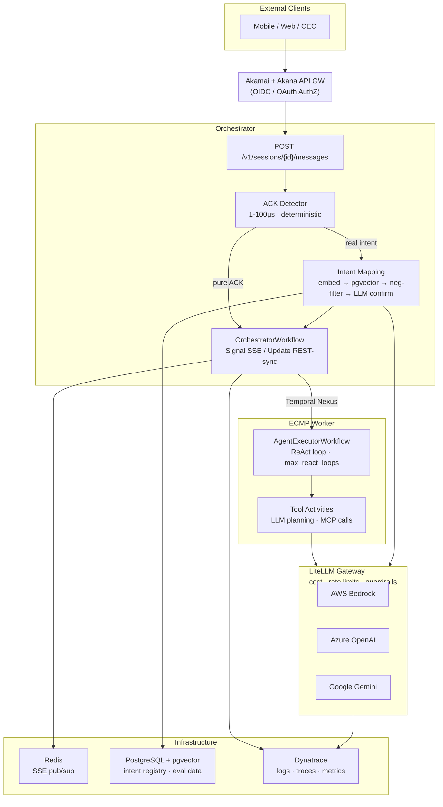

# 00 — Interview Prep Study Map

**Project:** TIP.AI v3 AI Engineering Interview Preparation
**Source:** ARB 713 TIPAI v3 (January 2026) + Live Codebase
**Tags:** #interview-prep #study-map

---

## Progress Tracker

| # | Module | Status | Topics |
|---|---|---|---|
| 1 | [[01-LLM-Foundations]] | ☐ | Transformers, KV cache, tokenization, LiteLLM, guardrails, hallucination |
| 2 | [[02-RAG-Architecture]] | ☐ | Chunking, embeddings, pgvector, hybrid search, agentic RAG, RAGAS |
| 3 | [[03-Agentic-AI-Patterns]] | ☐ | ReAct, intent mapping, ACK detection, Nexus multi-agent, HITL, slot filling |
| 4 | [[04-Temporal-Orchestration]] | ☐ | Determinism, activities, signals/updates, Nexus, fault tolerance |
| 5 | [[05-Observability-Guardrails]] | ☐ | OTel, Dynatrace, LLM metrics, guardrail architecture, Responsible AI |
| 6 | [[06-Enterprise-Architecture-MCP]] | ☐ | MCP, LiteLLM gateway, Zero Trust, ABAC, multi-tenant, scalability |
| 7 | [[07-ML-Evaluation-DeepEval]] | ☐ | DeepEval, LLM-as-judge, RAGAS metrics, A/B testing, dataset management |

Mark ☐ as ✅ as you complete each module.

---

## Learning Sequence

```
Week 1 — Foundations
  Day 1-2:  Module 1 (LLM Foundations)
  Day 3-4:  Module 2 (RAG Architecture)
  Day 5:    Module 4 (Temporal — skim for vocabulary)

Week 2 — Your Codebase Deep Dive
  Day 1-2:  Module 3 (Agentic AI Patterns)
  Day 3:    Module 4 (Temporal — full depth)
  Day 4-5:  Module 5 (Observability & Guardrails)

Week 3 — Advanced Topics + Practice
  Day 1-2:  Module 6 (Enterprise Architecture & MCP)
  Day 3-4:  Module 7 (ML Evaluation)
  Day 5:    Review all Q&A sections + mock interview
```

---

## Quick-Reference: The TIP.AI Architecture



---

## Quick-Reference: Key Numbers to Know Cold

### Bedrock Guardrail Results (ARB p. 35)

| Guardrail | Strength Used | Detection | False Alarm |
|---|---|---|---|
| Toxicity | Medium | **89%** | **22%** |
| Prompt Injection | Medium | **80%** | **13%** |
| PII | w/ SSN regex | **86%** | **5%** |
| Groundedness | 0.70 | **84%** | **5%** |
| Relevance | 0.33 | **91%** | **8%** |

### NFRs (ARB p. 15)

| Metric | Value |
|---|---|
| Transactions/min (avg) | 2,000–5,000 |
| Payload size | < 1 MB |
| Intent storage | < 10 GB (RDS) |
| Data retention | 12 months |
| Target users | Millions |
| Concurrent (initial) | 1,000 |
| Regions | US-E, US-W, EU-W |

### Stack Versions (ARB Software Inventory)

| Component | Version | Role |
|---|---|---|
| `temporalio` | 1.20.0 | Workflow orchestration |
| `langchain` | 0.3.10 | LLM application framework |
| `openai` | 1.56.0 | LLM client |
| `transformers` | 4.45.2 | Embeddings, NLP models |
| `tiktoken` | 0.9.0 | Tokenizer |
| `fastapi` | 0.115.6 | API framework |
| `redis` | 5.3.1 | Pub/Sub, caching |
| `psycopg` | 3.2.3 | PostgreSQL adapter |
| `opentelemetry-api` | 1.39.0 | Observability |
| `pandas` | 2.2.3 | Data analysis |

---

## Quick-Reference: System Design Patterns

| Pattern | Where Used | Why |
|---|---|---|
| **Deterministic fast-path** | ACK detector | Skip LLM for simple inputs; saves 500 tokens/call |
| **Negative embedding filter** | Intent registry | Filter false-positive intent matches without a classifier |
| **Activity isolation** | All I/O in Temporal | Keeps workflow deterministic; enables per-activity retry |
| **Pre-mode guardrails** | LiteLLM / Bedrock PII | Block PII before it reaches LLM provider logs |
| **Event sourcing** | Temporal workflow history | Immutable audit trail; replay-safe recovery |
| **Pub/Sub for SSE** | Redis → EventStreamReader | Decouple workflow events from HTTP streaming |
| **Update handler for HITL** | `send_message_and_wait` | Synchronous blocking on human/system approval |
| **Cross-namespace Nexus** | Orchestrator → Worker | Independent deployment, scaling, and fault isolation |
| **Intent graph** | Multi-intent decomposition | Handles compound requests ("book table AND get towels") |
| **LLM-as-judge** | Dashboard eval pipeline | Scalable semantic quality assessment |

---

## Quick-Reference: Interview Question Bank

### LLM Foundations
- Explain attention mechanism and its complexity
- What is the difference between temperature and top_p?
- How does KV cache work and why does it matter?
- What are the five Bedrock guardrail categories and their trade-offs?
- How would you defend against prompt injection?

### RAG
- RAG vs fine-tuning — when do you choose each?
- Explain your intent system's use of negative embeddings
- How does pgvector cosine similarity work?
- What causes low faithfulness and how do you fix it?
- What is MMR and when would you use it?

### Agentic AI
- Explain the ReAct pattern
- Why is ACK detection deterministic, not an LLM classifier?
- How does your multi-agent system use Temporal Nexus?
- How do you prevent an agent from running in an infinite loop?
- What is slot filling and how does it enable multi-turn conversations?

### Temporal
- What is the Temporal determinism requirement and why does it exist?
- Signal vs Update — when do you use each?
- Why use Nexus instead of HTTP calls between agents?
- How does Temporal handle long-running AI sessions?

### Observability & Guardrails
- What metrics do you monitor for an LLM-powered system?
- How does pre-mode PII blocking differ from post-mode?
- What is the OWASP LLM Top 10 and which are most relevant?
- How do you detect if your AI system is degrading over time?

### Enterprise Architecture
- What is MCP and why is it strategically important?
- How does LiteLLM prevent vendor lock-in?
- Explain ABAC vs RBAC for AI systems
- How do you design a multi-tenant AI platform?

### Evaluation
- What is LLM-as-judge and its failure modes?
- Explain the four RAGAS metrics
- How do you handle evaluation without a single ground truth?
- Walk me through your evaluation pipeline

---

## Quick-Reference: Codebase Map

| What You're Explaining | File |
|---|---|
| ACK detection logic | `orchestrator/app/intent_mapping/ack_detector.py` |
| Full session/intent orchestration | `orchestrator/app/workflows/orchestrator_workflow.py` |
| LLM + embedding calls | `orchestrator/app/llm/llm.py` |
| Embedding service + async handling | `orchestrator/app/registry/embedding_service.py` |
| Intent registry + pgvector search | `orchestrator/app/registry/client.py` |
| Worker ReAct loop | `ecmp-worker/app/executor/workflow.py` |
| LLM planning activity | `ecmp-worker/app/executor/activities/tool_activities.py` |
| MCP client stub | `ecmp-worker/app/integration/mcp_client.py` |
| Intent YAML policy | `ecmp-worker/app/intents/general_ack.yaml` |
| Eval pipeline | `ecmp-dashboard/src/adapters/inbound/routers/eval_runner.py` |
| OTel config | `orchestrator/docker/otel-collector-config.yaml` |

---

## Reading List — Prioritized

### Must Read Before Interview

1. [Attention Is All You Need](https://arxiv.org/abs/1706.03762) — understand Q/K/V, position encoding
2. [ReAct paper](https://arxiv.org/abs/2210.11610) — the pattern your agent implements
3. [Temporal determinism constraints](https://docs.temporal.io/workflows#deterministic-constraints) — core constraint you work around
4. [OWASP LLM Top 10](https://owasp.org/www-project-top-10-for-large-language-model-applications/) — security vocabulary
5. [Building effective agents (Anthropic)](https://www.anthropic.com/research/building-effective-agents) — anti-patterns to avoid

### Read If Time Permits

6. [RAGAS paper](https://arxiv.org/abs/2309.15217) — your eval metrics
7. [FlashAttention paper](https://arxiv.org/abs/2205.14135) — performance optimization vocabulary
8. [Lost in the Middle](https://arxiv.org/abs/2307.03172) — context window positioning
9. [MCP specification](https://modelcontextprotocol.io/introduction) — the protocol you're implementing
10. [LLM-as-judge paper](https://arxiv.org/abs/2306.05685) — judge biases and mitigations

**Video Articles**
Attention All you need - https://www.youtube.com/watch?v=avjX3QrYkls

---

*Modules:*
[[01-LLM-Foundations]] | [[02-RAG-Architecture]] | [[03-Agentic-AI-Patterns]] | [[04-Temporal-Orchestration]] | [[05-Observability-Guardrails]] | [[06-Enterprise-Architecture-MCP]] | [[07-ML-Evaluation-DeepEval]]
