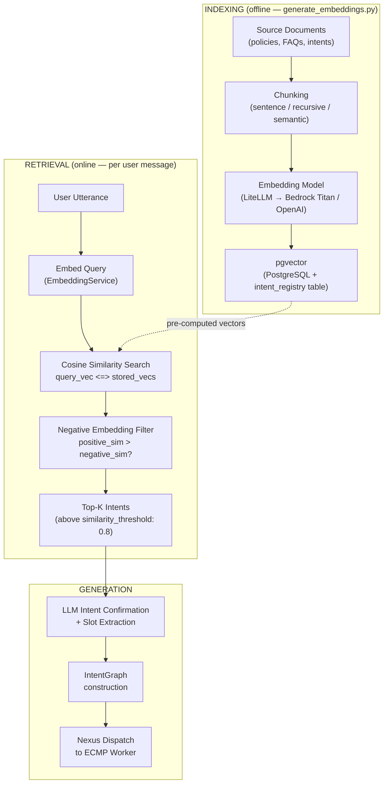
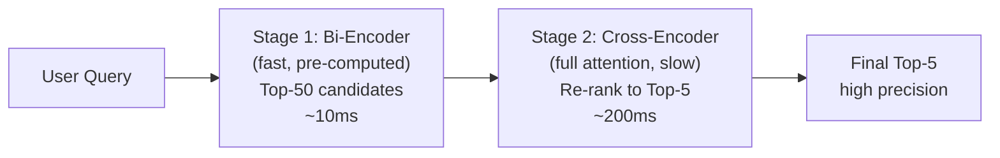
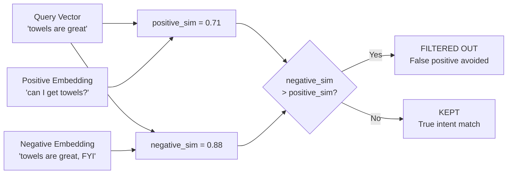

# Module 2 — RAG Architecture (Core + Advanced)

**Series:** [[00-Study-Map]] | **Prev:** [[01-LLM-Foundations]] | **Next:** [[03-Agentic-AI-Patterns]]
**Tags:** #interview-prep #rag #embeddings #vector-search #evaluation
**Anchored to:** `intent_search_service.py`, `embedding_service.py`, `registry/client.py`, ARB p. 29 (78% of use cases require RAG)

---

## 1. Why RAG Exists

Large language models have a **knowledge cutoff** and **no access to private/proprietary data**. Retrieval Augmented Generation solves this by fetching relevant external knowledge at inference time and injecting it into the prompt.

> From ARB p. 29: "approximately 78% of the [200+] use cases analyzed will require Retrieval Augmented Generation (RAG)... Developing 167 separate RAG use cases across platforms would require approximately 60,000 person-hours."

This is exactly why TIP.AI centralizes RAG as a shared platform capability rather than letting every team build their own.

---

## 2. The Core RAG Pipeline



### Step 1 — Document Chunking

Splitting source documents into retrievable units. Strategy matters enormously:

| Strategy | When to Use | Tradeoff |
|---|---|---|
| Fixed-size (512 tokens) | Simple, fast indexing | May split sentences mid-thought |
| Sentence-boundary | NLP-heavy text | Better semantic coherence |
| Recursive character split | General purpose (LangChain default) | Respects paragraph → sentence → word hierarchy |
| Semantic chunking | High-quality retrieval required | Expensive; splits on embedding similarity drops |
| Document-structure aware | PDFs, HTML, code | Preserves headings, tables, code blocks |

**Overlap**: Most strategies include a token overlap (e.g., 10%) between adjacent chunks to avoid losing context at boundaries.

### Step 2 — Embedding

Transform text into a dense vector in high-dimensional space where semantic similarity ≈ geometric proximity.

```python
# Your embedding_service.py wraps this
from app.llm import get_embedding, get_embeddings_batch

embedding: list[float] = await get_embedding("Can I get extra towels?")
# → [0.023, -0.145, 0.891, ...] (1536-dimensional for text-embedding-ada-002)
```

**Your `EmbeddingService`** handles the async/sync boundary problem:

```python
# embedding_service.py — running async LiteLLM calls from sync Temporal workflow context
def generate_intent_embeddings(self, semantics: dict) -> dict:
    with ThreadPoolExecutor(max_workers=1) as executor:
        future = executor.submit(self._run_async_in_new_loop, coro)
        result = future.result(timeout=30)
    return result

def _cleanup_loop(self, loop):
    # Cancel pending tasks to prevent LiteLLM async logger
    # from corrupting Temporal's thread pool
    pending = asyncio.all_tasks(loop)
    for task in pending:
        task.cancel()
```

### Step 3 — Vector Store and Indexing

Your stack uses **pgvector** (PostgreSQL extension) for vector storage, not a dedicated vector DB:

```sql
-- registry/client.py — cosine similarity search
SELECT id, name, embedding <=> $1::vector AS distance
FROM intent_registry
WHERE embedding IS NOT NULL
ORDER BY distance ASC
LIMIT $2;
```

`<=>` is pgvector's cosine distance operator. Lower = more similar.

**Why pgvector over Pinecone/Weaviate in your case:** intents are a relatively small, structured dataset (hundreds, not millions). pgvector co-locates vector search with your relational intent metadata, eliminating a separate service.

### Step 4 — Retrieval

```python
# registry/client.py — search_by_embedding_similarity
async def search_by_embedding_similarity(
    self, query_embedding: list[float], top_k: int = 5
) -> list[AgentIntent]:
    results = await self._cosine_search(query_embedding, top_k * 2)
    # Negative embedding filtering: exclude if negative_sim > positive_sim
    filtered = [
        r for r in results
        if r.negative_embedding is None
        or cosine_similarity(query_embedding, r.positive_embedding)
           > cosine_similarity(query_embedding, r.negative_embedding)
    ]
    return filtered[:top_k]
```

**Negative embedding filtering** is a key production pattern in your codebase: intents store both positive examples ("can I get towels?") and negative examples ("towels are great, just FYI") as separate embeddings. A query that is more similar to the negative embedding than the positive is filtered out — preventing false-positive intent matches.

### Step 5 — Generation with Context

```python
# Simplified — orchestrator builds prompt with retrieved context
system_prompt = f"""
You are a hotel concierge assistant.
Answer ONLY based on the following context:

{retrieved_chunks}

If the answer is not in the context, say you don't know.
"""
response = await get_completion(messages=[
    {"role": "system", "content": system_prompt},
    {"role": "user", "content": user_query}
])
```

---

## 3. Embedding Models

### Dense vs Sparse

| Type | Example Models | How It Works | Best For |
|---|---|---|---|
| **Dense** | text-embedding-ada-002, BGE, E5 | Neural network → single dense vector | Semantic similarity |
| **Sparse** | BM25, TF-IDF, SPLADE | Token frequency statistics | Keyword/exact match |

### Bi-Encoder vs Cross-Encoder

| Type | Architecture | Speed | Accuracy | Use Case |
|---|---|---|---|---|
| **Bi-encoder** | Encodes query and document independently | Fast (pre-compute docs) | Good | First-stage retrieval |
| **Cross-encoder** | Encodes query+document together (full attention) | Slow (can't pre-compute) | High | Re-ranking top-K results |

### Two-Stage Retrieval

**Production pattern (two-stage retrieval):**



1. Bi-encoder retrieves top-50 candidates (fast, approximate)
2. Cross-encoder re-ranks to top-5 (slow, high accuracy)

Your `transformers==4.45.2` library supports both. The `sentence-transformers` package (built on transformers) is the standard for bi-encoders.

### Embedding Dimensions and Trade-offs

| Model | Dimensions | Cost | Quality |
|---|---|---|---|
| text-embedding-ada-002 | 1536 | Low | Good |
| text-embedding-3-large | 3072 | Medium | Better |
| BGE-large-en | 1024 | Free (local) | Excellent (MTEB SOTA) |
| Titan Embed v2 (Bedrock) | 1024 | Low | Good |

---

## 4. Retrieval Strategies

### Semantic Search (Dense)

Cosine similarity between query and document embeddings. Your primary strategy in `search_by_embedding_similarity`.

```
similarity = (A · B) / (|A| × |B|)
```

Range: -1 to 1. Your `similarity_threshold: 0.8` in `general_ack.yaml` means only intents with >80% cosine similarity are considered.

### BM25 (Sparse / Keyword)

```
BM25(q, d) = Σ IDF(qi) × [tf(qi,d) × (k1+1)] / [tf(qi,d) + k1×(1 - b + b×|d|/avgdl)]
```

Best for: exact keyword queries, proper nouns, product codes, error messages. Your `search_by_keywords` in `registry/client.py` uses a simplified keyword approach with PostgreSQL array containment (`@>`).

### Hybrid Search

Combines dense + sparse scores:
```
hybrid_score = α × dense_score + (1-α) × sparse_score
```

Typically α = 0.5–0.7 (weight semantic more). Handles both "towels" (keyword) and "I need something to dry off with" (semantic).

### MMR — Maximal Marginal Relevance

Avoids redundant retrieved chunks:
```
MMR = argmax[λ × sim(d, q) - (1-λ) × max sim(d, d_selected)]
```

Returns results that are both relevant to the query AND diverse from each other. Useful when top-K results would otherwise all say the same thing.

---

## 5. Context Window Management

### The Context Window Problem

Modern LLMs have large context windows (128K–1M tokens), but:
- **Lost in the middle**: studies show LLMs recall information at beginning and end of context better than the middle
- **Cost**: every token in the prompt costs money
- **Latency**: processing longer contexts takes longer

### Strategies

| Strategy | How | When |
|---|---|---|
| Top-K retrieval | Only inject K most relevant chunks | Standard RAG |
| Sliding window | Maintain rolling conversation summary | Long multi-turn sessions |
| Hierarchical compression | Summarize old turns, keep recent verbatim | Your summarizer_workflow.py |
| Late chunking | Encode full document, chunk embeddings post-hoc | Preserves cross-chunk context |
| Reranking | Cross-encoder re-ranks before injection | High-precision requirements |

**In your stack:** `summarizer_workflow.py` handles conversation compression in long-lived Temporal sessions, preventing context window overflow across many turns.

---

## 6. Advanced: RAG for Intent Matching

Your system uses RAG not just for answering questions but for **intent classification** — a less common but powerful application.

### How Intent Retrieval Works in Your Stack

```
User utterance: "Can I get extra towels delivered?"
         │
         ▼
   Embed utterance → query_vector
         │
         ▼
pgvector cosine search across intent_registry
         │
         ▼
Top-K intents by similarity:
  - housekeeping/supplies (0.91) ← positive match
  - room_service/order (0.73)
  - general/ack (0.45)          ← negative match filters this out
         │
         ▼
Intent graph construction → Nexus dispatch to worker
```

### Why Intent Graph Adds Value Over Flat Vector Lookup

```python
# intent_graph.py — not just "which intent" but "how do they compose"
class IntentGraph:
    nodes: list[IntentNode]      # Each matched intent
    edges: list[IntentEdge]      # Dependencies between intents
    execution_order: list[str]   # Topological sort
```

A single user utterance like "Book me a table and then send towels to my room" decomposes into multiple intents with a dependency graph. Pure vector lookup returns the single closest intent; the graph processor handles multi-intent decomposition.

### Negative Embedding Filtering (Your Production Innovation)

Most RAG systems only store positive examples. Your `registry/client.py` stores **negative embeddings** per intent:



```python
# Intent semantics YAML defines both
semantics:
  examples:
    positive:
      - "can I get towels?"
      - "please send extra pillows"
    negative:
      - "towels are great, just FYI"  # Sounds similar but is NOT a request
      - "I already have my towels"
```

This filters false positives without needing an explicit classifier — elegant and fast.

---

## 7. Advanced: Agentic RAG

Traditional RAG: one retrieval step, then generation. Agentic RAG: the agent decides when and what to retrieve.

### Patterns

| Pattern | Description | When |
|---|---|---|
| **Single-hop** | One retrieval, one generation | Simple factual Q&A |
| **Multi-hop** | Generate a sub-query, retrieve, generate another sub-query | Complex reasoning chains |
| **Iterative** | ReAct loop: retrieve → reason → retrieve again if needed | Open-ended tasks |
| **Self-RAG** | Model decides whether to retrieve at all | Efficiency optimization |

**In your stack:** retrieval happens inside Temporal **activities**, not workflows, for two reasons:
1. Temporal determinism requirement — activities can have I/O, workflows cannot
2. Retry isolation — a failed vector search retries only the activity, not the full workflow

```python
# Your tool_activities.py pattern
@activity.defn(name="search_knowledge_base")
async def search_knowledge_base(query: str) -> list[str]:
    # I/O is fine here — activities can be non-deterministic
    results = await embedding_service.search(query)
    return [r.content for r in results]
```

---

## 8. RAG Evaluation (Your Dashboard)

Your `ecmp-dashboard` evaluates RAG with a custom pipeline (see Module 7 for full detail). Key metrics:

| Metric | What It Measures | Computed By |
|---|---|---|
| **Faithfulness** | Is the answer supported by retrieved context? | LLM-as-judge |
| **Answer Relevancy** | Does the answer address the question? | LLM-as-judge |
| **Contextual Precision** | Are the retrieved chunks actually useful? | LLM-as-judge |
| **Contextual Recall** | Were all relevant chunks retrieved? | Compared to ground truth |
| **Hallucination Rate** | % of responses containing unsupported claims | LLM-as-judge |

---

## 9. Interview Q&A

**Q: What is the difference between RAG and fine-tuning? When do you choose each?**
> Fine-tuning bakes knowledge into model weights — expensive, requires retraining when data changes, risks catastrophic forgetting. RAG retrieves knowledge at inference time — data can be updated without retraining, provides citation/provenance, handles private data without model exposure. Choose fine-tuning for: consistent style/format requirements, domain-specific reasoning patterns. Choose RAG for: frequently changing data, private/proprietary data, requiring source attribution. Hybrid: fine-tune for reasoning style, use RAG for facts.

**Q: How does your intent system use embeddings differently from typical document RAG?**
> Standard document RAG embeds passages from long documents and retrieves the most relevant passage for a query. Our intent system embeds short example utterances representing what a specific intent sounds like, then retrieves the closest intent to a user's message — it's similarity-based intent classification, not factual retrieval. We also store negative examples per intent to filter false positives without a separate classifier.

**Q: What causes retrieval failures in production RAG?**
> (1) Chunking mismatch — the answer spans a chunk boundary so no single chunk contains it. (2) Embedding model mismatch — embedding model has a different semantic space than the LLM's training. (3) Vocabulary gap — user uses different terminology than the indexed documents. (4) Context stuffing — too many retrieved chunks dilute the most relevant one. (5) Stale index — new documents not yet indexed.

**Q: How would you improve a RAG system whose faithfulness score is low?**
> Low faithfulness = model is hallucinating beyond the retrieved context. Steps: (1) Add a groundedness guardrail post-generation. (2) Strengthen system prompt: "Answer ONLY from the provided context. If the answer is not present, say 'I don't have that information'." (3) Reduce temperature to 0.0–0.2 for factual tasks. (4) Check chunk quality — poor chunks force the model to extrapolate. (5) Consider cross-encoder reranking to ensure top chunks are actually relevant.

**Q: What is MMR and when would you use it in a hotel concierge context?**
> MMR balances relevance and diversity in retrieved results. Without it, if you ask "tell me about the spa" and have 50 spa policy documents, the top-5 retrieved chunks might all say "the spa is open 9am-9pm" slightly differently. MMR would ensure you get the hours, the services list, the booking policy, the cancellation policy, and the location — diverse and complete.

---

## 10. Key Resources

| Resource | Why Read It |
|---|---|
| [RAGAS paper](https://arxiv.org/abs/2309.15217) | The eval framework; defines faithfulness, answer relevancy, contextual precision |
| [DeepEval docs](https://docs.confident-ai.com) | Your eval framework |
| [pgvector GitHub](https://github.com/pgvector/pgvector) | Your vector store |
| [BGE embedding models](https://huggingface.co/BAAI/bge-large-en-v1.5) | SOTA open-source embeddings |
| [LangChain RAG guide](https://python.langchain.com/docs/concepts/rag/) | LangChain is in your stack (langchain==0.3.10) |
| [Lost in the Middle paper](https://arxiv.org/abs/2307.03172) | Why position in context window matters for retrieval |

---

*Next module:* [[03-Agentic-AI-Patterns]]
