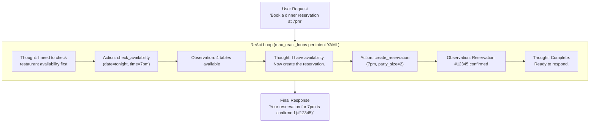
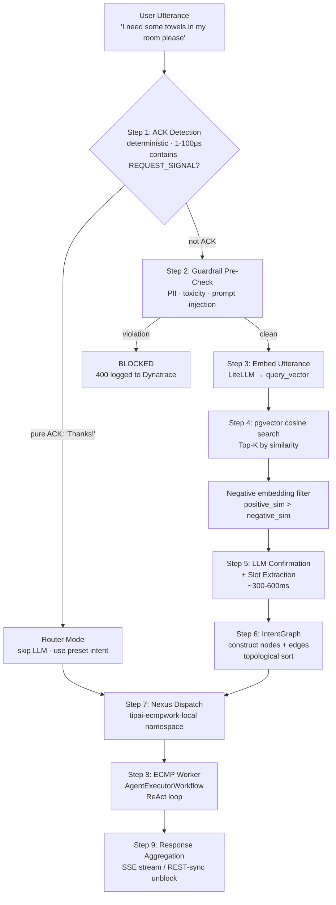
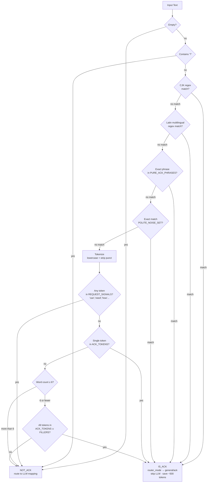
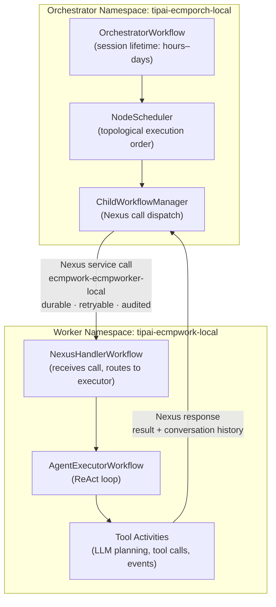

# Module 3 — Agentic AI Patterns

**Series:** [[00-Study-Map]] | **Prev:** [[02-RAG-Architecture]] | **Next:** [[04-Temporal-Orchestration]]
**Tags:** #interview-prep #agents #react #agentic-ai #intent-mapping #multi-agent
**Anchored to:** `orchestrator_workflow.py`, `ack_detector.py`, `intent_graph.py`, `executor/workflow.py`, Nexus dispatch

---

## 1. What Makes an AI System "Agentic"

A standard LLM call is stateless: prompt in → response out. An **agent** adds:

| Capability | Description | In Your Stack |
|---|---|---|
| **Tool use** | Call external APIs, DBs, services | Temporal activities as tools |
| **Multi-turn memory** | Maintain context across interactions | `conversation_history` in workflow state |
| **Planning** | Decompose a goal into steps | Intent graph construction |
| **Autonomous loops** | Retry, re-plan, recover from failure | `max_react_loops`, Temporal retries |
| **Perception** | Interpret complex inputs (text, structured data) | Intent mapping pipeline |
| **Action** | Affect external state (book a room, send a message) | Tool activities with side effects |

> From ARB p. 29: TIP.AI v3 enables "AI systems that go beyond answering questions to understand intent, manage context, and reliably execute actions across enterprise systems."

---

## 2. Agent Architectures

### ReAct — Reasoning + Acting (Your Pattern)

The dominant agentic pattern. The LLM alternates between **Thought** and **Action** in a loop:



```
User: "Book a dinner reservation at the restaurant for tonight at 7pm"

Thought: I need to check restaurant availability first.
Action: check_availability(date="tonight", time="7pm")
Observation: 4 tables available

Thought: I have availability. Now I need to create the reservation.
Action: create_reservation(date="tonight", time="7pm", party_size=2)
Observation: Reservation #12345 confirmed

Thought: Reservation is complete. I can now respond.
Response: "Your dinner reservation for tonight at 7pm is confirmed (#12345)."
```

**In your intent YAML:**
```yaml
# general_ack.yaml
policy:
  max_steps: 1
  max_react_loops: 1    # ACK only needs 1 loop — respond and done
  max_tool_retries: 0
  timeout_seconds: 10
```

For more complex intents (e.g., `policyqa.yaml`, `stay_history.yaml`), `max_react_loops` would be higher to allow multi-step retrieval and reasoning.

### Plan-and-Execute

Unlike ReAct (interleaved reasoning and action), Plan-and-Execute separates:
1. **Planning phase**: LLM generates a full plan upfront
2. **Execution phase**: each step executes sequentially

**Your intent graph is a Plan-and-Execute variant:**
- Intent mapping produces a full `IntentGraph` with all nodes and dependencies upfront
- `NodeScheduler` then executes nodes following the topological order

```python
# orchestrator_workflow.py — plan-and-execute pattern
intent_graph = await self._map_intents(user_prompt)  # Planning phase
for node in intent_graph.topological_order():         # Execution phase
    result = await self._dispatch_to_worker(node)
```

### Reflection Pattern

After generating a response, the agent evaluates its own output and revises if needed.

```python
# tool_activities.py — is_reflection flag
@activity.defn(name="agent_toolPlanner")
async def agent_tool_planner(
    messages: list,
    is_reflection: bool = False,
    ...
) -> dict:
    agent_id = "reflection" if is_reflection else "planning"
    # Reflection uses a different system prompt that asks:
    # "Was the previous response correct? Does it answer the user's question?"
```

---

## 3. The Full Intent Mapping Pipeline

This is the core of what you've built. Know every stage cold.



---

## 4. ACK Detection — Deterministic Fast-Path

This is a pattern worth deeply understanding for interviews: **hybrid rule-engine + LLM routing**.



```python
# ack_detector.py — called inside Temporal workflow (must be deterministic)
@dataclass(frozen=True)
class AckDetectionResult:
    is_ack: bool
    method: str = "DETERMINISTIC"
    confidence: str = "HIGH"
    bucket_key: str = "GENERAL_ACK"
    matched_token: str = ""

ACK_TOKENS: FrozenSet[str] = frozenset({
    "thanks", "thank you", "thx", "ty",
    "ok", "okay", "got it", "understood",
    # + multilingual: CJK, Spanish, French, German, Portuguese
})

REQUEST_SIGNALS: FrozenSet[str] = frozenset({
    "can", "could", "please", "need", "want",
    "what", "where", "when", "how", "which",
    # These BLOCK ack classification even if ack tokens are present
})

def detect_acknowledgement(text: str) -> AckDetectionResult:
    # Decision logic (in order):
    # 1. Empty check
    # 2. "?" blocker
    # 3. CJK regex match
    # 4. Latin multilingual regex
    # 5. Exact phrase match (PURE_ACK_PHRASES)
    # 6. Polite noise exact match
    # 7. Tokenize → REQUEST_SIGNAL blocker
    # 8. Single token match
    # 9. ≤6 word composite (all tokens in ACK_FILLERS ∪ ACK_TOKENS)
    # 10. >6 words → False
```

**Why run this in the workflow (not an activity)?**
- It's pure computation, no I/O — safe and required to be deterministic
- ~1-100μs latency vs ~500ms+ for an LLM call
- **Saves ~500 tokens per ACK message** — at scale this is significant cost reduction

**Known gap (from your Obsidian notes):** Greetings like "Hi" and "Good morning" are in `ACK_TOKENS` — they should have their own routing path. This is a legitimate architectural improvement to mention.

---

## 5. Multi-Agent Orchestration via Temporal Nexus

### The Parent-Child Workflow Boundary



**Why cross-namespace?** Isolation, independent deployment, independent scaling. The orchestrator and worker can be in different Kubernetes clusters, owned by different teams, deployed independently.

**Why Nexus instead of HTTP?** Nexus calls are tracked in Temporal's event history — they're durable, retry-safe, and auditable. An HTTP call to a worker could fail silently; a Nexus call failure is visible in Temporal UI and triggers configured retry policy.

### Namespace and Endpoint Configuration (From Your Notes)

```bash
# Register namespaces
docker exec temporal tctl --address temporal:7233 \
  --ns tipai-ecmpwork-local namespace register --rd 3
docker exec temporal tctl --address temporal:7233 \
  --ns tipai-ecmporch-local namespace register --rd 3

# Nexus endpoint resolves worker:
# executor_service_name = "{routing.base}-{DEPLOY_ENV}"
#                       = "ecmpwork-ecmpworker" + "-" + "local"
#                       = "ecmpwork-ecmpworker-local"
```

---

## 6. Human-in-the-Loop (HITL)

From ARB requirements 3.8 and 9.1: "Implement HITL oversight and structured feedback loops. Required for high-risk domains." and "Gate high-risk actions with HITL or automated safeguards."

### How HITL Works in Your Stack

The `send_message_and_wait` Temporal Update handler is the HITL mechanism:

```python
# orchestrator_workflow.py — REST-sync mode blocks until response is ready
@workflow.update
async def send_message_and_wait(self, prompt: str) -> str:
    # 1. Queue the prompt (same as signal handler)
    self.session.queue_prompt(prompt)
    # 2. Block — wait until __final_summary appears in event buffer
    await workflow.wait_condition(
        lambda: self._final_summary_ready,
        timeout=timedelta(seconds=30)
    )
    # 3. Return response synchronously to caller
    return self._final_summary
```

For high-risk actions (e.g., booking a non-refundable reservation), HITL would look like:

```python
# Worker activity signals back to orchestrator for approval
@activity.defn(name="request_human_approval")
async def request_human_approval(action: str, details: dict) -> bool:
    # Emit approval_required event → SSE → UI shows "Approve?" button
    # Block until human approves or timeout
    approval = await wait_for_human_signal(timeout=timedelta(minutes=5))
    return approval.approved
```

---

## 7. Slot Filling and Multi-Turn Context

### What is Slot Filling?

When an intent requires specific information to execute, and that information isn't in the current message, the agent must elicit it through follow-up questions.

```
User: "Book a restaurant reservation"
System: "For how many people and what time?"  ← slot filling
User: "Two people at 7pm"
System: [executes booking with slots: party_size=2, time="7pm"]
```

**Your `slot_filling.py`** handles this in the orchestrator:

```python
# models/slot_filling.py
class SlotRequirement:
    name: str           # e.g., "time", "party_size"
    description: str    # Natural language description for the LLM to elicit
    required: bool
    type: str           # "string", "integer", "datetime"

class SlotEvaluator:
    async def evaluate(
        self,
        intent: AgentIntent,
        conversation_history: ConversationHistory,
    ) -> SlotEvaluationResult:
        # Checks if all required slots are filled from conversation context
        # Returns: filled_slots, missing_slots, clarification_prompt
```

### Multi-Turn Context Management

Long-lived Temporal sessions maintain conversation state across multiple user messages:

```python
# orchestrator_workflow.py __init__ — state persists across turns
self.session = SessionManager()           # tracks conversation turns
self.conversation_history = ConversationHistory()  # full message history
self._current_message_id: Optional[str]  # trace correlation
self._pending_unknown_nodes: List        # unresolved intents awaiting clarification
```

Memory types in your system:
- **In-context memory**: `conversation_history` in workflow state (fast, bounded by context window)
- **External memory**: PostgreSQL via `eval_runs` / intent registry (persistent, queryable)
- **Semantic cache**: Redis for intent embeddings (fast lookup, evictable)

---

## 8. Message Interrupt Pattern

Your stack handles the case where a user sends a new message before the previous one is processed:

```python
# orchestrator_workflow.py
self._message_interrupted: bool = False
self._interrupted_message_ids: set = set()  # Discard results for these

# When new message arrives mid-processing:
# 1. Set _message_interrupted = True
# 2. Add current message_id to _interrupted_message_ids
# 3. New message processing begins
# 4. When old result arrives, check: if node_id in _interrupted_message_ids → discard
```

This is a production pattern for chat systems — avoids showing stale results from a superseded query.

---

## 9. Agent Memory Architecture

| Memory Type | Storage | Scope | Access Pattern |
|---|---|---|---|
| **Sensory** | In-context (system prompt) | Current call only | Immediate |
| **Working** | Workflow state (Temporal) | Session lifetime | Direct attribute |
| **Episodic** | Conversation history | Session + persistent | Sequential scan |
| **Semantic** | Intent registry + vector store | System-wide | Similarity search |
| **Procedural** | Intent YAML definitions | Deployment | Config lookup |

---

## 10. Interview Q&A

**Q: What is the ReAct pattern and why is it significant?**
> ReAct (Reasoning + Acting) interleaves chain-of-thought reasoning with action execution in a loop. The LLM generates a "thought" explaining its reasoning, then an "action" calling a tool, observes the result, and reasons again. This allows complex multi-step tasks to be decomposed at runtime without a pre-specified plan. It's significant because it showed that reasoning and acting can be unified in a single LLM prompt, without separate planning and execution models.

**Q: How does your system handle an agent that gets stuck in a loop?**
> `max_react_loops` in the intent YAML policy caps the number of ReAct iterations. When the limit is reached, the executor workflow either returns a partial result or a graceful "I wasn't able to complete this" response. Additionally, Temporal's `timeout_seconds` provides an absolute deadline that terminates the workflow regardless of loop state. The workflow history provides a full audit trail of what the agent attempted.

**Q: What is the difference between agentic AI and traditional automation?**
> Traditional automation executes a fixed, pre-programmed sequence of steps. Agentic AI: (1) understands natural language intent rather than requiring structured commands, (2) dynamically plans its approach based on the specific request, (3) can recover from failures by re-planning, (4) handles ambiguity through slot filling and clarification, (5) composes capabilities (tools) at runtime. TIP.AI's intent-to-Nexus pipeline exemplifies this: the same platform handles "get towels" and "book a reservation" without hand-coding each flow.

**Q: Why is the ACK detection deterministic instead of using an LLM classifier?**
> Three reasons: (1) Latency — 1-100μs vs 300-700ms for an LLM call; (2) Cost — saves ~500 tokens per ACK at potentially millions of interactions/day; (3) Temporal determinism — the detection runs inside the workflow function where non-deterministic I/O is prohibited. An LLM call would need to be in an activity, adding overhead. The rule engine covers the vast majority of cases with 95%+ accuracy at essentially zero cost.

**Q: How would you extend this system to support multi-agent collaboration?**
> The Temporal Nexus pattern already enables multi-agent: the orchestrator is one agent, each worker is another. To extend: (1) Add a "meta-orchestrator" that routes between multiple domain orchestrators (e.g., one for guest services, one for hotel operations). (2) Use Nexus for cross-orchestrator calls just as we do for orchestrator→worker. (3) Shared intent registry allows any agent to discover capabilities. (4) Temporal's event history provides cross-agent audit trails automatically.

---

## 11. Key Resources

| Resource | Why Read It |
|---|---|
| [ReAct paper](https://arxiv.org/abs/2210.11610) | The foundational agentic pattern in your stack |
| [Temporal Nexus docs](https://docs.temporal.io/nexus) | Cross-namespace multi-agent in production |
| [LangChain agents](https://python.langchain.com/docs/concepts/agents/) | LangChain is in your stack; understand agent executor |
| [OpenAI function calling](https://platform.openai.com/docs/guides/function-calling) | Structured tool use — underlying mechanism |
| [Building effective agents (Anthropic)](https://www.anthropic.com/research/building-effective-agents) | Patterns, anti-patterns, when NOT to build agents |

---

*Next module:* [[04-Temporal-Orchestration]]
