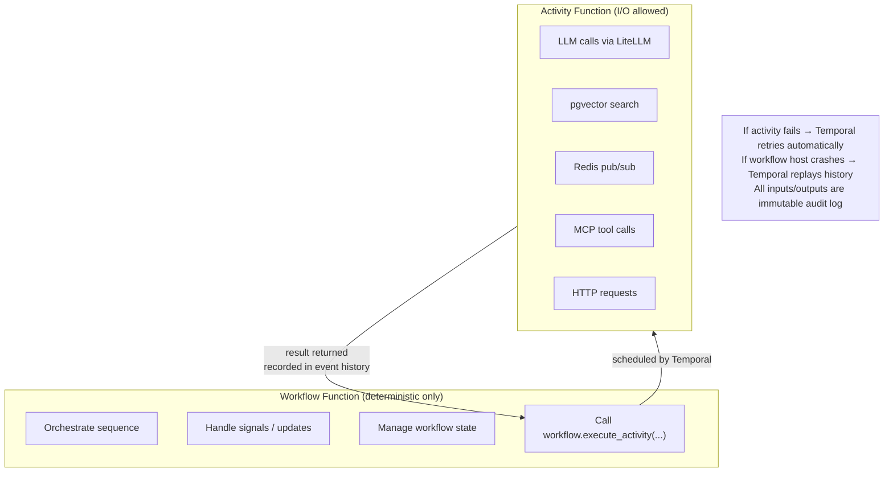
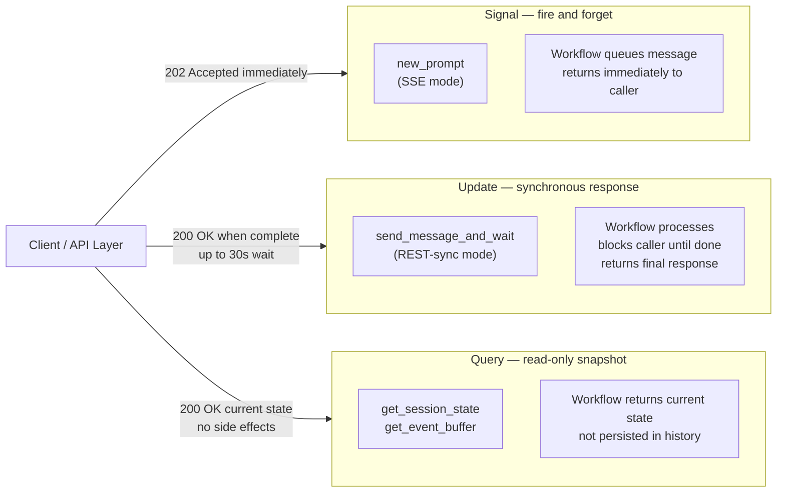
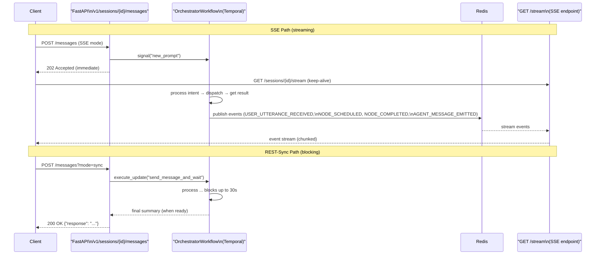

# Module 4 — Workflow Orchestration with Temporal

**Series:** [[00-Study-Map]] | **Prev:** [[03-Agentic-AI-Patterns]] | **Next:** [[05-Observability-Guardrails]]
**Tags:** #interview-prep #temporal #workflow-orchestration #distributed-systems #nexus
**Anchored to:** `temporalio==1.20.0`, `orchestrator_workflow.py`, `executor/workflow.py`, `Worker Configuration - TIP.md`

---

## 1. Why Temporal — The Problem It Solves

Without Temporal, a multi-step AI workflow would be a series of HTTP calls with custom retry logic:

```python
# WITHOUT Temporal — fragile
async def process_booking():
    intent = await call_intent_mapper()   # What if this crashes mid-execution?
    tools = await call_tool_executor()    # What if the server restarts here?
    result = await call_aggregator()      # What if the network drops?
    # No history, no retry guarantees, no audit trail
```

With Temporal, every step is recorded in **durable event history**. If the process crashes at step 2, Temporal **replays** from the beginning using the recorded event history — the workflow resumes exactly where it left off with zero data loss.

> From ARB p. 9: "deterministic orchestration layer where all execution is auditable, replay-safe, and policy-driven"

---

## 2. Core Concepts

### Workflow

A **workflow** is a durable, long-running function. It orchestrates activities and other workflows.

```python
# orchestrator_workflow.py
@workflow.defn
class OrchestratorWorkflow(BaseWorkflow):
    """
    Manages a user session lifecycle.
    Can run for hours or days (indefinitely until terminated).
    """
    @workflow.run
    async def run(self, *args, **kwargs) -> Dict[str, Dict]:
        # This function is replayed deterministically on every restart
        # ALL state is derived from the event history
        ...
```

### Activity

An **activity** is a unit of work with I/O. It can be non-deterministic (call APIs, query databases, call LLMs). Temporal retries activities independently on failure.

```python
# tool_activities.py
@activity.defn(name="agent_tool_planner")
async def agent_tool_planner(messages: list, ...) -> dict:
    # This CAN call external services — it's an activity, not a workflow
    response = await get_completion(messages=messages, model=model)
    return parse_json_response(response)
```

### Worker

A **worker** polls a task queue for workflow and activity tasks and executes them. Your stack has multiple worker types:

```
ECMP Worker process
├── NexusHandlerWorker  (polls nexus-ecmpwork-ecmpworker-q-local)
├── ExecutorWorker      (polls executor task queue)
└── ActivitiesWorker    (polls activities task queue)
```

### Task Queue

Workers poll task queues, not the orchestrator directly. This decouples dispatch from execution and enables horizontal scaling.

```yaml
# Worker Configuration - TIP.md
Nexus task queue: nexus-ecmpwork-ecmpworker-q-local
```

### Namespace

Logical isolation unit in Temporal. Separate event histories, separate task queues, separate security boundaries.

```bash
# Your namespaces (from Worker Configuration - TIP.md)
tipai-ecmporch-local    # Orchestrator workflows
tipai-ecmpwork-local    # ECMP Worker workflows
tipai-centralorch-local # Central orchestrator
tipai-centralwork-local # Central worker
```

---

## 3. The Determinism Constraint — Most Important Concept

**Rule:** Workflow code must be **deterministic and side-effect-free**. Every time Temporal replays the workflow history, the code must produce exactly the same sequence of commands.

### What You CANNOT Do In a Workflow

```python
@workflow.defn
class MyWorkflow:
    @workflow.run
    async def run(self):
        # ❌ FORBIDDEN — non-deterministic
        import random
        x = random.random()

        # ❌ FORBIDDEN — I/O in workflow
        response = await httpx.get("https://api.example.com")

        # ❌ FORBIDDEN — system time (use workflow.now() instead)
        import datetime
        now = datetime.datetime.now()

        # ❌ FORBIDDEN — LLM call directly
        result = await litellm.acompletion(...)
```

### What You MUST Do Instead



```python
@workflow.defn
class MyWorkflow:
    @workflow.run
    async def run(self):
        # ✅ Temporal's time (reproducible in replay)
        now = workflow.now()

        # ✅ LLM call via activity
        result = await workflow.execute_activity(
            agent_tool_planner,
            messages,
            start_to_close_timeout=timedelta(seconds=30),
        )
```

### The imports_passed_through Pattern

```python
# orchestrator_workflow.py — safe import of non-deterministic code
with workflow.unsafe.imports_passed_through():
    from app.intent_mapping.fallback_handler import FallbackHandler
    from app.intent_mapping.ack_detector import detect_acknowledgement
```

`imports_passed_through` tells Temporal's sandbox to allow these imports without the determinism checker intercepting them. Used for code that is safe to call (pure functions like `detect_acknowledgement`) but whose imports would otherwise be flagged.

---

## 4. Signal vs Update vs Query

All three are ways to communicate with a running workflow:



| Mechanism | Direction | Blocks Caller? | Persisted in History? | Use Case |
|---|---|---|---|---|
| **Signal** | → Workflow | No (fire and forget) | Yes | Async message delivery |
| **Update** | → Workflow | Yes (waits for response) | Yes | Synchronous request-response |
| **Query** | → Workflow | Yes (immediate read) | No | Read current state |

### Signal — `new_prompt` (Your SSE Mode)

```python
# messaging.py — SSE mode: fire and forget, return 202 immediately
await handle.signal("new_prompt", {
    "prompt": user_message,
    "message_id": f"msg-{uuid4().hex[:12]}",
    ...
})
return Response(status_code=202)  # Don't wait for response

# orchestrator_workflow.py — signal handler
@workflow.signal
async def new_prompt(self, payload: dict) -> None:
    self.session.queue_prompt(payload["prompt"])
    self._pending_messages.append(payload)
```

### Update — `send_message_and_wait` (Your REST-Sync Mode)

```python
# messaging.py — REST-sync mode: blocks until workflow responds
result = await handle.execute_update(
    "send_message_and_wait",
    user_message,
    rpc_timeout=timedelta(seconds=30),
)
return JSONResponse({"response": result})  # Synchronous response

# orchestrator_workflow.py — update handler
@workflow.update
async def send_message_and_wait(self, prompt: str) -> str:
    self.session.queue_prompt(prompt)
    await workflow.wait_condition(
        lambda: self._final_summary_ready,
        timeout=timedelta(seconds=30),
    )
    return self._final_summary
```

### When to Use Each

- **Signal**: streaming responses (SSE), notifications, events where caller doesn't need to wait
- **Update**: REST-sync mode, any case where the HTTP caller needs the actual response
- **Query**: health checks, status polling, reading session state

---

## 5. Temporal Nexus — Cross-Namespace Multi-Agent

Nexus enables durable, auditable calls between workflows in different namespaces (and different clusters).

```
Orchestrator Namespace: tipai-ecmporch-local
                │
                │ Nexus call: ecmpwork-ecmpworker-local
                │ (endpoint name = executor_service_name)
                ▼
Worker Namespace: tipai-ecmpwork-local
    NexusHandlerWorkflow receives call
                │
                ▼
    AgentExecutorWorkflow runs ReAct loop
                │
                ▼
    Result returned to Orchestrator via Nexus response
```

### Nexus vs HTTP — Why Nexus Wins for AI Agents

| Property | HTTP | Temporal Nexus |
|---|---|---|
| Durability | Request lost if caller crashes | Request persisted in caller's event history |
| Retries | Manual implementation | Built-in with configurable retry policy |
| Observability | Custom tracing required | Full event history in Temporal UI |
| Timeout handling | Manual deadline tracking | Temporal manages start-to-close timeouts |
| Audit trail | Application logs only | Immutable event history |

---

## 6. Fault Tolerance and Retry Configuration

### Activity Retry Policy

```python
# Typical activity execution in orchestrator
result = await workflow.execute_activity(
    agent_tool_planner,
    messages,
    start_to_close_timeout=timedelta(seconds=30),
    retry_policy=RetryPolicy(
        maximum_attempts=3,
        initial_interval=timedelta(seconds=1),
        backoff_coefficient=2.0,    # Exponential: 1s, 2s, 4s
        maximum_interval=timedelta(seconds=10),
        non_retryable_error_types=["GuardrailError"],  # Don't retry safety blocks
    ),
)
```

### Intent YAML Policy

```yaml
# general_ack.yaml — the timeout_seconds maps to start_to_close_timeout
policy:
  max_steps: 1
  max_react_loops: 1
  max_tool_retries: 0
  timeout_seconds: 10    # Hard deadline for the entire worker execution
```

### GuardrailError — Non-Retryable

```python
# tool_activities.py — prevents infinite retries on guardrail blocks
try:
    response = await get_completion(messages=messages, model=model)
except GuardrailError as e:
    # Return as a structured response instead of raising
    # Raising would cause Temporal to retry — we don't want that
    return _build_guardrail_response(e)
except ContentPolicyError as e:
    return _build_guardrail_response(e)
```

This is a critical production pattern: **don't retry errors that will always fail** (safety blocks, auth failures, invalid inputs).

---

## 7. SSE vs REST-Sync Delivery Paths

Both paths exist to serve different clients (streaming UI vs synchronous API consumers):



**Why offer both?** Some clients (mobile apps, backend-to-backend) prefer a simple request/response. Others (chat UI) need streaming to show progress and partial responses.

---

## 8. Workflow Event History and Auditing

Every Temporal event is stored in an immutable, append-only log:

```
Event 1:  WorkflowExecutionStarted
Event 2:  ActivityTaskScheduled (agent_tool_planner)
Event 3:  ActivityTaskStarted
Event 4:  ActivityTaskCompleted
Event 5:  TimerStarted (session idle timeout)
Event 6:  SignalReceived (new_prompt: "Can I get towels?")
Event 7:  ActivityTaskScheduled (search_intents)
...
```

**ARB audit requirement (p. 9):** "all execution is auditable, replay-safe, and policy-driven." Temporal's event history is the implementation of this requirement — every action the AI took is recorded with inputs, outputs, and timestamps.

---

## 9. Interview Q&A

**Q: What is Temporal's determinism requirement and why does it exist?**
> Temporal replays the workflow event history to restore state after failures. For replay to produce the same result, workflow code must be deterministic — given the same history, it must generate the same sequence of commands. Non-deterministic code (random numbers, system time, I/O) would produce a different sequence during replay, creating inconsistency between what was recorded and what the code now wants to do. All side effects (LLM calls, API calls, random numbers) must be in activities, not in workflow functions.

**Q: What's the difference between a Temporal signal and an update?**
> A signal is fire-and-forget: the sender returns immediately without waiting for the workflow to process it. An update is synchronous: the sender blocks until the workflow handler completes and returns a value. In our system, SSE mode uses signals (the API returns 202 immediately, client streams events separately), while REST-sync mode uses updates (the API blocks until the full response is ready, then returns 200 with the complete answer).

**Q: Why use Temporal Nexus instead of direct HTTP calls between the orchestrator and worker?**
> HTTP calls in a workflow are forbidden by Temporal's determinism constraint. But more importantly, Nexus calls are persisted in the event history — if the orchestrator crashes after dispatching a Nexus call but before receiving the response, Temporal will replay and the Nexus call will be recovered. With HTTP, that call is lost. Nexus also provides built-in timeout management, retry policies, and cross-namespace isolation without any custom code.

**Q: How does Temporal handle long-running AI sessions that span hours or days?**
> Temporal workflows can run indefinitely. The session state (conversation history, pending nodes, message IDs) lives in the workflow's in-memory state, which is reconstructed from event history on restart. For very long sessions, Temporal supports "continue-as-new" which creates a new workflow execution with a clean history but preserves essential state — preventing event history from growing too large. Your `summarizer_workflow.py` complements this by compressing conversation history.

**Q: What happens if an LLM activity times out after 3 retries?**
> After exhausting retries (3 attempts with exponential backoff), Temporal raises `ActivityError` with cause `ApplicationError("Activity timeout")` in the workflow. The workflow can catch this and either: (1) emit a graceful error event and continue (e.g., return "I'm sorry, I couldn't complete that request"), (2) fail the node and try a fallback intent, or (3) propagate the failure which closes the session. In your stack, GuardrailErrors are non-retryable so they don't exhaust retries — they return immediately with the guardrail response.

---

## 10. Key Resources

| Resource | Why Read It |
|---|---|
| [Temporal Python SDK docs](https://python.temporal.io) | Your SDK; activities, workflows, signals, updates |
| [Temporal Nexus guide](https://docs.temporal.io/nexus) | Cross-namespace multi-agent in production |
| [Temporal determinism constraints](https://docs.temporal.io/workflows#deterministic-constraints) | The core constraint you work around daily |
| [Temporal UI (local)](http://localhost:8233) | Your local Temporal UI for debugging workflows |
| [temporalio Python GitHub](https://github.com/temporalio/sdk-python) | Source code, examples |

---

*Next module:* [[05-Observability-Guardrails]]
