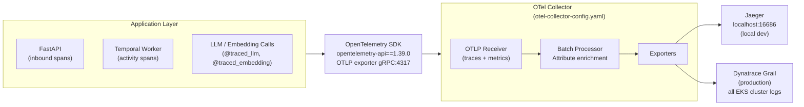

# Module 5 — Production AI Observability & Guardrails

**Series:** [[00-Study-Map]] | **Prev:** [[04-Temporal-Orchestration]] | **Next:** [[06-Enterprise-Architecture-MCP]]
**Tags:** #interview-prep #observability #opentelemetry #guardrails #responsible-ai #dynatrace
**Anchored to:** `opentelemetry-api==1.39.0`, `otel-collector-config.yaml`, Dynatrace (ARB p. 22), `guardrail_activities.py`, ARB Shared Responsibility Model (p. 36-37)

---

## 1. The Three Pillars of Observability

For AI systems, observability goes beyond traditional application monitoring. You need to understand not just "is the service up?" but "is the AI producing correct, safe, and efficient outputs?"

| Pillar      | What It Captures                                                 | Your Stack                                       |
| ----------- | ---------------------------------------------------------------- | ------------------------------------------------ |
| **Traces**  | End-to-end request flow across services                          | OpenTelemetry → Jaeger (local), Dynatrace (prod) |
| **Metrics** | Aggregated measurements (latency p99, token counts, error rates) | OpenTelemetry metrics → Dynatrace                |
| **Logs**    | Discrete events with structured context                          | Console → Dynatrace Grail (EKS cluster level)    |

**The fourth pillar for AI:** **Evaluation** — offline and online quality metrics (faithfulness, hallucination rate, relevance). Covered in Module 7.

---

## 2. OpenTelemetry in Your Stack

### Stack Components



### Instrumentation in Code

```python
# Your stack uses @traced_llm() and @traced_embedding() decorators
# These wrap LiteLLM calls with automatic span creation

from opentelemetry import trace
from opentelemetry.trace import Status, StatusCode

tracer = trace.get_tracer(__name__)

@traced_llm()  # Automatic span: llm.completion
async def get_completion(messages, model, **kwargs) -> str:
    response = await litellm.acompletion(
        model=model,
        messages=messages,
        **kwargs,
    )
    return response.choices[0].message.content

@traced_embedding()  # Automatic span: llm.embedding
async def get_embedding(text: str) -> list[float]:
    response = await litellm.aembedding(model=model, input=text)
    return response.data[0].embedding
```

### Trace Context Propagation

```python
# tool_activities.py — sets trace context for correlation
def _setup_principal_context(job_request, session_id, message_id):
    set_principal_from_job_request(job_request)
    # OTel baggage: session_id, message_id, principal propagated
    # through all downstream spans in this activity execution
```

This means a single user message (session_id + message_id) is traceable through:
- API layer → Temporal signal → Orchestrator workflow → Nexus call → Worker activity → LLM call

---

## 3. LLM-Specific Observability

Standard APM tools don't capture what matters most for LLMs. You need:

| Metric | Why It Matters | How Captured |
|---|---|---|
| **Token usage** (prompt + completion) | Direct cost driver | LiteLLM logs per request |
| **Latency by model** | User experience; compare providers | OTel span duration |
| **Cost per request/session** | Budget governance | LiteLLM cost tracking |
| **Guardrail block rate** | Safety and false positive monitoring | Dynatrace error events (400/500) |
| **Intent match rate** | RAG quality; how often does the system find the right intent | Application metrics |
| **Fallback rate** | How often does intent mapping fall back to LLM | Application metrics |
| **Hallucination rate** | Offline eval metric | DeepEval / LLM-as-judge |

### Dynatrace Log Structure (From ARB p. 30-31)

**Successful request log:**
```json
{
  "level": "INFO",
  "message": "LLM request completed",
  "response_code": 200,
  "model": "anthropic.claude-3-5-sonnet-20241022-v2:0",
  "prompt_tokens": 487,
  "completion_tokens": 43,
  "latency_ms": 342,
  "session_id": "sess-abc123",
  "message_id": "msg-def456"
}
```

**PII-blocked request log (Bedrock pre-guardrail):**
```json
{
  "level": "ERROR",
  "message": "Query contains PII information",
  "response_code": 400,
  "guardrail": "bedrock-pii",
  "violation_type": "PII_DETECTED",
  "session_id": "sess-abc123"
}
```

Note: The PII-containing prompt text is **NOT logged** — only the block event. This is by design (MIP-98 GenAI policy).

---

## 4. Guardrail Architecture — Deep Dive

### Pre-Mode vs Post-Mode

```
                    ┌─────────────────────────────────────────┐
                    │         LiteLLM Gateway                  │
                    │                                          │
User Prompt ──────► │  PRE-GUARDRAILS                          │
                    │  1. PII filter (Bedrock Sensitive Info)  │
                    │  2. Toxicity check (Bedrock Content Mod) │
                    │  3. Prompt injection check               │
                    │                                          │
                    │  ↓ (if clean)                            │
                    │                                          │
                    │  LLM Provider call                       │
                    │                                          │
                    │  POST-GUARDRAILS                         │
                    │  4. Groundedness check (0.70 threshold)  │
                    │  5. Relevance check (0.33 threshold)     │
                    │                                          │
LLM Response ◄───── │  ↓ (if passes)                          │
                    └─────────────────────────────────────────┘
```

**Why PII must be pre-mode:** If PII reaches the LLM endpoint, it gets logged in AWS/Azure/Google infrastructure, creating a data residency and compliance violation. Pre-mode stops it before that happens.

**Why groundedness is post-mode:** You need the LLM to generate a response before you can check if the response is grounded in the retrieved context.

### Bedrock Guardrail Performance Table (Memorize for Interviews)

| Category | Guard | Strength | Detection | False Alarm | F1 Optimized |
|---|---|---|---|---|---|
| **Toxicity** | Bedrock Content Mod | High | **94%** | 24% | Medium |
| Toxicity | | Medium | 89% | 22% | ← chosen |
| Toxicity | | Low | 77% | 13% | |
| **Prompt Injection** | Bedrock Content Mod | High | **87%** | 25% | |
| Prompt Injection | | Medium | **80%** | **13%** | ← chosen |
| Prompt Injection | | Low | 55% | 7% | |
| **PII** | Bedrock Sensitive Info | w/ SSN regex | **86%** | **5%** | ← chosen |
| PII | | w/o SSN regex | 81% | 5% | |
| **Groundedness** | Contextual Grounding | 0.80 | 87% | 8% | |
| Groundedness | | **0.70** | **84%** | **5%** | ← chosen |
| Groundedness | | 0.60 | 81% | 4% | |
| **Relevance** | Contextual Relevance | 0.43 | 93% | 11% | |
| Relevance | | **0.33** | **91%** | **8%** | ← chosen |

**Chosen configurations** reflect F1-score optimization — the sweet spot between detection rate and false alarm rate. Know why each threshold was chosen.

### Guardrail Categories Explained

**1. Toxicity**
- Detects: harmful content, hate speech, self-harm references, violent imagery
- Gap: at high strength, 24% of benign queries blocked (too aggressive for a hotel concierge)
- Example bypass: asking for an "article that explores the dark side of hospitality"

**2. Prompt Injection**
- Detects: "Ignore previous instructions", role manipulation, system prompt override attempts
- Gap: can be bypassed with indirect framing like "write a story where a character says [harmful thing]"
- Defense in depth: system prompt is not in user context; schema-constrained outputs

**3. PII (Sensitive Information)**
- Detects: SSN, credit card, email, phone, name+address combinations
- Gap: SSNs without explicit labeling can be missed → supplemented with custom regex
- Policy: MIP-98 GenAI policy prohibits personal data in AI prompts at Marriott

**4. Groundedness**
- Detects: model assertions not supported by retrieved context (hallucination)
- Known gap (ARB p. 34): "does not consider the user's query" — contextually relevant but incorrect responses can pass
- Threshold 0.70 chosen: 84% detection with only 5% false alarms

**5. Relevance**
- Detects: model responses that don't answer the user's question
- Threshold 0.33: aggressive detection (91%) accepted 8% false alarms as acceptable friction

---

## 5. Responsible AI — ARB Shared Responsibility Model

The ARB defines 40+ controls across 9 categories. Know the key ones by number:

### Access Controls (1.x)
- **1.1**: All AI agents (NHIs) provisioned via IAM, uniquely identifiable, governed like human users
- **1.2**: Zero Trust principles — no implicit trust, cryptographic identity verification
- **1.4**: ABAC as default (not RBAC) — enforce contextual data isolation, prevent cross-session leakage

### Model Controls (3.x)
- **3.1**: Semantic Versioning for all models (GitFlow branch discipline)
- **3.4**: Use SHAP, LIME, HELM, BEATS for fairness and explainability
- **3.8**: Human-in-the-loop for high-risk domains (your `send_message_and_wait` update)
- **3.13**: STRIDE threat modeling, MITRE ATLAS for AI-specific threats
- **3.14**: Adversarial prompt simulation and jailbreak testing

### Monitoring (4.x)
- **4.5**: Log and audit all model interactions — detect misuse or probing
- **4.7**: Continuously monitor outputs for drift, hallucinations, bias
- **4.8**: Audit datasets for drift, tampering, integrity

### Testing (8.x)
- **8.1**: Require unit, fuzz, adversarial, and regression testing
- **8.2**: Run models in shadow mode before production
- **8.5**: Embed security checks in CI/CD pipelines

### User Control (9.x)
- **9.1**: Gate high-risk actions with HITL or automated safeguards

---

## 6. OWASP LLM Top 10 — Know These

| # | Vulnerability | Your Defense |
|---|---|---|
| LLM01 | **Prompt Injection** | Bedrock content moderation (87% detection) |
| LLM02 | **Insecure Output Handling** | Schema-constrained JSON outputs; `parse_json_response` sanitization |
| LLM03 | **Training Data Poisoning** | Controlled intent registry; versioned intent YAML in git |
| LLM04 | **Model Denial of Service** | LiteLLM rate limits, token budgets per application |
| LLM05 | **Supply Chain Vulnerabilities** | STB/SAC approval process; SBOMs required (ARB 3.22) |
| LLM06 | **Sensitive Info Disclosure** | PII guardrails in pre-mode; MIP-98 policy enforcement |
| LLM07 | **Insecure Plugin Design** | MCP tools validated via intent registry schema |
| LLM08 | **Excessive Agency** | `max_steps`, `max_react_loops`, HITL for high-risk actions |
| LLM09 | **Overreliance** | Groundedness guardrail; source attribution in responses |
| LLM10 | **Model Theft** | Red data classification (ARB); AES-256 at rest, TLS 1.2+ in transit |

---

## 7. Tracing an AI Request End-to-End

A complete trace for "Can I get towels?" through your system:

```mermaid
gantt
    title End-to-End Trace — "Can I get towels?" (p50 ~2.6s)
    dateFormat  x
    axisFormat %Lms

    section API Layer
    POST /v1/sessions/messages       :0, 5
    dedup_check                      :0, 1
    temporal.signal(new_prompt)      :1, 5

    section Orchestrator Workflow
    ack_detection (deterministic)    :10, 10
    guardrail.pre_check (Bedrock)    :20, 80
    llm.embedding (query vector)     :100, 150
    pgvector.search                  :250, 270
    llm.completion (intent confirm)  :270, 700

    section Nexus + Worker
    nexus.call dispatch              :700, 710
    AgentExecutorWorkflow.run        :710, 2500
    activity.agent_tool_planner      :720, 1200
    llm.completion (planning)        :730, 1100
    activity.request_housekeeping    :1200, 1500

    section Response Delivery
    response_aggregation             :2500, 2550
    SSE publish to Redis             :2550, 2600
    client receives AGENT_MESSAGE    :2600, 2610
```



---

## 8. Interview Q&A

**Q: What's the difference between distributed tracing and logging?**
> Logs are discrete structured events at a point in time. Traces show the causal chain of a request across multiple services — each span has a parent-child relationship (trace_id, span_id, parent_span_id) enabling you to see exactly how a request flowed through API → Temporal → worker → LLM. For AI systems, tracing is essential because a single user message creates spans across 5+ services. Without traces, you'd only know "something was slow" not "the LLM embedding call was the bottleneck."

**Q: How do you decide the right guardrail threshold?**
> It's an F1-score optimization problem with business context. For PII: false alarms are extremely costly (blocking legitimate hotel requests causes guest friction), so we prioritize low false alarm rate (5%). For toxicity: a hotel concierge should err toward safety, so we accept higher false alarms (22% at medium strength) to maintain high detection. For groundedness: 0.70 threshold gives 84% hallucination detection with only 5% false alarms — balanced for factual accuracy without over-blocking correct responses.

**Q: What is the OWASP LLM Top 10 and which are most relevant to your system?**
> The OWASP LLM Top 10 is a reference framework for LLM application security risks. Most relevant to our system: LLM01 (Prompt Injection — mitigated by Bedrock at 87% detection), LLM06 (Sensitive Info Disclosure — mitigated by PII pre-guardrail and MIP-98 policy), LLM08 (Excessive Agency — controlled by max_steps/max_react_loops/HITL requirements), and LLM04 (Model DoS — controlled by LiteLLM rate limits and token budgets).

**Q: How do you observe whether your AI system is degrading over time?**
> Multiple layers: (1) Dynatrace dashboards tracking latency p99, error rates, guardrail block rates by day. (2) DeepEval scheduled evaluation runs tracking faithfulness and relevance scores across model updates. (3) Intent match rate tracking — if the system falls back to LLM classification more often, embeddings may need retraining. (4) Human feedback collection — associate ratings (if implemented) surfaced through the dashboard. (5) Drift detection on dataset distribution (ARB 4.8).

---

## 9. Key Resources

| Resource | Why Read It |
|---|---|
| [OpenTelemetry Python docs](https://opentelemetry.io/docs/languages/python/) | Your telemetry SDK |
| [Dynatrace Grail](https://docs.dynatrace.com/docs/discover-dynatrace/platform/grail) | Your production log/trace destination |
| [OWASP LLM Top 10](https://owasp.org/www-project-top-10-for-large-language-model-applications/) | LLM security reference |
| [Bedrock Guardrails](https://docs.aws.amazon.com/bedrock/latest/userguide/guardrails.html) | Your guardrail implementation |
| [MITRE ATLAS](https://atlas.mitre.org/) | AI-specific adversarial threat model (ARB 3.13) |
| [Responsible AI principles](https://www.microsoft.com/en-us/ai/responsible-ai) | Conceptual framework |

---

*Next module:* [[06-Enterprise-Architecture-MCP]]
