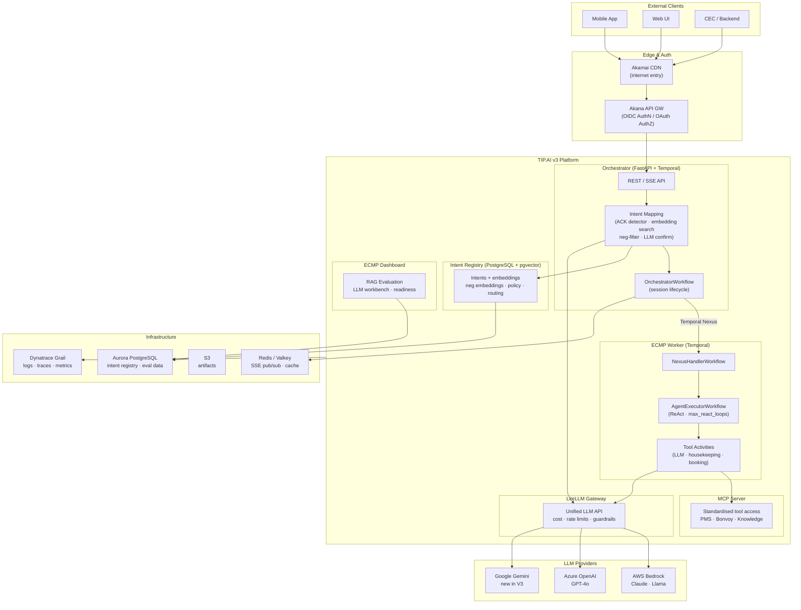
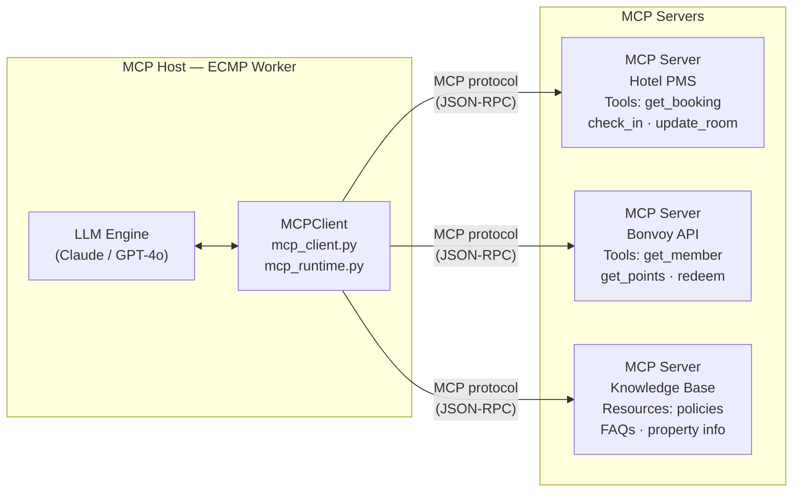
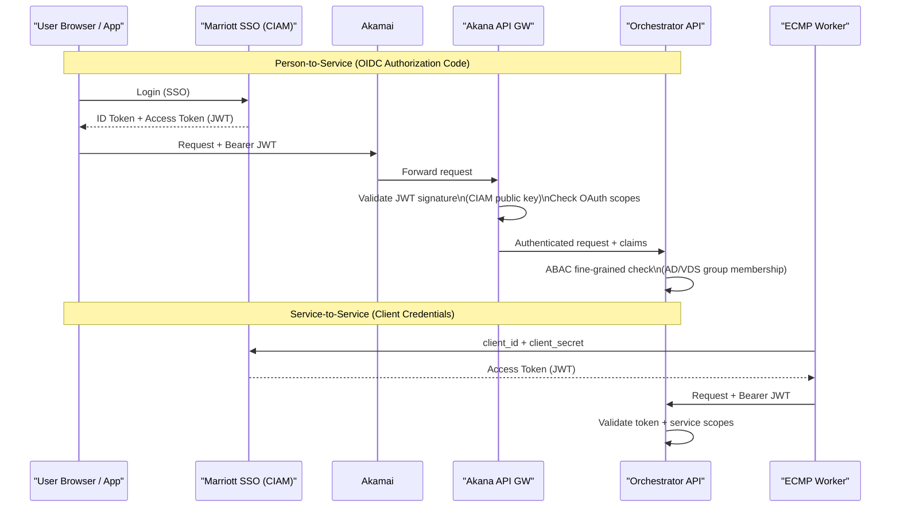

# Module 6 — Enterprise AI Architecture & MCP

**Series:** [[00-Study-Map]] | **Prev:** [[05-Observability-Guardrails]] | **Next:** [[07-ML-Evaluation-DeepEval]]
**Tags:** #interview-prep #enterprise-ai #mcp #litellm #architecture #security
**Anchored to:** ARB system architecture, `mcpserver/`, `mcp_client.py`, `mcp_runtime.py`, LiteLLM routing, ARB security slides

---

## 1. TIP.AI v3 Architecture Overview

TIP.AI is a **platform**, not an application. Its purpose is to provide shared, governed, reusable AI primitives that product teams build on top of — eliminating the 60,000-person-hour cost of building 167 separate RAG implementations.



### Three Architectural Layers

1. **Platform layer**: LiteLLM gateway, intent registry, Temporal cluster
2. **Orchestration layer**: OrchestratorWorkflow, intent mapping, session management
3. **Execution layer**: ECMP workers, tool activities, MCP integrations

---

## 2. Model Context Protocol (MCP)

### What MCP Is

MCP (Model Context Protocol) is an open standard (Anthropic, 2024) for how AI applications connect to external data sources and tools. Think of it as "USB-C for AI tool integrations" — a universal plug instead of custom adapters for every data source.

```
Without MCP:
AI App ──► Custom Jira adapter ──► Jira
AI App ──► Custom Slack adapter ──► Slack
AI App ──► Custom DB adapter ──► Database
(N apps × M data sources = N×M custom integrations)

With MCP:
AI App ──► MCP Client ──► MCP Server ──► Jira
                     └──► MCP Server ──► Slack
                     └──► MCP Server ──► Database
(N apps × 1 protocol = N+M integrations)
```

### MCP Architecture



### MCP Primitives

| Primitive | Description | Your Usage |
|---|---|---|
| **Tools** | Functions the LLM can call (actions with side effects) | `request_housekeeping`, `check_availability` |
| **Resources** | Read-only data the LLM can access | Hotel policies, FAQs, property information |
| **Prompts** | Reusable prompt templates | Intent-specific system prompts |
| **Sampling** | MCP server requests LLM completion | Not commonly used |

### Your MCP Implementation

```python
# ecmp-worker/app/integration/mcp_client.py — current state (stub)
class MCPClient:
    def __init__(self, auth_profile: Optional[str] = None):
        self.auth_profile = auth_profile

    async def call_tool(
        self,
        endpoint: str,
        fn: str,
        args: Dict[str, Any],
    ) -> Dict[str, Any]:
        raise NotImplementedError("MCP client not yet implemented")
```

The stub is in place — the full MCP client will implement the actual protocol communication. This is production-ready scaffolding that enforces the architectural boundary.

```python
# ecmp-worker/app/integration/mcp_runtime.py
# Manages MCP server connections and session lifecycle
# Handles server discovery, capability negotiation, connection pooling
```

**ARB context (p. 2):** MCP integration is a V3 capability being added alongside Gemini integration. The architecture is designed for it; implementation follows ARB approval.

---

## 3. LiteLLM — Multi-Provider Gateway Architecture

### Why a Gateway Is Required at Enterprise Scale

Direct provider integration creates:
- **Vendor lock-in**: every app directly depends on AWS/Azure/Google SDKs
- **No centralized cost visibility**: 200+ use cases each billing independently
- **Duplicate guardrail implementations**: every team re-implements PII filtering
- **No unified rate limiting**: thundering herd problem when one model is slow

LiteLLM solves all four as a single gateway service:

```python
# litellm config (managed by Platform team)
model_list:
  - model_name: "claude-3-5-sonnet"
    litellm_params:
      model: "bedrock/anthropic.claude-3-5-sonnet-20241022-v2:0"
      aws_region_name: "us-east-1"
      rpm: 1000       # rate limit: requests per minute
      tpm: 100000     # rate limit: tokens per minute
      max_budget: 50  # daily spend cap in USD

  - model_name: "gpt-4o"
    litellm_params:
      model: "azure/gpt-4o"
      api_base: "https://marriott-openai.openai.azure.com/"
      rpm: 500
      fallback: "claude-3-5-sonnet"   # auto-failover

  - model_name: "gemini-1.5-pro"       # NEW in V3
    litellm_params:
      model: "gemini/gemini-1.5-pro"
      vertex_project: "marriott-ai-prod"
      rpm: 200
```

### Cost Management Features

```python
# Application teams get their own API key with budget
# LiteLLM tracks spend per key
litellm_client = LiteLLM(
    api_key="sk-ecmp-worker-prod",  # Scoped to ECMP application
    base_url="https://litellm.tipai.marriott.com"
)

# LiteLLM enforces:
# - max_budget: block requests when budget exceeded
# - rpm/tpm: rate limit per application
# - spend tracking: per model, per application, per day
```

### Gemini Integration (V3 Change — ARB p. 4, 8)

Before V3: only Bedrock (Claude, Llama) and Azure (GPT-4o).
V3 adds Gemini through LiteLLM without any application code changes:

```python
# Application code doesn't change:
response = await litellm.acompletion(
    model="gemini-1.5-pro",  # Just change the model name
    messages=messages,
)

# LiteLLM handles:
# - Google Vertex AI auth
# - Request format translation (OpenAI format → Gemini format)
# - Response format normalization (Gemini format → OpenAI format)
# - Bedrock guardrails still apply (via LiteLLM pre/post hooks)
```

---

## 4. Authentication and Authorization Architecture

### Auth Flows (ARB Security Slide)

**Person-to-Service (SSO):**



**Why OIDC, not API keys?**
- JWT contains the principal's identity, groups, and scope claims
- Stateless validation (signature check, no DB roundtrip)
- Token expiry enforces short-lived credentials
- Enables ABAC based on token claims

### Zero Trust Principles (ARB 1.2)

Zero Trust means: **no implicit trust based on network location**. Every request must be authenticated and authorized, even internal ones.

```
Old model: "Inside the firewall = trusted"
Zero Trust: "Every request is treated as untrusted until proven otherwise"

Implementation:
- mTLS for service-to-service (planned; ARB p. 19: "mTLS required when onboarded to service mesh")
- JWT validation at every service boundary
- Continuous validation (token expiry, scope re-check)
- Centralized logging of all auth events (SIEM)
```

---

## 5. Data Architecture and Security

### Data Classification (ARB p. 20)

| Classification | Description | Handling |
|---|---|---|
| **Red** (your system) | Highly sensitive; Marriott internal AI system state | AES-256 at rest, TLS 1.2+ in transit, no external exposure |
| Yellow | Internal business data | Standard encryption |
| Green | Public data | No special requirements |

### Storage Architecture

```
PostgreSQL (Aurora RDS)
├── intent_registry         ← Intent definitions, embeddings, metadata
├── eval_runs               ← Evaluation run history
├── eval_results            ← Per-evaluation-case results
└── eval_test_cases         ← Ground truth test cases

Redis (Elasticache → Valkey migration)
├── intent embedding cache  ← Fast lookup, TTL eviction
└── SSE event pub/sub       ← Workflow events → client streams

S3
└── Artifact storage        ← Model artifacts, evaluation datasets

Temporal (self-managed)
└── Workflow event history  ← Immutable audit log of all AI actions
```

### Data Residency (ARB NFR Slide)

Three production regions: **US-E, US-W, EU-W**. EU-W specifically handles EU guest data to comply with GDPR data residency requirements. LiteLLM and Temporal are deployed per-region.

---

## 6. Intent Registry as a Central Capability Catalog

The intent registry is what enables TIP.AI to be a platform rather than a single application.

```python
# Intent schema — every capability registered here
{
  "name": "housekeeping/supplies",
  "description": "Request housekeeping supplies to a guest room",
  "version": "1.2.0",           # SemVer (ARB 3.1)
  "owner_team": "ecmpwork",
  "routing": {
    "base": "enterprise-chat-ecmp-worker",
    "nexus_endpoint": "ecmpwork-ecmpworker-{env}"
  },
  "semantics": {
    "examples": {
      "positive": ["can I get towels", "please send extra pillows"],
      "negative": ["towels are great", "I have enough pillows"]
    },
    "similarity_threshold": 0.82
  },
  "embedding": [...],           # Pre-computed pgvector embedding
  "negative_embedding": [...],  # Pre-computed negative embedding
  "policy": {
    "max_steps": 3,
    "timeout_seconds": 30
  }
}
```

**Why centralizing this matters:** Without it, 200 teams each implement their own intent classification. With it, any new application can register its capabilities and immediately be discoverable by the routing layer.

---

## 7. Vendor Lock-In Avoidance Strategy

From ARB p. 29:
> "TIP.AI v3 deliberately separates core platform capabilities (intent understanding, orchestration, data access, observability) from model choice, allowing Marriott to swap or combine LLM providers without re-architecting applications."

### How the Architecture Achieves This

| Capability | Implementation | Lock-in Risk | Mitigation |
|---|---|---|---|
| LLM inference | LiteLLM gateway | OpenAI/Bedrock/Gemini | Model name config only |
| Orchestration | Temporal (open source) | Temporal Inc | Can self-host; Apache License |
| Vector storage | pgvector (PostgreSQL) | — | Standard SQL + extension |
| Tool protocol | MCP (open standard) | Anthropic | Open spec, multi-vendor |
| Model format | ONNX/MLflow (ARB 7.8) | — | Open formats |

**The LiteLLM abstraction** is the most critical lock-in mitigation. Swapping Claude for GPT-4o or Gemini is a one-line config change, not an application rewrite.

---

## 8. Scalability Architecture (ARB NFR Slide)

| Requirement | Value |
|---|---|
| Transactions/minute (avg) | 2,000–5,000 |
| Target users | Millions (Mobile, Web, CEC) |
| Concurrent users | 1,000 initial, scale horizontally |
| Geographic regions | US-E, US-W, EU-W |

### Horizontal Scaling Points

```
EKS (Kubernetes)
├── Orchestrator pods     ← Scale based on active session count
├── ECMP Worker pods      ← Scale based on Temporal task queue depth
├── LiteLLM pods          ← Scale based on token throughput
└── Redis (Valkey)        ← Can be swapped for larger cluster (ARB p. 15)

Temporal
└── Worker poll model: workers scale independently, no central bottleneck
```

---

## 9. Interview Q&A

**Q: What is MCP and why is it strategically important for enterprise AI?**
> MCP (Model Context Protocol) is an open standard for connecting AI systems to external data and tools. Strategically, it solves the N×M integration problem — without it, every AI application needs custom adapters for every data source. With MCP, any application can use any MCP-compliant server. For Marriott, this means: build a PMS MCP server once, and all 200 AI use cases can access hotel booking data without custom integrations. It also enables vendor independence — if Anthropic and OpenAI both support MCP, tools work with either.

**Q: How does the LiteLLM gateway prevent vendor lock-in?**
> LiteLLM sits between applications and LLM providers, exposing a unified OpenAI-compatible interface. Applications call the same API regardless of whether Bedrock, Azure OpenAI, or Gemini is the backend. Model selection is configuration, not code. When Gemini was added in V3, zero application code changed — only the LiteLLM routing config was updated. This is the architectural equivalent of a database abstraction layer — applications don't know or care which SQL engine is running.

**Q: Explain how Zero Trust applies to AI agents specifically.**
> AI agents (Non-Human Identities, NHIs) are governed with the same rigor as human users. Each agent has a unique IAM identity, not shared credentials. They authenticate via client credentials grant (OAuth 2.0), not API keys. Every cross-service call is validated — there is no "trusted internal network" assumption. Agent permissions are scoped to their specific intents (ABAC based on agent role + intent context). All agent actions are logged to SIEM. The concern is novel to AI: an agent could be compromised or manipulated to exfiltrate data through prompt injection, so strong identity boundaries are essential.

**Q: How would you design a multi-tenant AI platform where different business units share infrastructure but are isolated?**
> Exactly how TIP.AI is designed: (1) LiteLLM API keys scoped per business unit with independent token budgets and rate limits. (2) Temporal namespaces provide workflow isolation — BU A's workflows never interact with BU B's. (3) Intent registry is tagged by `owner_team` — teams can only modify their own intents. (4) PostgreSQL row-level security (ABAC) ensures teams only query their own eval data. (5) Separate EKS namespaces for network isolation if needed. (6) Separate Nexus endpoints per team prevent cross-team tool invocation.

**Q: What is ABAC and why does TIP.AI prefer it over RBAC?**
> RBAC (Role-Based Access Control) assigns permissions to roles. ABAC (Attribute-Based Access Control) evaluates policies based on attributes of the subject (user), object (resource), action, and environment. TIP.AI prefers ABAC (ARB 1.4) because: (1) AI sessions have rich contextual attributes — user's Bonvoy tier, property type, session state. (2) Fine-grained decisions like "a Diamond member can access this tool but a standard member cannot" are natural in ABAC but require role explosion in RBAC. (3) Prevents cross-session data leakage based on dynamic context evaluation.

---

## 10. Key Resources

| Resource | Why Read It |
|---|---|
| [Model Context Protocol spec](https://modelcontextprotocol.io/introduction) | The open standard you're implementing |
| [LiteLLM routing docs](https://docs.litellm.ai/docs/routing) | Multi-provider routing in your gateway |
| [AWS Bedrock docs](https://docs.aws.amazon.com/bedrock/latest/userguide/) | Primary LLM provider in your stack |
| [Temporal security docs](https://docs.temporal.io/cloud/security) | Namespace isolation, mTLS |
| [NIST Zero Trust Architecture (SP 800-207)](https://csrc.nist.gov/publications/detail/sp/800/207/final) | Conceptual foundation for 1.2 control |
| [OAuth 2.0 RFC 6749](https://tools.ietf.org/html/rfc6749) | Auth patterns you implement |

---

*Next module:* [[07-ML-Evaluation-DeepEval]]
