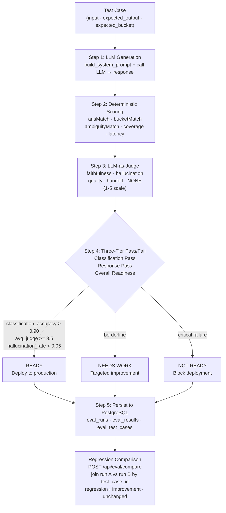
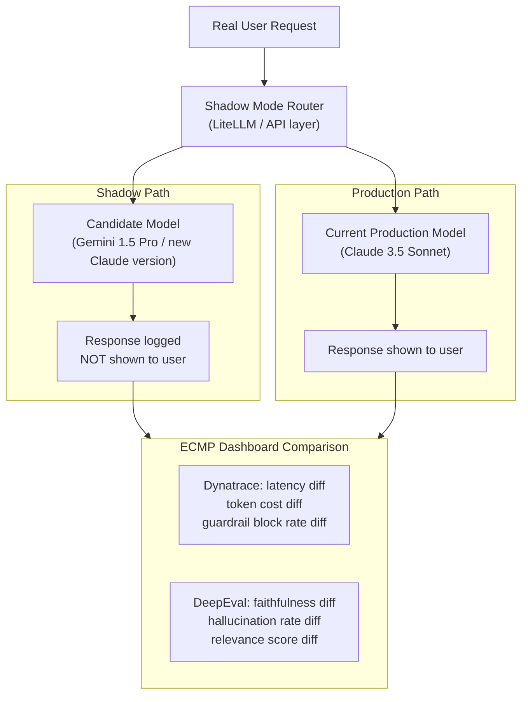

# Module 7 — ML Evaluation & DeepEval

**Series:** [[00-Study-Map]] | **Prev:** [[06-Enterprise-Architecture-MCP]]
**Tags:** #interview-prep #evaluation #deepeval #llm-as-judge #ragas #metrics
**Anchored to:** `emergingtech-tipai-ecmp-dashboard`, `Deepeval Framework Design.md`, `Dashboard Evalulation.md`, ARB 8.x controls

---

## 1. Why Evaluation is Hard for LLMs

Traditional ML evaluation: compare predicted label against ground-truth label. Accuracy = correct/total.

LLM evaluation problems:
1. **No single correct answer** — "What's the hotel spa policy?" has many valid responses
2. **Quality is multi-dimensional** — faithful, relevant, complete, safe, well-formatted
3. **Ground truth is expensive** — human annotation at scale is costly
4. **Models evaluate models** — LLM-as-judge introduces its own biases
5. **Distribution shift** — the query distribution changes as users discover new capabilities

---

## 2. Evaluation Taxonomy

### Offline vs Online Evaluation

| Type | When | Data | Goal |
|---|---|---|---|
| **Offline (static)** | Before deployment | Curated golden dataset | Catch regressions before they reach users |
| **Online (live)** | After deployment | Real user queries | Monitor production quality continuously |

Your `ecmp-dashboard` focuses on **offline evaluation** — a golden test case set run against model changes.

**ARB 8.2:** "Run models in shadow mode before production. Compare against baseline." Shadow mode = real traffic, but responses not shown to users, logged for comparison.

### Automated vs Human Evaluation

| Type | Cost | Scale | Best For |
|---|---|---|---|
| Rule-based | Very low | Very high | Deterministic checks (format, length, keyword) |
| LLM-as-judge | Low | High | Semantic quality, faithfulness, relevance |
| Human annotation | High | Low | Ground truth creation, disagreement resolution |
| A/B testing | Medium | High | User preference between model versions |

**Your dashboard combines all three:**
- Deterministic scoring: `ansMatch`, `bucketMatch`, `ambiguityMatch`, `coverage`, `latency` (rule-based)
- LLM-as-judge: separate judge call scoring 1–5 for faithfulness, hallucination, response quality
- Human judge: `judge_score` field for annotator override

---

## 3. RAG Evaluation Metrics (RAGAS Framework)

RAGAS (Retrieval Augmented Generation Assessment) defines four core metrics:

### Faithfulness

**Definition:** Is every claim in the response supported by the retrieved context?

```
faithfulness = (# claims in response that are in context) / (# total claims in response)
```

- Score 1.0: every statement is grounded in retrieved chunks
- Score 0.0: completely hallucinated response
- **LLM-as-judge** implementation: decompose response into atomic claims, check each against context

**Low faithfulness → action:** Strengthen groundedness guardrail, reduce temperature, improve context injection.

### Answer Relevancy

**Definition:** Does the response address the user's question?

Computed by generating synthetic questions from the response and checking their similarity to the original question.

```
answer_relevancy = mean cosine_similarity(synthetic_question_i, original_question)
```

- Score 1.0: response directly and fully answers the question
- Score 0.0: response is accurate but off-topic

**Low answer relevancy → action:** Check if intent routing is correct, improve system prompt focus.

### Contextual Precision

**Definition:** Of the retrieved chunks, how many were actually useful?

```
contextual_precision = (# useful chunks) / (# retrieved chunks)
```

- Measures retrieval precision — are we retrieving noise?
- **Low score → action:** Reduce top-K, improve similarity threshold, use reranking

### Contextual Recall

**Definition:** Of all the information needed to answer the question, how much was retrieved?

Requires ground-truth context to compare against.

```
contextual_recall = (# ground truth statements covered by retrieved context) / (# total ground truth statements)
```

- **Low score → action:** Lower similarity threshold, add more embeddings, check chunking strategy

---

## 4. Your Dashboard's Evaluation Pipeline

From `Dashboard Evalulation.md`, the pipeline per test case:



```python
# Step 1 — LLM Generation Call
system_prompt = build_system_prompt(intent_config)
response = await llm_client.complete(
    system_prompt=system_prompt,
    user_prompt=test_case.input
)

# Step 2 — Deterministic Scoring (fast, rule-based)
scores = {
    "ansMatch": check_answer_match(response, test_case.expected_output),
    "bucketMatch": check_intent_bucket(response, test_case.expected_bucket),
    "ambiguityMatch": check_ambiguity_handling(response),
    "coverage": check_coverage(response, test_case.required_elements),
    "latency": measure_latency()
}

# Step 3 — LLM-as-Judge (semantic quality)
judge_prompt = build_judge_prompt(
    input=test_case.input,
    response=response,
    expected=test_case.expected_output
)
judge_result = await llm_client.complete(judge_prompt)
# Returns: {faithfulness: 4, hallucination: 1, quality: 5, ...} (1-5 scale)

# Step 4 — Three-Tier Pass/Fail
classification_pass = scores["bucketMatch"] >= THRESHOLD
response_pass = scores["ansMatch"] >= THRESHOLD
overall_readiness = classification_pass and response_pass and judge_result.average >= 3.5

# Step 5 — Persist to PostgreSQL (eval_runs, eval_results tables)
await db.save_eval_result(run_id, test_case_id, scores, judge_result, overall_readiness)
```

### Regression Comparison

```python
# POST /api/eval/compare — join two runs by test_case_id
comparison = {
    test_case_id: "regression"   # if run_b score < run_a score
    test_case_id: "improvement"  # if run_b score > run_a score
    test_case_id: "unchanged"    # if scores are equivalent
}
```

This is what makes evaluation actionable: not just "current score" but "did the new model version improve or regress vs. baseline?"

---

## 5. DeepEval Framework

DeepEval is a Python framework for LLM evaluation with a pytest-like interface.

### Core Concepts

```python
from deepeval import evaluate
from deepeval.test_case import LLMTestCase
from deepeval.metrics import (
    AnswerRelevancyMetric,
    FaithfulnessMetric,
    ContextualPrecisionMetric,
    ContextualRecallMetric,
    HallucinationMetric,
)

test_case = LLMTestCase(
    input="Can I request extra towels?",
    actual_output="Yes, you can request extra towels by calling housekeeping at extension 5.",
    expected_output="You can request housekeeping supplies by...",
    retrieval_context=[
        "Housekeeping services are available 24/7 via extension 5.",
        "Guests may request additional linens at any time.",
    ],
)

metrics = [
    AnswerRelevancyMetric(threshold=0.7),
    FaithfulnessMetric(threshold=0.8),
    ContextualPrecisionMetric(threshold=0.7),
]

evaluate(test_cases=[test_case], metrics=metrics)
```

### MetricData Structure (From `Deepeval Framework Design.md`)

```python
class MetricData(BaseModel):
    name: str                              # "Answer Relevancy"
    threshold: float                       # 0.7
    success: bool                          # passed threshold?
    score: Optional[float] = None          # 0.0–1.0
    reason: Optional[str] = None           # LLM-generated explanation
    strictMode: Optional[bool] = False
    evaluationModel: Optional[str] = None  # "gpt-4o"
    error: Optional[str] = None
    evaluationCost: Optional[float] = None
    verboseLogs: Optional[str] = None
```

### Result Storage (`.latest_test_run.json`)

```json
{
  "testRunData": {
    "testFile": "test_ack_eval_offline.py",
    "testPassed": 42,
    "testFailed": 3,
    "runDuration": 12.5,
    "evaluationCost": 0.023,
    "metricsScores": [
      {
        "metric": "Answer Relevancy",
        "scores": [0.95, 0.87, 0.91, ...],
        "passes": 42,
        "fails": 3,
        "errors": 0
      }
    ]
  }
}
```

---

## 6. LLM-as-Judge Pattern

Using an LLM to evaluate another LLM's output. Your dashboard uses this as Step 3 of the pipeline.

### Why It Works (and Its Limits)

**Works because:** A powerful LLM (GPT-4o, Claude 3.5) can reason about quality dimensions that can't be expressed as rules — "is this response empathetic?", "does this answer fully address the user's need?"

**Limits:**
- **Position bias**: judges score responses higher when they appear first in a comparison
- **Verbosity bias**: longer responses score higher regardless of quality
- **Self-enhancement bias**: GPT-4 tends to favor GPT-4 outputs
- **Inconsistency**: same prompt + slightly different phrasing → different score

**Mitigations:**
- Use a different model as judge than the one being evaluated
- Randomize presentation order in comparisons
- Define detailed rubrics with concrete score anchors
- Cross-validate with multiple judge models
- Use calibration examples in the judge prompt

### Judge Prompt Structure (Your Dashboard)

```python
judge_prompt = f"""
You are an expert evaluator for a hotel concierge AI system.
Evaluate the following response on a scale of 1-5 for each dimension.

User Query: {user_query}
AI Response: {ai_response}
Expected Response: {expected_response}
Retrieved Context: {context}

Evaluate:
1. Faithfulness (1=hallucinated, 5=fully grounded): Does every claim come from context?
2. Hallucination (1=major hallucination, 5=none): Are any claims fabricated?
3. Response Quality (1=poor, 5=excellent): Is the response helpful and complete?
4. Handoff Correctness (1=wrong, 5=correct): If escalation needed, was it correct?
5. NONE Correctness (1=wrong, 5=correct): If "cannot help", was that correct?

Return JSON: {{"faithfulness": N, "hallucination": N, "quality": N, ...}}
"""
```

---

## 7. Classification Metrics — The Math

These apply both to your eval dashboard and to the Bedrock guardrail analysis.

### Confusion Matrix

```
                  Predicted
                  Positive  Negative
Actual Positive | TP       | FN      |
Actual Negative | FP       | TN      |
```

| Metric | Formula | What It Means |
|---|---|---|
| **Precision** | TP / (TP + FP) | Of predicted positives, how many were correct? |
| **Recall** (Sensitivity) | TP / (TP + FN) | Of actual positives, how many were found? |
| **F1 Score** | 2 × (P × R) / (P + R) | Harmonic mean of precision and recall |
| **False Alarm Rate** | FP / (FP + TN) | Of actual negatives, how many were wrongly flagged? |

**Applying to Bedrock guardrails:**
- **Detection Rate** = Recall = TP Rate: "How many problematic prompts were blocked?"
- **False Alarm Rate** = FP Rate: "How many benign prompts were incorrectly blocked?"

For toxicity at high strength: Recall=94%, FPR=24% → F1 ≈ 0.78 (not optimal)
For toxicity at medium strength: Recall=89%, FPR=22% → F1 ≈ 0.75 (chosen as balanced)

---

## 8. Intent Readiness Scoring

The `readiness_generation_use_case.py` and its underlying router produce intent readiness scores — answering the question: "Is this intent mature enough to deploy to production?"

```python
# Readiness score components
readiness_score = {
    "classification_accuracy": (correct_intent_matches / total_test_cases),
    "avg_response_quality": avg(judge_scores),
    "hallucination_rate": (cases_with_hallucination / total_cases),
    "latency_p99_ms": percentile(latencies, 99),
    "coverage_score": avg(coverage_scores),
    "overall_readiness": "READY" | "NEEDS_WORK" | "NOT_READY"
}
```

**Three-tier threshold:**
1. **READY**: classification_accuracy > 0.90 AND avg_response_quality > 3.5 AND hallucination_rate < 0.05
2. **NEEDS_WORK**: any metric borderline, needs targeted improvement
3. **NOT_READY**: critical failure — would harm users if deployed

---

## 9. A/B Testing and Shadow Mode

**Shadow Mode (ARB 8.2):** Real user traffic is duplicated — one copy goes to the current production model, another to the candidate model. The candidate's responses are logged but not shown to users. Metrics are compared.



**A/B Testing:** Both variants shown to different user segments. Requires statistical significance testing.

```python
# Statistical significance for A/B test
from scipy import stats

control_scores = [0.87, 0.91, 0.85, ...]   # Model A
treatment_scores = [0.92, 0.88, 0.94, ...]  # Model B

t_stat, p_value = stats.ttest_ind(control_scores, treatment_scores)
if p_value < 0.05:
    print(f"Significant improvement: p={p_value:.3f}")
else:
    print(f"No significant difference: p={p_value:.3f}")
```

---

## 10. Dataset Management (ARB 3.5)

> ARB 3.5: "Enforce strict separation of training and validation datasets. Document and audit for compliance."

### Best Practices in Your Context

1. **Train/validation separation**: embeddings trained on positive/negative examples should never include the exact test utterances
2. **Temporal splits**: for production systems, validate on data from a time period after training data cutoff
3. **Distribution tracking**: monitor if new production queries look different from the golden test set (data drift)
4. **Version golden datasets**: when the test set changes, old results are no longer comparable — tag dataset versions

```python
# Dataset versioning pattern
{
  "dataset_id": "ecmp-ack-golden-v3",
  "created": "2026-03-15",
  "test_case_count": 156,
  "intent_coverage": ["general/ack", "housekeeping/supplies", "room_service"],
  "prev_version": "ecmp-ack-golden-v2",
  "change_summary": "Added 24 multilingual test cases"
}
```

---

## 11. Interview Q&A

**Q: What is LLM-as-judge and what are its failure modes?**
> LLM-as-judge uses a capable LLM (often different from the one being evaluated) to assess response quality on dimensions that can't be expressed as rules — faithfulness, completeness, empathy. It scales evaluation cheaply. Failure modes: (1) position bias — the judge scores the first response in a comparison higher; (2) verbosity bias — longer = better, regardless of quality; (3) self-enhancement bias — GPT-4 favors GPT-4 outputs; (4) inconsistency — slight prompt changes cause different scores. Mitigations: randomize presentation order, use a different judge model, calibrate with human-annotated examples, define concrete rubrics with score anchors.

**Q: How do you design an evaluation suite for an intent classification system?**
> Four components: (1) Golden dataset: curated test cases with input utterances, expected intent labels, and expected response quality. Cover each intent with 20–50 examples including edge cases, multilingual, and adversarial. (2) Negative examples: utterances that should NOT match each intent (prevents false positive regression). (3) Deterministic metrics: intent accuracy, slot extraction accuracy — ground-truth comparable. (4) LLM-as-judge metrics: response quality, faithfulness, completeness — evaluates the full pipeline end-to-end. Run on every model or embedding update before deployment.

**Q: Your faithfulness score dropped from 0.92 to 0.78 after a model update. How do you investigate?**
> (1) Run the evaluation at the test-case level to identify which specific cases regressed. (2) Cluster the regressing cases — do they share an intent, topic, or query pattern? (3) Check if the model is extrapolating beyond retrieved context on those cases — review the retrieved chunks. (4) Compare the system prompt in the old vs. new model version. (5) Test with temperature 0 to eliminate randomness. (6) Check if the groundedness guardrail threshold needs adjusting. (7) If the regression is consistent, roll back the model update until root cause is identified.

**Q: What is the difference between contextual precision and contextual recall?**
> Contextual precision asks: of the chunks we retrieved, how many were actually useful for answering the question? It measures retrieval quality. Contextual recall asks: of all the information needed to answer the question, how much was present in our retrieved chunks? It measures retrieval completeness. High precision + low recall = we're retrieving a small amount of relevant information but missing a lot. Low precision + high recall = we're retrieving everything relevant but also lots of noise. Ideal is both high.

**Q: How do you handle evaluation when there's no single ground truth answer?**
> Use a reference-free evaluation approach: (1) Faithfulness — does the answer align with the retrieved context (no "correct answer" needed, just the context)? (2) Answer relevancy — does the response address the question? (compute synthetically). (3) LLM-as-judge with a rubric that allows multiple valid answers ("Any response that correctly explains the spa hours is acceptable"). (4) Human preference pairs when ambiguity is high — annotators prefer A or B without needing a "correct" answer. (5) Use multiple judge models and aggregate scores to reduce individual model bias.

---

## 12. Key Resources

| Resource | Why Read It |
|---|---|
| [DeepEval docs](https://docs.confident-ai.com) | Your eval framework |
| [RAGAS paper](https://arxiv.org/abs/2309.15217) | Defines RAG eval metrics your dashboard implements |
| [HELM benchmarking](https://crfm.stanford.edu/helm/latest/) | Holistic LLM evaluation framework (ARB 3.4) |
| [MLflow model tracking](https://mlflow.org/docs/latest/index.html) | Model lifecycle management (ARB 7.8) |
| [LLM-as-judge paper (MT-Bench)](https://arxiv.org/abs/2306.05685) | Analysis of LLM judge biases and mitigations |
| [Calibration of LLMs](https://arxiv.org/abs/2207.05221) | Why LLMs are overconfident; importance of calibration |

---

*Return to:* [[00-Study-Map]]
