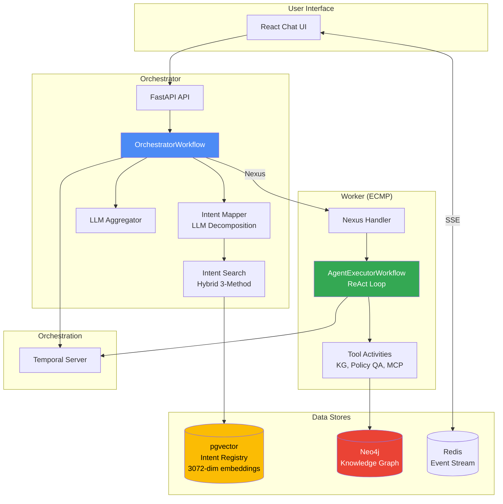

# TIP-AI Implementation Summary — Interview Reference

> Quick-reference index for all implementation deep dives. Copy to Obsidian Vault at `TIP-AI-Codebase/InterviewPrep/`.

## Linked Notes

- [[01-Graph-DB-Knowledge-Graph]] — Neo4j KG, YAML schema, 8-tool query layer
- [[02-Vector-DB-Semantic-Search]] — pgvector, 3072-dim embeddings, negative filtering
- [[03-Intent-Classification-Decomposition]] — LLM decomposition, DAG generation, Tarjan's SCC
- [[04-Temporal-Workflow-Orchestration]] — Nexus, ReAct loops, slot filling, SSE streaming

---

## Resume Bullet Points (Word Document)

### Existing Points
- Designed and presented an enterprise application architecture prototype to the Architecture Review Board (ARB), driving approval of a scalable, cloud-native AI platform.
- Architected and implemented a Unified Enterprise Messaging Platform integrating Guest and Associate communications (SMS, WhatsApp) using event-driven architecture, microservices, and cloud messaging services.
- Led systems integration and technical leadership for the unified messaging platform, aligning stakeholders, defining API contracts, and using data-driven decisions to guide design and delivery.
- Implementing agentic AI capabilities for guest stay–related queries using multi-agent systems, Retrieval-Augmented Generation (RAG), and Model Context Protocol (MCP) for tool- and workflow-aware AI agents.
- Building natural-language-driven auto-provisioning services using MCP-based backends, enabling intent-based orchestration of guest services and automated configuration workflows.

### New Points — Graph DB & Knowledge Graph
- Designed and implemented a Neo4j-backed enterprise knowledge graph for hotel property data, modeling properties, amenities, recreation activities, and payment methods as a labeled property graph with config-driven, YAML-declarative schema ingestion and MERGE-based idempotent data loading.
- Built an 8-tool LLM-invocable knowledge graph query layer enabling semantic property search, multi-hop similarity scoring, faceted filtering, and path explanation — bridging natural-language user queries to structured Cypher traversals via fuzzy enum canonicalization and runtime schema introspection.

### New Points — Vector DB & Semantic Search
- Architected a pgvector-based (PostgreSQL) semantic intent retrieval system using 3072-dimensional embeddings (Gemini Embedding 001), combining cosine similarity search with negative-embedding filtering to accurately route user queries to domain-specific AI agents.
- Implemented a hybrid three-method parallel intent search pipeline (TF-IDF keyword matching, utterance pattern regex, and vector embedding similarity) with per-intent configurable similarity thresholds, feeding ranked candidates to an LLM for final intent selection.

### New Points — Intent Classification & Multi-Intent Orchestration
- Designed and built an LLM-powered multi-intent classification and decomposition engine that splits compound user queries into atomic sub-queries, performs hybrid retrieval (keyword + regex + vector), and generates a dependency-aware Directed Acyclic Graph (DAG) with parallel/sequential execution semantics.
- Implemented a YAML-driven intent registry with positive/negative semantic examples, utterance patterns, few-shot conversation histories, and per-intent execution policies (max loops, timeouts, retries), enabling zero-code onboarding of new AI agent capabilities.

### New Points — Temporal Workflow Orchestration
- Designing Temporal-based workflow orchestration for intent classification, RAG pipelines, and long-running agent workflows, improving reliability, observability, and auditability of production AI systems.
- Engineered a cross-service orchestrator-executor architecture using Temporal Nexus for namespace-isolated workflow invocation, with per-tool retry policies, non-retryable error classification (guardrails, content policy), configurable timeouts, and async child workflows for background summarization — achieving production-grade reliability, observability, and auditability.

---

## LinkedIn Profile (Concise, Impact-Oriented)

- Designed a Neo4j knowledge graph with an 8-tool LLM query layer for semantic property search, enabling natural-language-to-Cypher traversals with fuzzy matching and multi-hop similarity scoring.
- Built a pgvector-powered semantic search system (3072-dim embeddings, cosine similarity with negative-embedding filtering) for intelligent intent routing across AI agent domains.
- Engineered a multi-intent classification engine using LLM-based query decomposition, hybrid retrieval (keyword + regex + vector), and DAG-based execution planning with parallel/sequential dependency semantics.
- Implemented a YAML-driven intent registry supporting zero-code onboarding of new AI agent capabilities with per-intent semantic examples, few-shot prompts, and configurable execution policies.
- Architected Temporal-based workflow orchestration with Nexus cross-service dispatch, ReAct agent loops, multi-turn slot filling, rolling summarization, and real-time SSE event streaming — powering a production-grade agentic AI platform.

---

## Quick Tech Stack Reference

| Component | Technology | Details |
|-----------|-----------|---------|
| **Graph DB** | Neo4j 5.21 Community + APOC | Bolt protocol, Cypher queries |
| **Vector DB** | pgvector on PostgreSQL 15 | 3072-dim, cosine distance |
| **Embedding Model** | Gemini Embedding 001 | Via LiteLLM proxy |
| **Orchestration** | Temporal 1.25.2 + Nexus | Cross-namespace workflows |
| **LLM Provider** | Claude Sonnet, Gemini | Via LiteLLM |
| **Event Streaming** | Redis 7 (SSE) | Real-time UI updates |
| **API** | FastAPI | Orchestrator API |
| **Frontend** | React + TypeScript | Streamlit for internal tools |
| **Observability** | OpenTelemetry + Jaeger | AOS spans for KnowledgeRetrieval |
| **Infrastructure** | Docker Compose, AWS Aurora RDS | Temporal Cloud supported |

## Architecture Overview

---

## Interview Talking Points

### "Tell me about the Knowledge Graph"
> We built a Neo4j knowledge graph for hotel property data. The schema is YAML-declarative — adding new entity types requires zero code changes. I built an 8-tool LLM-invocable query layer so the AI agent can do faceted search, multi-hop similarity scoring, and path explanation. The fuzzy canonicalization layer bridges natural language ("tour activities") to graph enum values (`tour_recreation_activities`) using `difflib.get_close_matches`.

### "How does intent routing work?"
> We use a hybrid three-method parallel search: TF-IDF keywords, regex pattern matching, and pgvector cosine similarity. Each intent has both positive and negative embeddings — if a query is more similar to what an intent does NOT handle, it's excluded. The LLM then picks the best intent from ranked candidates. Per-intent similarity thresholds allow fine-grained control.

### "How do you handle multi-intent queries?"
> Compound queries like "What's the pet policy and does Ritz Carlton have a pool?" are decomposed into atomic sub-queries by an LLM. Each sub-query gets its own intent candidates via hybrid search. Another LLM call generates a DAG with parallel/sequential dependencies. The graph processor uses Tarjan's SCC algorithm for cycle detection and collapses cycles by merging nodes. Same-intent nodes are merged to avoid duplication.

### "Why Temporal?"
> Temporal gives us durable, fault-tolerant orchestration for long-running AI workflows. Each user session is a single OrchestratorWorkflow that stays alive across messages using signals. Executors run in a separate repo via Temporal Nexus — this gives us namespace isolation and independent deployment. The ReAct loop (plan → execute → reflect) runs inside the executor workflow with per-tool retry policies and non-retryable error classification for guardrails. Background summarization runs as an async child workflow that signals the parent when done.
