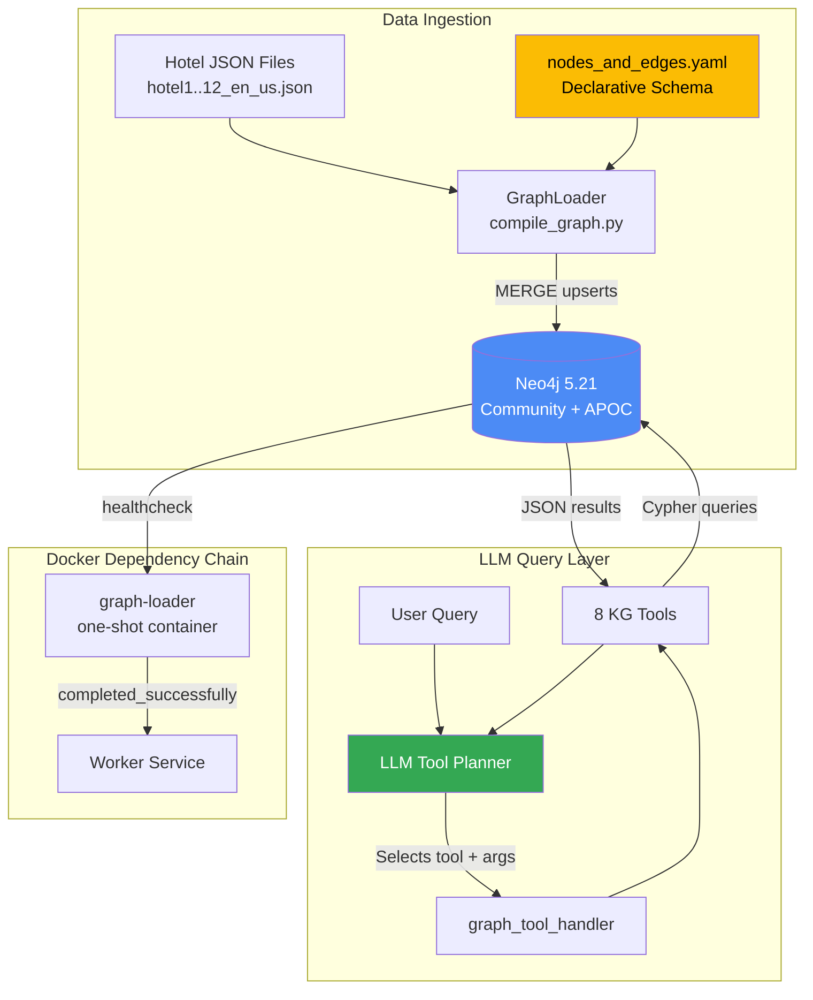
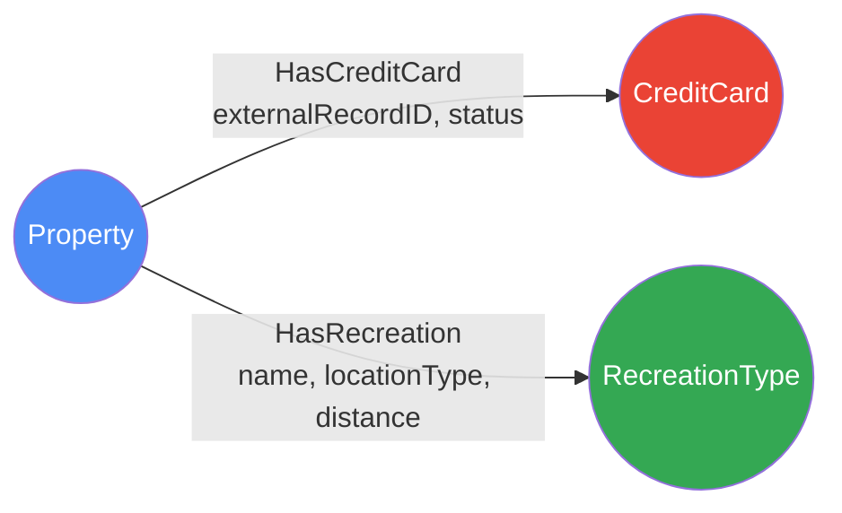

# Neo4j Knowledge Graph — Implementation Deep Dive

## Overview

Built an enterprise **Neo4j Knowledge Graph (KG)** for hotel property data with a config-driven ingestion pipeline and an 8-tool LLM-invocable query layer. The KG enables natural-language-to-Cypher traversals via fuzzy matching, multi-hop similarity, and schema introspection.

## Architecture



## Graph Schema (YAML-Driven)

The schema is defined declaratively — adding new node/edge types requires **zero code changes**.

**File:** `graph/config/nodes_and_edges.yaml`

```yaml
NODES:
  PROPERTY_NODE:
    LABEL: Property
    KEY: _id
    SOURCE: propertyInformation
    PROPERTIES_LIST: [propertyDisplayName, _id, propertyId, ContextID,
      propertyCode, city, maxMeetingSpace, meetingRoomCount,
      amenities, hoursOfOperation, address, phoneNumbers]

  CREDIT_CARD_NODE:
    LABEL: CreditCard
    KEY: code
    SOURCE: creditCards
    PROPERTIES_LIST: [code, description]

  RECREATION_NODE:
    LABEL: RecreationType
    KEY: type
    SOURCE: recreationActivities
    PROPERTIES_LIST: [type]

EDGES:
  PROPERTY_TO_CREDIT_CARD:
    TYPE: HasCreditCard
    FROM: PROPERTY_NODE
    TO:   CREDIT_CARD_NODE
    SOURCE: creditCards
    REL_PROPERTIES_LIST: [externalRecordID, status]

  PROPERTY_TO_RECREATION:
    TYPE: HasRecreation
    FROM: PROPERTY_NODE
    TO:   RECREATION_NODE
    SOURCE: recreationActivities
    REL_PROPERTIES_LIST: [name, locationType, distance]
```

**Visual Schema:**



> **Design Decision:** Activity-specific details (name, locationType, distance) live on the **edge**, not the node. This allows a single `RecreationType` node (e.g., `water_recreation_activities`) to be shared across many properties without node explosion.

## Data Ingestion Pipeline

**File:** `graph/compile_graph.py` — `GraphLoader` class

```python
class GraphLoader:
    def __init__(self, uri, user, password, db="neo4j"):
        self.driver = GraphDatabase.driver(uri, auth=basic_auth(user, password))
        self.db = db

    def upsert_node(self, label, key_prop, item, prop_list):
        label_q = _quote_ident(label)
        key_prop_q = _quote_ident(key_prop)
        props = {
            k: _coerce_neo4j_value(item.get(k))
            for k in prop_list if k in item and k != key_prop
        }
        cypher = f"""
        MERGE (n:{label_q} {{ {key_prop_q}: $key }})
        SET n += $props
        """
        with self._session() as s:
            s.run(cypher, key=item[key_prop], props=props)

    def upsert_edge(self, from_label, from_key_prop, from_key_val,
                    to_label, to_key_prop, to_key_val, rel_type, rel_props):
        cypher = f"""
        MERGE (a:{_quote_ident(from_label)} {{ {_quote_ident(from_key_prop)}: $fromKey }})
        MERGE (b:{_quote_ident(to_label)} {{ {_quote_ident(to_key_prop)}: $toKey }})
        MERGE (a)-[r:{_quote_ident(rel_type)}]->(b)
        SET r += $relProps
        """
        with self._session() as s:
            s.run(cypher, fromKey=from_key_val, toKey=to_key_val, relProps=rel_props)
```

**Key patterns:**
- **MERGE-based idempotent ingestion** — safely re-runnable
- **Cypher injection prevention** — `_quote_ident()` validates identifiers via regex
- **Type coercion** — `_coerce_neo4j_value()` converts dicts/lists to JSON strings

## 8-Tool LLM Query Layer

**File:** `app/tools/graph_tools.py` (928 lines)

| Tool | Purpose | Cypher Pattern |
|------|---------|---------------|
| `kg_schema_catalog` | Full schema introspection with TTL cache (5 min) | `db.schema.nodeTypeProperties()` |
| `kg_schema_summary` | Lightweight labels + rel types | `db.labels()`, `db.relationshipTypes()` |
| `kg_resolve_property` | Multi-predicate property lookup | `MATCH (p:Property) WHERE ... OR ...` |
| `kg_get_property_overview` | Deep-dive with multi-hop OPTIONAL MATCH | `OPTIONAL MATCH (p)-[:HasRecreation]->...` |
| `kg_search_properties` | **Most complex** — Faceted search | Multi-WITH pipeline, regex distance |
| `kg_find_similar_properties` | 2-hop similarity via shared recreation | `MATCH (seed)-[:HasRecreation]->(rt)<-[:HasRecreation]-(p)` |
| `kg_recreation_within_distance` | Distance-filtered (property, activity) pairs | Distance parsing + Python safety-net |
| `kg_explain_paths` | Path explanation between two properties | `MATCH path = (p1)-[:HasRecreation]->(rt)<-[:HasRecreation]-(p2)` |

### Faceted Search (Most Complex Tool)

```python
def kg_search_properties(args):
    # Canonicalize enums via fuzzy matching
    cat = _get_schema_catalog_cached()
    rec_types = _canonicalize_values(
        a.get("recreationTypes"), cat["valueHints"],
        "RecreationType", "type"
    )
    
    q = """
    MATCH (p:Property)
    OPTIONAL MATCH (p)-[:HasRecreation]->(rt:RecreationType)
    WITH p, collect(DISTINCT rt.type) AS rtypes
    OPTIONAL MATCH (p)-[:HasCreditCard]->(cc:CreditCard)
    WITH p, rtypes, collect(DISTINCT cc.code) AS cards
    WHERE ($city IS NULL OR toLower(p.city) = toLower($city))
      AND ($recreationTypes IS NULL OR any(t IN $recreationTypes WHERE t IN rtypes))
      AND ($cardCodes IS NULL OR any(c IN $cardCodes WHERE c IN cards))
      AND ($minMeetingSpace IS NULL OR p.maxMeetingSpace >= $minMeetingSpace)
    ...
    """
    rows = _run(q, params)
    
    # Safety net: enforce distance again in Python
    if max_miles is not None:
        rows = [r for r in rows
                if r.get("minDistanceMiles") is not None
                and r["minDistanceMiles"] <= max_miles]
    return {"filtersEcho": {...}, "results": rows}
```

### Fuzzy Enum Canonicalization

```python
def _canonicalize_values(requested, hints, label, key, cutoff=None):
    """Match user input like 'tour' to canonical 'tour_recreation_activities'."""
    if cutoff is None:
        cutoff = _get_fuzzy_match_cutoff()  # default 0.6
    known = set()
    for h in hints or []:
        if h.get("label") == label and h.get("key") == key:
            known |= set(h.get("values") or [])
    out = []
    for v in requested:
        if v.strip() in known:
            out.append(v.strip())
        else:
            m = get_close_matches(v.strip(), known, n=1, cutoff=cutoff)
            out.append(m[0] if m else v.strip())
    return out
```

### 2-Hop Similarity Scoring

```python
def kg_find_similar_properties(args):
    q = """
    MATCH (seed:Property)
    WHERE seed._id = $seedId OR seed.propertyDisplayName = $seedName
    MATCH (seed)-[:HasRecreation]->(rt:RecreationType)
    MATCH (p:Property)-[:HasRecreation]->(rt)
    WHERE p <> seed
    OPTIONAL MATCH (p)-[:HasCreditCard]->(cc:CreditCard)
    WITH p, collect(DISTINCT rt.type) AS sharedTypes,
         collect(DISTINCT cc.code) AS cards
    RETURN p._id AS id, p.propertyDisplayName AS name,
           sharedTypes, size(sharedTypes) AS score, cards
    ORDER BY score DESC, name
    LIMIT coalesce($k, 10)
    """
```

## Key Architectural Patterns

1. **Config-Driven Schema** — YAML defines the graph; no code changes for new types
2. **MERGE-Based Idempotent Ingestion** — Atomic find-or-create, safely re-runnable
3. **Edge-as-Data-Carrier** — Activity details on edges prevent node explosion
4. **LLM Tool-Calling with KG** — Tool-augmented RAG where retrieval = graph traversal
5. **Two-Layer Distance Filtering** — Cypher regex for speed, Python safety-net for correctness
6. **Lazy Singleton Driver** — Neo4j driver initialized once, reused across requests
7. **One-Shot Loader Container** — Docker service loads data and exits; downstream uses `service_completed_successfully`

## File Reference

| File | Purpose |
|------|---------|
| `graph/config/nodes_and_edges.yaml` | Declarative schema |
| `graph/compile_graph.py` | GraphLoader ingestion class |
| `graph/data/hotel{1-12}_en_us.json` | 12 source data files |
| `app/tools/graph_tools.py` | All 8 `kg_*` tool functions |
| `app/tools/tool_registry.py` | ToolDefinition registrations |
| `app/tools/__init__.py` | `kg*` prefix routing |
| `docker/docker-compose.yml` | Neo4j + graph-loader services |

---
*Source: emergingtech-tipai-orchestrator / emergingtech-tipai-ecmp-worker*
