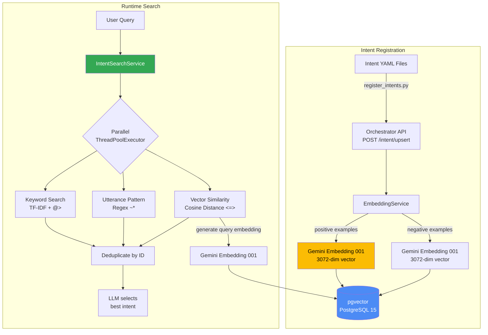
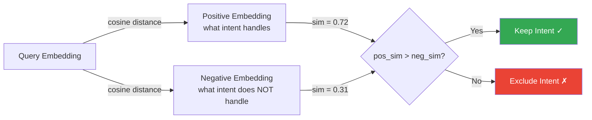

# pgvector Semantic Search — Implementation Deep Dive

## Overview

Built a **pgvector-based semantic intent retrieval system** using 3072-dimensional embeddings (Gemini Embedding 001). The system combines cosine similarity search with negative-embedding filtering and a hybrid three-method parallel search pipeline for accurate AI agent routing.

## Architecture



## Database Schema

**File:** `app/database/init/01-create-intent-registry-schema.sql`

```sql
CREATE EXTENSION IF NOT EXISTS vector;

CREATE TABLE intent_registry_schema.intents (
    id SERIAL PRIMARY KEY,
    name TEXT NOT NULL UNIQUE,
    title TEXT NOT NULL,
    description TEXT NOT NULL,
    domain TEXT NOT NULL,
    version TEXT NOT NULL DEFAULT '1.0.0',
    owner_team TEXT NOT NULL,
    status TEXT NOT NULL DEFAULT 'active'
        CHECK (status IN ('active', 'preview', 'deprecated')),
    
    semantics JSONB,           -- Keywords, examples, patterns
    routing JSONB,             -- Execution routing
    keywords TEXT[],           -- Searchable keyword array
    
    embedding VECTOR(3072),           -- Positive examples embedding
    negative_embedding VECTOR(3072),  -- Negative examples embedding
    
    example_conversation_history TEXT,
    created_at TIMESTAMP WITH TIME ZONE DEFAULT NOW(),
    updated_at TIMESTAMP WITH TIME ZONE DEFAULT NOW()
);

-- Performance indexes
CREATE INDEX idx_intents_keywords
    ON intent_registry_schema.intents USING GIN(keywords);
CREATE INDEX idx_intents_semantics
    ON intent_registry_schema.intents USING GIN(semantics);

-- NOTE: pgvector ANN indexes currently support max 2000 dimensions.
-- We use 3072-dim embeddings, so ANN indexes are intentionally omitted.
-- Similarity queries still work via sequential scan.
```

## Embedding Service

**File:** `app/registry/embedding_service.py`

```python
class EmbeddingService:
    def extract_positive_examples_text(self, semantics):
        """Join positive examples with periods for sentence structure."""
        examples = semantics.get("examples", {}).get("positive", [])
        return ". ".join(str(ex).strip() for ex in examples if str(ex).strip())

    def extract_negative_examples_text(self, semantics):
        examples = semantics.get("examples", {}).get("negative", [])
        return ". ".join(str(ex).strip() for ex in examples if str(ex).strip())

    def generate_intent_embeddings(self, semantics):
        """Generate both positive and negative embeddings for an intent."""
        positive_text = self.extract_positive_examples_text(semantics)
        negative_text = self.extract_negative_examples_text(semantics)
        
        positive_embedding = self.generate_embedding(positive_text) if positive_text else None
        negative_embedding = self.generate_embedding(negative_text) if negative_text else None
        
        return positive_embedding, negative_embedding

    def generate_embedding(self, text):
        """Generate embedding via LiteLLM → Gemini Embedding 001."""
        try:
            asyncio.get_running_loop()
            with concurrent.futures.ThreadPoolExecutor() as executor:
                future = executor.submit(self._run_embedding_sync, text.strip())
                return future.result(timeout=60)
        except RuntimeError:
            return self._run_embedding_sync(text.strip())

    def _run_embedding_sync(self, text):
        loop = asyncio.new_event_loop()
        try:
            return loop.run_until_complete(get_embedding(text))
        finally:
            self._cleanup_loop(loop)  # Prevents Temporal worker thread pool corruption
```

## Cosine Similarity Search with Negative Filtering

**File:** `app/registry/client.py`

```python
def search_by_embedding_similarity(self, query, team=None, limit=None,
                                    similarity_threshold=None):
    query_embedding = embedding_service.generate_embedding(query)
    embedding_str = "[" + ",".join(str(float(x)) for x in query_embedding) + "]"

    base_query = """
        SELECT id, name, title, description, domain,
               1 - (embedding <=> %s::vector) as positive_similarity,
               CASE 
                   WHEN negative_embedding IS NOT NULL 
                   THEN 1 - (negative_embedding <=> %s::vector)
                   ELSE 0 
               END as negative_similarity
        FROM intents
        WHERE status = 'active'
          AND embedding IS NOT NULL
          AND 1 - (embedding <=> %s::vector) >= %s
        ORDER BY embedding <=> %s::vector
        LIMIT %s
    """
    cursor.execute(base_query, params)

    for row in rows:
        positive_sim = row["positive_similarity"]
        negative_sim = row["negative_similarity"]

        # NEGATIVE FILTERING: Exclude if query is more similar to
        # what the intent does NOT handle
        if negative_sim > 0 and negative_sim > positive_sim:
            logger.debug("Excluding intent '%s': neg=%.3f > pos=%.3f",
                         row["name"], negative_sim, positive_sim)
            continue
        intents.append(build_agent_intent(row))
```



## Hybrid Three-Method Parallel Search

**File:** `app/intent_mapping/intent_search_service.py`

```python
class IntentSearchService:
    def _search_all_methods(self, query, team=None, session_id=None, principal_ctx=None):
        """Search using all methods — failures don't block others."""
        results = []

        # Method 1: TF-IDF keyword search (PostgreSQL array containment)
        try:
            keyword_results = self.registry_client.search_by_keywords(query, team=team)
            results.extend(keyword_results)
        except (ValueError, RuntimeError, ConnectionError):
            pass

        # Method 2: Utterance pattern matching (PostgreSQL regex ~*)
        try:
            pattern_results = self.registry_client.search_by_utterance_patterns(query, team=team)
            results.extend(pattern_results)
        except (ValueError, RuntimeError, ConnectionError):
            pass

        # Method 3: Embedding similarity search (pgvector cosine)
        try:
            embedding_results = self._search_embedding_with_span(
                query, team, session_id, principal_ctx
            )
            results.extend(embedding_results)
        except (ValueError, RuntimeError, ConnectionError):
            pass

        # If ALL methods failed with 0 results → registry may be down
        if len(errors) == 3 and len(results) == 0:
            raise IntentSearchError("All search methods failed")

        return results

    def search_for_queries(self, queries, team=None):
        """Search for intents using multiple queries in parallel."""
        with concurrent.futures.ThreadPoolExecutor(max_workers=max_workers) as executor:
            future_to_query = {
                executor.submit(self._search_all_methods, query, team, session_id): query
                for query in valid_queries
            }
            for future in concurrent.futures.as_completed(future_to_query):
                results = future.result()
                intents.extend(results)
        return self._deduplicate_intents(intents)
```

## Per-Intent Similarity Thresholds

Each intent can override the global threshold (default 0.4):

```python
def filter_by_similarity_threshold(self, intents, default_threshold=None):
    for intent in intents:
        score = getattr(intent, '_similarity_score', None)
        if score is None:
            filtered.append(intent)  # From keyword/pattern search — keep
            continue
        
        # Per-intent threshold overrides global default
        intent_threshold = getattr(intent, 'similarity_threshold', None)
        effective_threshold = intent_threshold if intent_threshold is not None else default_threshold
        
        if score >= effective_threshold:
            filtered.append(intent)
```

Example from `policyqa.yaml`:
```yaml
semantics:
  similarity_threshold: 0.3  # More lenient than default 0.4
  examples:
    positive:
      - can platinum get 4pm late checkout?
      - what are the pet policies at marriott?
    negative:
      - book a room
      - cancel my reservation
```

## AOS Observability Integration

```python
def _search_embedding_with_span(self, query, team, session_id, principal_ctx):
    with span_builder.knowledge_retrieval_span(
        query=query,
        session_id=session_id,
        backend_type="vector",
        backend_id="pgvector-intent-registry",
        backend_index="intents",
        top_k=10,
        similarity_threshold=default_threshold,
    ) as span:
        results = self.registry_client.search_by_embedding_similarity(query, team=team)
        span_builder.set_knowledge_retrieval_results(span, results=[...], sources=[...])
        return results
```

## Summary Table

| Aspect | Detail |
|--------|--------|
| **Vector DB** | pgvector (PostgreSQL 15), Prod: AWS Aurora RDS |
| **Embedding Model** | `openai/gemini/gemini-embedding-001` (3072-dim) via LiteLLM |
| **Distance Metric** | Cosine distance (`<=>` operator) |
| **Default Threshold** | 0.4 (per-intent override supported) |
| **Negative Filtering** | Excludes intents where neg_similarity > pos_similarity |
| **ANN Index** | Not used (3072 dims > pgvector HNSW 2000-dim limit) |
| **Search Methods** | Keyword (GIN), Regex (~*), Vector (cosine) — all parallel |
| **Observability** | AOS KnowledgeRetrieval spans for embedding search |

## File Reference

| File | Purpose |
|------|---------|
| `app/database/init/01-create-intent-registry-schema.sql` | Schema + pgvector extension |
| `app/registry/embedding_service.py` | Embedding generation |
| `app/registry/client.py` | Cosine search + negative filtering |
| `app/intent_mapping/intent_search_service.py` | Hybrid parallel search |
| `app/llm/llm.py` | `get_embedding()` via LiteLLM |
| `scripts/generate_embeddings.py` | Batch backfill embeddings |

---
*Source: emergingtech-tipai-orchestrator*
