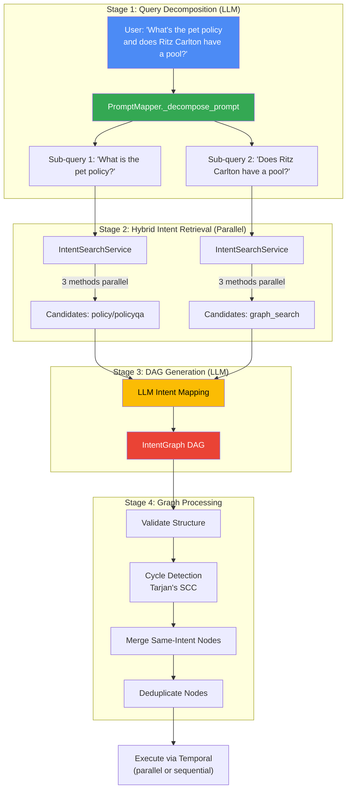
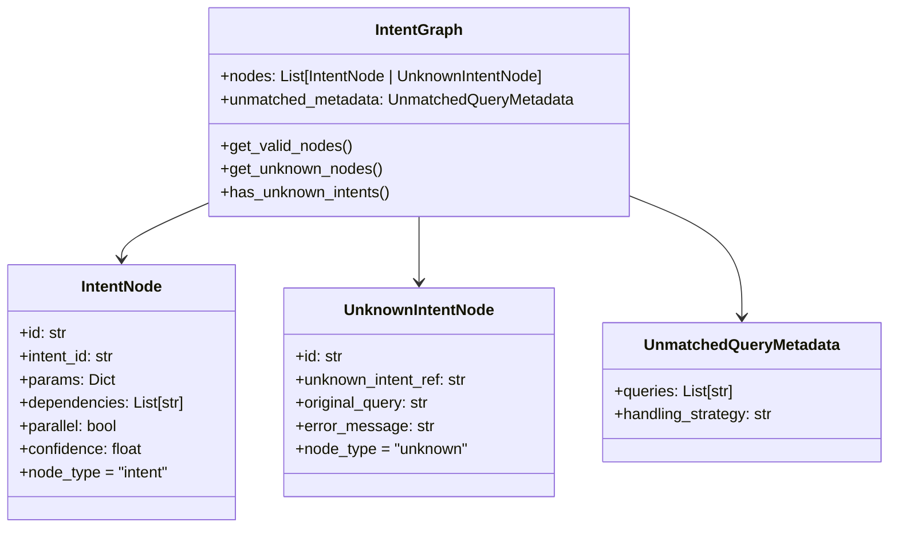

# Intent Classification & Multi-Intent Decomposition — Implementation Deep Dive

## Overview

Designed an **LLM-powered multi-intent classification and decomposition engine** that splits compound user queries into atomic sub-queries, performs hybrid retrieval (keyword + regex + vector), and generates a dependency-aware Directed Acyclic Graph (DAG) with parallel/sequential execution semantics.

## End-to-End Flow



## Stage 1: Query Decomposition

**File:** `app/prompts/intent_mapping_prompts.py`

```python
def build_decomposition_prompt(user_query, conversation_context=None):
    return [
        {
            "role": "system",
            "content": (
                "You are a query decomposition assistant. "
                "Split ONLY the latest user query into separate atomic questions.\n\n"
                "For each atomic question:\n"
                "- Preserve the user's original wording and intent\n"
                "- Make the question self-contained\n"
                "- If important details (city, dates, hotel name) are in context, "
                "include them in the question\n"
                "- Never invent details\n\n"
                "Return ONLY a JSON array of strings."
            ),
        },
        {"role": "user", "content": user_content},
    ]
```

**File:** `app/intent_mapping/prompt_mapper.py`

```python
class PromptMapper:
    async def _decompose_prompt(self, prompt, conversation_context=None, model=None):
        """Use LLM to decompose a prompt into atomic sub-queries."""
        messages = build_decomposition_prompt(prompt, conversation_context)
        content = await get_completion(messages, model=model)
        
        sanitized = self.json_processor.sanitize_response(content)
        parsed = json.loads(sanitized)
        # Returns: ["What is the pet policy?", "Does Ritz Carlton have a pool?"]
        return [q.strip() for q in parsed if q and q.strip()]
```

## Stage 2: Intent Retrieval (Bypass vs Similarity Mode)

```python
class PromptMapper:
    async def map_prompt_to_graph(self, prompt, bypass_intent_similarity=True, team=None, ...):
        # Step 1: Decompose
        sub_queries = await self._decompose_prompt(prompt, conversation_context)

        # Step 2: Search for matching intents per sub-query
        if bypass_intent_similarity:
            # DEFAULT: Send ALL active intents to LLM — let LLM choose
            active_intents = self.intent_search_service.get_active_intents(limit=50, team=team)
            formatted = self.intent_search_service.format_intents_for_llm(active_intents)
            subquery_intent_map = {sq: formatted for sq in sub_queries}
        else:
            # SIMILARITY MODE: Hybrid 3-method search per sub-query
            subquery_intent_map = self._search_intents_per_subquery(sub_queries, team=team)
```

## Stage 3: DAG Generation via LLM

**File:** `app/prompts/intent_mapping_prompts.py`

```python
def build_mapping_prompt(original_query, subquery_intent_pairs, conversation_context=None):
    return [
        {
            "role": "system",
            "content": (
                "You are an intent mapping assistant. "
                "For each sub-query, select the best matching intent "
                "FROM THAT SUB-QUERY'S CANDIDATE LIST.\n\n"
                "Create a DAG of intent nodes where each node has:\n"
                "- id: string (n1, n2, n3)\n"
                "- intent: the intent id, or 'none' if no match\n"
                "- params: object with 'sub_query'\n"
                "- dependencies: array of node ids\n"
                "- parallel: boolean\n"
                "- needs_user_input: boolean\n\n"
                "Prefer selecting an intent if ANY plausible match exists."
            ),
        },
        {"role": "user", "content": f'ORIGINAL: "{original_query}"\n\n{pairs_block}'},
    ]
```

**Example LLM Output:**
```json
{
  "nodes": [
    {
      "id": "n1",
      "intent": "3",
      "params": {"sub_query": "What is the pet policy?"},
      "dependencies": [],
      "parallel": true,
      "needs_user_input": false
    },
    {
      "id": "n2",
      "intent": "5",
      "params": {"sub_query": "Does Ritz Carlton have a pool?"},
      "dependencies": [],
      "parallel": true,
      "needs_user_input": false
    }
  ]
}
```

## Stage 4: Intent Graph Data Model

**File:** `app/models/intent_graph.py`

```python
@dataclass
class IntentNode:
    """A valid intent node that was successfully resolved."""
    id: str
    intent_id: str
    params: Dict[str, Any]
    dependencies: List[str]
    parallel: bool = False
    needs_user_input: bool = False
    confidence: Optional[float] = None
    intent_name: Optional[str] = None
    node_type: Literal["intent"] = "intent"

@dataclass
class UnknownIntentNode:
    """An intent that couldn't be resolved from the registry."""
    id: str
    unknown_intent_ref: str
    original_query: Optional[str] = None
    error_message: str = ""
    dependencies: List[str] = field(default_factory=list)
    node_type: Literal["unknown"] = "unknown"

@dataclass
class UnmatchedQueryMetadata:
    """Sub-queries that didn't match any intents during search."""
    queries: List[str]
    handling_strategy: str = "static_clarification"

@dataclass
class IntentGraph:
    """Graph of intent nodes to be executed."""
    nodes: List[Union[IntentNode, UnknownIntentNode]]
    unmatched_metadata: Optional[UnmatchedQueryMetadata] = None

    def get_valid_nodes(self) -> List[IntentNode]:
        return [n for n in self.nodes if n.node_type == "intent"]

    def get_unknown_nodes(self) -> List[UnknownIntentNode]:
        return [n for n in self.nodes if n.node_type == "unknown"]
```



## Graph Processing: Cycle Detection & Node Merging

**File:** `app/intent_mapping/graph_processor.py`

### Tarjan's SCC Algorithm for Cycle Collapse

```python
class GraphProcessor:
    def _find_strongly_connected_components(self, adj):
        """Tarjan's algorithm for cycle detection."""
        index = 0
        indices, lowlink, stack, onstack, sccs = {}, {}, [], set(), []

        def strongconnect(node):
            nonlocal index
            indices[node] = lowlink[node] = index
            index += 1
            stack.append(node)
            onstack.add(node)

            for neighbor in adj.get(node, []):
                if neighbor not in indices:
                    strongconnect(neighbor)
                    lowlink[node] = min(lowlink[node], lowlink[neighbor])
                elif neighbor in onstack:
                    lowlink[node] = min(lowlink[node], indices[neighbor])

            if lowlink[node] == indices[node]:
                scc = []
                while True:
                    w = stack.pop()
                    onstack.remove(w)
                    scc.append(w)
                    if w == node:
                        break
                sccs.append(scc)

        for node_id in adj:
            if node_id not in indices:
                strongconnect(node_id)
        return sccs

    def collapse_cycles(self, graph_json):
        """Merge strongly-connected components into single nodes."""
        sccs = self._find_strongly_connected_components(adj)
        multi_node_sccs = [scc for scc in sccs if len(scc) > 1]
        if not multi_node_sccs:
            return graph_json  # No cycles
        # Merge sub-queries with " and ", union dependencies, filter internal deps
        ...
```

### Node Merging by Intent

```python
    def merge_nodes_by_intent(self, graph_json):
        """Merge nodes referencing the same intent into a single node."""
        groups = {}
        for node in nodes:
            intent_ref = node.get("intent") or node.get("intent_id")
            groups.setdefault(intent_ref, []).append(node)

        for members in groups.values():
            if len(members) == 1:
                merged_nodes.append(members[0])
            else:
                merged_node = self._merge_intent_nodes(members)
                # Sub-queries joined with " and "
                merged_nodes.append(merged_node)
```

## YAML-Driven Intent Definitions

**File:** `emergingtech-tipai-ecmp-worker/app/intents/policyqa.yaml`

```yaml
name: policy/policyqa
title: Policy Q&A
description: Answers questions about Marriott Bonvoy policies
domain: policy
owner_team: centralwork

system_prompt: |
  You are a Marriott Bonvoy policy expert assistant...

tools:
  - name: policy_qa_activity
    binding:
      type: activity
      activity:
        activity_name: policy_qa_activity
        timeout_ms: 60000
        retries: 3
        idempotent: true

policy:
  max_steps: 3
  max_react_loops: 3
  timeout_seconds: 120

semantics:
  examples:
    positive:
      - can platinum get 4pm late checkout?
      - what are the pet policies at marriott?
    negative:
      - book a room
      - cancel my reservation
  utterance_pattern: policy|bonvoy.*rules|late.*checkout
  similarity_threshold: 0.3

keywords: [policy, bonvoy, elite benefits, pet policy]

example_conversation_history: |
  === TOOL: policy_qa_activity ===
  EXECUTE: Task='pet policy'
    ✓ {'next': 'execute_tool_call', 'tool': 'policy_qa_activity',
       'args': {'question': 'what is the pet policy'}}
  COMPLETE: Tool returned answer
    ✓ {'next': 'complete', 'response': 'Pets up to 40lbs allowed...'}
  UNSUPPORTED: Task='book dinner'
    ✓ {'next': 'unsupported_request', 'response': 'I can only answer policy questions.'}

routing:
  base: ecmpwork-ecmpworker
  executor_model: anthropic/claude-sonnet-4-20250514
```

## Defined Intents

| YAML File | Name | Domain | Tools |
|-----------|------|--------|-------|
| `policyqa.yaml` | `policy/policyqa` | policy | `policy_qa_activity` |
| `graph_search.yaml` | `graph_search` | search | `KgSearchProperties`, `KgGetPropertyOverview` |
| `get_hotel_details.yaml` | `hotel_details` | hospitality | `get_hotel_profile` |
| `sample_search.yaml` | `sample_search` | sample | `mock_hotel_search_activity` |

## Key Patterns

1. **LLM-Based Classification** (not traditional ML) — hybrid retrieval feeds candidates to LLM for final selection
2. **Multi-Intent Decomposition** — compound queries split into atomic sub-queries
3. **DAG with Parallel Semantics** — nodes can run concurrently based on dependency graph
4. **Graceful Unknowns** — `UnknownIntentNode` for unresolvable intents instead of errors
5. **YAML-Driven Zero-Code Onboarding** — new intents = new YAML file + register
6. **Few-Shot Examples Per Intent** — rich conversation examples guide executor behavior
7. **Per-Intent Thresholds** — fine-grained similarity control per intent

## File Reference

| File | Purpose |
|------|---------|
| `app/intent_mapping/prompt_mapper.py` | Main PromptMapper orchestration |
| `app/prompts/intent_mapping_prompts.py` | LLM prompts for decomposition + mapping |
| `app/models/intent_graph.py` | IntentNode, IntentGraph dataclasses |
| `app/intent_mapping/graph_processor.py` | Tarjan's SCC, validation, merging |
| `app/intent_mapping/intent_search_service.py` | Hybrid parallel search |
| `app/intents/*.yaml` | Intent YAML definitions |
| `scripts/register_intents.py` | Registry publishing |

---
*Source: emergingtech-tipai-orchestrator / emergingtech-tipai-ecmp-worker*
