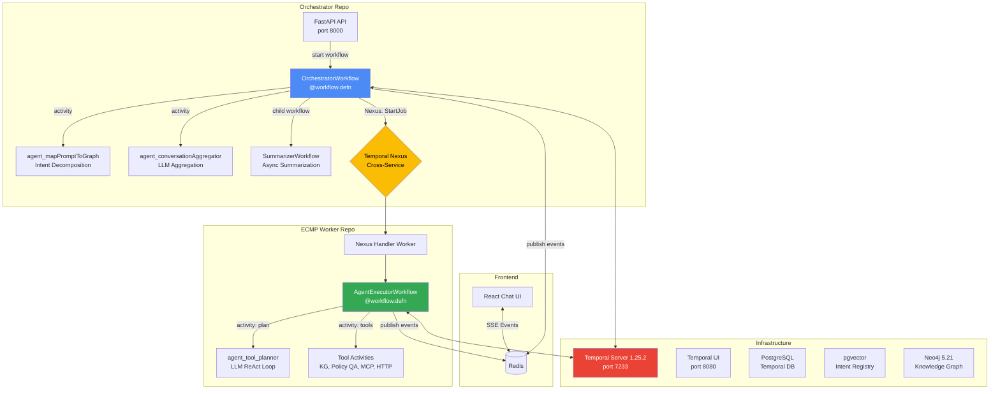
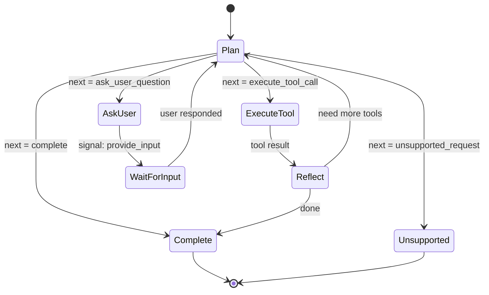
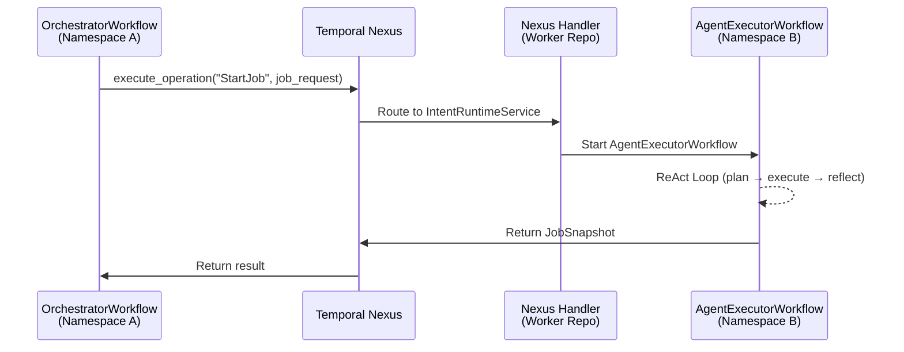
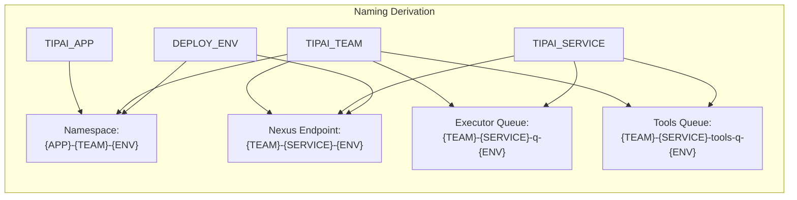

# Temporal Workflow Orchestration — Implementation Deep Dive

## Overview

Designed and implemented **Temporal-based workflow orchestration** for the end-to-end AI agent lifecycle — spanning intent decomposition, parallel executor dispatch via **Temporal Nexus**, ReAct-style tool execution loops, multi-turn slot filling, rolling conversation summarization, and real-time event streaming.

## System Architecture



## Workflow Definitions

### OrchestratorWorkflow (Main Brain)

**File:** `app/workflows/orchestrator_workflow.py`

```python
@workflow.defn
class OrchestratorWorkflow(BaseWorkflow):
    """Decomposes user requests and spawns executor workflows via Nexus."""

    def __init__(self):
        super().__init__()
        self.session = SessionManager()
        self.scheduler = NodeScheduler()
        self.event_buffer: Optional[WorkflowEventBuffer] = None
        self.event_mode: EventMode = EventMode.SSE
        self._message_interrupted: bool = False
        self._suspend_requested: bool = False
        self._pending_unknown_nodes: List = []

    @workflow.run
    async def run(self, *args, **kwargs) -> Dict[str, Dict]:
        """Long-running session workflow — stays alive across many user messages."""
        # Extract arguments...
        # Initialize event buffer, greeting, etc.
        # Main message loop:
        #   1. Map prompt to intent graph
        #   2. Schedule nodes (parallel/sequential)
        #   3. Execute via Nexus
        #   4. Aggregate results
        #   5. Wait for next prompt signal
        ...
```

**Signals (6):**
```python
@workflow.signal
async def user_input(self, data):     # User answers to questions
@workflow.signal
async def new_prompt(self, data):     # Follow-up messages
@workflow.signal
async def end_session(self):          # Terminate session
@workflow.signal
async def interrupt_message(self):    # Cancel current, keep session
@workflow.signal
async def summary_complete(self, data): # Child summarizer done
@workflow.signal
async def suspend_session(self):      # Suspend for later resumption
```

**Queries (10):**
```python
@workflow.query
def get_user_facing_conversation_history(self): ...  # For UI
@workflow.query
def get_full_conversation_history(self): ...         # Internal
@workflow.query
def get_intent_mapping(self): ...                    # Confidence scores
@workflow.query
def get_latest_tool_data(self): ...                  # All node results
@workflow.query
def get_event_mode(self): ...                        # SSE vs REST
@workflow.query
def get_session_snapshot(self): ...                   # Restart payload
```

### AgentExecutorWorkflow (ReAct Agent)

**File:** `emergingtech-tipai-ecmp-worker/app/executor/workflow.py`

```python
@workflow.defn
class AgentExecutorWorkflow:
    """Executes intent jobs via a ReAct-style loop."""

    def __init__(self):
        self.intent_definition: Optional[IntentDefinition] = None
        self.state = ExecutionState()
        self.conversation_history = ConversationHistory()
        self.max_tool_retries: int = 3
        self.max_react_loops: int = 3
        self.executor_wait_timeout_seconds: int = 300
        self.executed_tool_calls: List[Tuple[str, str]] = []  # duplicate prevention

    # ReAct Loop (simplified):
    # while not done and loops < max_react_loops:
    #   1. plan = await execute_activity(agent_tool_planner, ...)
    #   2. if plan.next == "execute_tool_call":
    #        result = await execute_tool(tool_spec, args, ...)
    #        conversation_history.add(tool_result)
    #   3. if plan.next == "ask_user_question":
    #        await workflow.wait_condition(lambda: self.provided_input_data)
    #   4. if plan.next == "complete":
    #        return final_response
    #   5. if plan.next == "unsupported_request":
    #        return unsupported_message
```



### SummarizerWorkflow (Async Child)

**File:** `app/workflows/summarizer_workflow.py`

```python
@workflow.defn
class SummarizerWorkflow:
    """Async child workflow that summarizes conversation history."""
    
    @workflow.run
    async def run(self, conversation_text, session_id):
        summary = await workflow.execute_activity(
            agent_conversationSummarizer,
            {"conversation": conversation_text, "session_id": session_id},
            start_to_close_timeout=timedelta(seconds=120),
        )
        # Signal parent with result (non-blocking)
        return summary
```

## Temporal Nexus Cross-Service Communication



**File:** `app/workflows/orchestrator_components/child_workflow_manager.py`

```python
async def call_remote_executor():
    nexus_client = workflow.create_nexus_client(
        endpoint=nexus_endpoint,       # e.g., "ecmpwork-ecmpworker-dev"
        service="IntentRuntimeService"
    )
    handle = await nexus_client.execute_operation(
        "StartJob",
        job_request,
        schedule_to_close_timeout=timedelta(minutes=5),
    )
```

**File:** `emergingtech-tipai-ecmp-worker/app/integration/nexus/handler.py`

```python
@nexus_service
class IntentRuntimeService:
    """Nexus contract: names + IO types must match implementation."""
    start_job: Operation[JobRequest, JobSnapshot]
    await_update: Operation[str, JobUpdate]

@service_handler
class IntentRuntimeServiceHandler:
    @sync_operation
    async def start_job(self, ctx: StartOperationContext, input: JobRequest):
        """Start a new executor workflow."""
        handle = await client.start_workflow(
            AgentExecutorWorkflow.run,
            args=[input],
            id=job_id,
            task_queue=executor_task_queue,
        )
        return nexus.WorkflowRunOperationResult(handle)
```

## Activity Dispatch with Per-Tool Retry Policies

**File:** `emergingtech-tipai-ecmp-worker/app/executor/workflow_activity_dispatch.py`

```python
# Activity binding (from intent YAML)
result = await workflow.execute_activity(
    activity_reg.fn,
    enhanced_args,
    task_queue=queue,
    start_to_close_timeout=timedelta(seconds=binding.activity.timeout_ms / 1000),
    retry_policy=RetryPolicy(
        initial_interval=timedelta(seconds=1),
        backoff_coefficient=2.0,
        maximum_attempts=binding.activity.retries,
    ),
)

# MCP tool binding
result = await workflow.execute_activity(
    mcp_activity.fn,
    mcp_payload,
    task_queue=queue,
    start_to_close_timeout=timedelta(seconds=mcp_binding.timeout_ms / 1000),
    retry_policy=RetryPolicy(
        initial_interval=timedelta(seconds=5),
        backoff_coefficient=1.0,
        maximum_attempts=mcp_binding.retries,
    ),
)

# LLM Planner (non-retryable errors excluded)
LLM_NON_RETRYABLE_ERRORS = [
    "GuardrailError",
    "ContentPolicyError",
    "AuthenticationError",
]
retry_policy=RetryPolicy(
    initial_interval=timedelta(seconds=5),
    backoff_coefficient=1,
    maximum_attempts=3,
    non_retryable_error_types=LLM_NON_RETRYABLE_ERRORS,
)
```

## Worker Configuration

### Orchestrator Worker

**File:** `scripts/run_worker.py`

```python
with concurrent.futures.ThreadPoolExecutor(max_workers=100) as activity_executor:
    worker = Worker(
        client,
        task_queue=TEMPORAL_TASK_QUEUE,
        workflows=[OrchestratorWorkflow, SummarizerWorkflow],
        activities=[
            activities.agent_validatePrompt,
            activities.agent_toolPlanner,
            activities.agent_conversationAggregator,
            activities.agent_conversationSummarizer,
            activities.agent_mapPromptToGraph,
            activities.get_wf_env_vars,
            activities.mcp_tool_activity,
            activities.agent_slotEvaluator,
            dynamic_tool_activity,
            mcp_list_tools,
            event_activities.publish_workflow_events_activity,
            cancel_executor_workflows,
            get_intent_by_id,
        ],
        activity_executor=activity_executor,
    )
    await worker.run()
```

### ECMP Worker (3 Workers in Parallel)

**File:** `emergingtech-tipai-ecmp-worker/app/entrypoints/worker.py`

```python
async def run_all_workers(self):
    """Run all three worker types concurrently."""
    await asyncio.gather(
        self.run_nexus_handler(),       # Polls nexus queue, routes StartJob
        self.run_executor_worker(),      # Runs AgentExecutorWorkflow
        self.run_activities_worker(),    # Runs tool activities on tools queue
        return_exceptions=True,
    )
```

## Activities Summary

### Orchestrator Activities

| Activity | Purpose |
|----------|---------|
| `agent_mapPromptToGraph` | Decompose prompt → intent graph (LLM + vector search) |
| `agent_toolPlanner` | LLM-based tool planning with context |
| `agent_conversationAggregator` | LLM aggregation of multi-node results |
| `agent_conversationSummarizer` | Rolling conversation summarization |
| `agent_validatePrompt` | Prompt validation |
| `agent_slotEvaluator` | Evaluate if user answer fills missing slots |
| `publish_workflow_events_activity` | Flush buffered events to Redis |
| `cancel_executor_workflows` | Cancel running executors (interrupt) |
| `get_intent_by_id` | Fetch intent from PostgreSQL |

### Worker Activities

| Activity | Purpose |
|----------|---------|
| `agent_tool_planner` | LLM planner for ReAct loop |
| `policy_qa_activity` | RAG-based policy Q&A |
| `KgSearchProperties` | Neo4j faceted property search |
| `KgGetPropertyOverview` | Neo4j property deep-dive |
| `get_hotel_profile` | Hotel details via Marriott APIs |
| `mcp_run_tool` | MCP tool execution |
| `poll_for_update` | Long-poll for executor state changes |

## Namespace & Queue Naming Convention



## Key Patterns

1. **Long-Running Session Workflow** — OrchestratorWorkflow stays alive across messages via signals
2. **Nexus Cross-Service Dispatch** — Namespace-isolated executor invocation
3. **ReAct Agent Loop** — Plan → Execute Tool → Reflect → Repeat
4. **Multi-Turn Slot Filling** — Executor asks question → orchestrator evaluates user answer
5. **Per-Tool Retry Policies** — Timeouts/retries from YAML intent definitions
6. **Non-Retryable Error Classification** — GuardrailError, ContentPolicyError never retried
7. **Async Summarization** — Background child workflow signals parent when done
8. **SSE Event Streaming** — WorkflowEventBuffer → Redis → frontend
9. **3-Worker Architecture** — Nexus handler + executor + activities run concurrently
10. **Session Interrupt/Suspend** — Cancel current processing or suspend for later

## File Reference

| File | Purpose |
|------|---------|
| `app/workflows/orchestrator_workflow.py` | OrchestratorWorkflow (main brain) |
| `app/workflows/summarizer_workflow.py` | Async summarization child workflow |
| `app/workflows/orchestrator_components/` | NodeScheduler, ChildWorkflowManager, etc. |
| `scripts/run_worker.py` | Orchestrator worker startup |
| `executor/workflow.py` | AgentExecutorWorkflow (ReAct loop) |
| `executor/workflow_activity_dispatch.py` | Tool execution with retry policies |
| `integration/nexus/handler.py` | Nexus service handler |
| `app/entrypoints/worker.py` | ECMP 3-worker startup |
| `docker/docker-compose.yml` | Full local infrastructure |

---
*Source: emergingtech-tipai-orchestrator / emergingtech-tipai-ecmp-worker*
